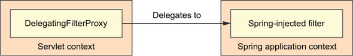

# 9강
[[toc]]
## 1. 스프링 시큐리티 시작하기
- 스프링 프레임워크 기반의 보안 프레임워크
- 기원은 Acegi 


```java
스프링 시큐리티에서 사용하는 기술

1. 필터 : 웹 요청에 대한 보안과 URL 수준의 접근을 제어 - 인증 제어
2. Advice : AOP, 객체 프록싱, 어드바이스 적용을 통해 메소드 실행 보안 - 인가 제어
```

### 1-1. 스프링 시큐리티 모듈의 이해
- 스프링 시큐리티를 사용하기 위해선, 스프링 시큐리티 모듈을 추가해 주어야 한다.

| 모듈 | 설명 |
| ----|---- |
| ACL | 접근 제어 목록 (ACL, Access Control List)을 통한 도메인 객체 보안 지원 |
| Aspects | 스프링 시큐리티 어노테이션을 사용할 때, 표준 스프링 AOP 대신 AspectJ 기반을 지원하는 모듈 |
| CAS Client | Jasig의 통합 인증서비스를 사용하여 통합 인증 로그인 지원 |
| Configuration | XML과 자바를 통한 스프링 시큐리티 설정 지원 |
| Core | 스프링 시큐리티 라이브러리 핵심 기능 제공 |
| Cyptography | 암호화 및 암호 부호화 지원 | 
| LDAP | LDAP 기반 인증 지원 | 
| OpenID | OpenID로 중앙 집중 인증 지원 | 
| Remoting | 스프링 리모팅 통합 지원 |
| Tag Library | 스프링 시큐리티의 JSP 태그 라이브러리 지원 |
| Web | 스프링 시큐리티 필터 기반 웹 보안 지원 |

### 1-2. 웹 요청 필터링
- 스프링 시큐리티는 다양한 보안의 관점들을 제공하기 위해 몇 가지 서블릿 필터를 제공한다.
- 모든 security 관련 필터 설정을 web.xml 이나 WebApplicationInitializer 에 설정하는게 아닌, 
DelegatingFilterProxy만 등록해서 사용한다.



- DelegatingFilterProxy는 스프링 어플리케이션 컨텍스트의 위임된 필터 빈을 처리하기 위한 프록시 필터
- 즉 springSecurityFilterChain bean name 인 DelegatingFilterProxy만 등록해주면, 
원하는 스프링 시큐리티 필터의 사용이 가능하다.

```java
public class SecurityWebInitializer extends AbstractSecurityWebApplicationInitializer {}
```

- 따로 빈등록을 할 필요는 없고, AbstractSecurityWebApplicationInitializer를 상속받는 클래스를 하나 생성해 주면된다.
- 이제 요청이 오면, springSecurityFilterChain인 빈에게 위임되어 인증 처리를 하게 된다.
- [스프링 필터 체인 구조](https://gwegwe1234.github.io/study-collection/programming/Spring_Filter_Chain.html)

### 1-3. 간단한 보안 설정 작성
- 스프링 시큐리를 사용하기 위한 간단한 자바빈 설정이다.

```java
@Configuration
@EnableWebSecurity // 웹 보안 설정
public class SecurityConfig extends WebSecurityConfigurerAdapter {
    ...
}
```

- @EnableWebSecurity 설정을 통해 웹 보안을 활성화 하지만, 
실제로 쓸모 있게 쓰려면 WebSecurityConfigurerAdapter를 확장하여 설정을 해야 한다.
- MVC 어플리케이션만 개발할 때는 @EnableWebMvcSecurity를 사용하면 된다.

```java
@Configuration
@EnableWebMvcSecurity를 // 웹 보안 설정
public class SecurityConfig extends WebSecurityConfigurerAdapter {
    ...
}
```
- @EnableWebMvcSecurity는 CSRF 체크해주고 그런다.
- 이정도만 설정해 주면 이제 이 웹사이트는 못들어오게 막혀버린다.
- 이제 설정을 해 주어야 하는데, WebSecurityConfigurerAdapter의 세가지 configure() 메소드를 오버 라이딩을 해서 추가보안 설정이 가능하다.

| 메소드 | 설명 |
| ---- | ---- |
| configure(WebSecurity) | 스프링 시큐리티의 필터 연결을 설정하기 위한 메소드 |
| configure(HttpSecurity) | 인터셉터로 요청을 안전하게 보호하는 방법을 설정하기 위한 메소드 |
| configure(AuthenticationManagerBuilder) | 사용사 세부 서비스를 설정하기 위한 메소드 |

```java
// 설정 sample
protected void configure(HttpSecurity http) throws Exception {
    http.
        authorizeRequests().anyRequest().authenticated()
        .and()
        formLogin()
        .and()
        .httpBasic();
}
```

- 이런 식으로 Http 요청에 대해 어떻게 인증을 할 것인지 설정을 해 줄 수있다.
#
- 어플리케이션에서 요구하는 것을 맞춰 주기 위해 설정에 약간 추가되는 것이 있어야 한다.

```java
1. 사용자 저장소 설정
2. 인증이 필요한 요청과, 아닌 요청을 명시하고, 필요한 권한이 무엇인지 명시
3. 평범한 기본 로그인 화면을 대체하기 위한 수정된 로그인 화면 제공
``` 

## 2. 사용자 상세 서비스 선택
### 2-1. 인메모리 사용자 저장소 사용
- WebSecurityConfigurerAdapter를 상속받아 보안 설정을 했으면, 
저장소 설정은 AuthenticationManagerBuilder를 인자로 같는 configure() 메소드를 오버라이딩 한다.
- AuthenticationManagerBuilder는 inMemoryAuthentication() 메소드를 제공한다.

```java
@Configuration
@EnableWebMvcSecurity
public class SecurityConfig extends WebSecurityConfigurerAdapter {

    @Override
    protected void configure(AuthenticationManagerBuilder auth) throws Exception {
        auth
            .inMemoryAuthentication()
            .withUser("user").password("password").roles("USER")
            .and()
            .withUser("admin").password("password").roles("USER", "ADMIN");
    }
}
```

- 보통 roles는 자동으로 ROLE_를 붙여준다. 원래는 authorities를 많이 씀
- 거의 테스트용으로 사용되는 저장소

### 2-2. DB 테이블 인증
- JDBC를 통해 RDB에 사용자 데이터를 저장을 많이함
- 스프링 시큐리티는 JDBC 지원 사용자 저장소에서 인증하기 위해 jdbcAuthentication() 메소드를 사용한다

```java
@Autowired
DataSource dataSource;

@Override
protected void configure(AuthenticationManagerBuilder auth) throws Exception {
    auth
        .jdbcAuthentication()
        .dataSource(dataSource);
}
```

#### 기본 사용자 쿼리 오버라이딩 하기
- 스프링 시큐리티 내부의 다음과 같은 코드들이 사용자 상세 정보를 검색하기 위해 SQL 쿼리를 실행한다.

```java
public static final String DEF_USERS_BY_USERNAME_QUERY =
        "select username,password,enabled " +
        "from users " +
        "where username = ?";
public static final String DEF_AUTHORITIES_BY_USERNAME_QUERY =
        "select username,authority " +
        "from authorities " +
        "where username = ?";
public static final String DEF_GROUP_AUTHORITIES_BY_USERNAME_QUERY =
        "select g.id, g.group_name, ga.authority " +
        "from groups g, group_members gm, group_authorities ga " +
        "where gm.username = ? " +
        "and g.id = ga.group_id " +
        "and g.id = gm.group_id";
```

- 잘 동작하면 문제가 없는데, 잘 안동작하면 추가적인 스프링 시큐리티 자체 설정이 필요하다.

```java
@Override
protected void configure(AuthenticationManagerBuilder auth) throws Exception {
  auth
    .jdbcAuthentication()
      .dataSource(dataSource)
      .usersByUsernameQuery(
        "select username, password, true " +
        "from Spitter where username=?")
      .authoritiesByUsernameQuery(
        "select username, 'ROLE_USER' from Spitter where username=?");
}
```

#### 부호화된 암호로 작업하기
- passwordEncoder() 메소드를 사용하면 부호화가 가능하다

```java
@Override
protected void configure(AuthenticationManagerBuilder auth) throws Exception {
  auth
    .jdbcAuthentication()
      .dataSource(dataSource)
      .usersByUsernameQuery(
        "select username, password, true " +
        "from Spitter where username=?")
      .authoritiesByUsernameQuery(
        "select username, 'ROLE_USER' from Spitter where username=?")
      .passwordEncoder(new StandardPasswordEncoder("53cr3t"));
}
```

- passwordEncoder() 메소드는 스프링 시큐리티의 PassEncoder 인터페이스를 구현한 클래스의 객체는 무엇이든 받을 수 있다.
- 스프링 시큐리티에선 BCryptPasswordEncoder, NoOpPasswordEncoder, StandardPasswordEncode 를 제공해 준다.
- 물론 직접 인터페이스를 구현해서 만들어 쓸 수도있다.

### 2-3. Ldap 기반 인증 적용
- ldapAuthentication() 메소드를 사용하여 구현한다.

```java
@Override
protected void configure(AuthenticationManagerBuilder auth) throws Exception {
  auth
    .ldapAuthentication()
      .userSearchFilter("(uid={0})")
      .groupSearchFilter("member={0}");
}
```

- userSearchFilter()와 groupSearchFilter() 메소드는 사용자와 그룹을 찾기 위한 기본 Ldap 쿼리 필터를 제공하기 위해 사용된다.
- 기본 쿼리를 명시해 줘서 설장 변경도 가능

```java
@Override
protected void configure(AuthenticationManagerBuilder auth) throws Exception {
  auth
    .ldapAuthentication()
      .userSearchBase("ou=people")
      .userSearchFilter("(uid={0})")
      .groupSearchBase("ou=groups")
      .groupSearchFilter("member={0}");
}
```

- 암호를 비교 설정하고 싶다면 passwordCompare() 메소드를 선언한다.

```java
@Override
protected void configure(AuthenticationManagerBuilder auth) throws Exception {
  auth
    .ldapAuthentication()
      .userSearchBase("ou=people")
      .userSearchFilter("(uid={0})")
      .groupSearchBase("ou=groups")
      .groupSearchFilter("member={0}")
      .passwordCompare();
}
```

- 이렇게 보내면 전달된 사용자의 비밀번호와 Ldap 엔트리의 userPassword 어트리뷰트 값과 비교해서 체크한다.
- 어트리뷰트 명이 다르면 passwordAttribute()에 명시해준다.
- 암호화 전략을 사용하는 것도 물론 가능

```java
@Override
protected void configure(AuthenticationManagerBuilder auth) throws Exception {
  auth
    .ldapAuthentication()
      .userSearchBase("ou=people")
      .userSearchFilter("(uid={0})")
      .groupSearchBase("ou=groups")
      .groupSearchFilter("member={0}")
      .passwordCompare()
      .passwordEncoder(new Md5PasswordEncoder())
      .passwordAttribute("passcode");
}
```

- 스프링 시큐리티의 Ldap 기본 인증은 localhost 33389에 있다고 가정한다.
- 만약 원격 Ldap 서버에서 조회하기 위해선 contextSource() 메소드를 사용해 url을 명시해 준다.

```java
@Override
protected void configure(AuthenticationManagerBuilder auth) throws Exception {
  auth
  .ldapAuthentication()
    .userSearchBase("ou=people")
    .userSearchFilter("(uid={0})")
    .groupSearchBase("ou=groups")
    .groupSearchFilter("member={0}")
    .contextSource()
      .url("ldap://habuma.com:389/dc=habuma,dc=com");
}
```

- 내장 Ldap 서버에서 조회하기 위해선 URL을 설정하는 대신, root() 메소드를 사용해 내장 서버의 루트 접두사를 명시해 준다.

```java
@Override
protected void configure(AuthenticationManagerBuilder auth) throws Exception {
  auth
  .ldapAuthentication()
    .userSearchBase("ou=people")
    .userSearchFilter("(uid={0})")
    .groupSearchBase("ou=groups")
    .groupSearchFilter("member={0}")
    .contextSource()
      .root("dc=habuma,dc=com");
}
```

- Ldap 서버가 시작할 때, 클래스 패스내의 모든 LDIF 파일 데이터를 마구 긁어오는데, 특정 파일만 가져오고 싶다면 lidf() 메소드를 사용한다.

```java
@Override
protected void configure(AuthenticationManagerBuilder auth) throws Exception {
  auth
  .ldapAuthentication()
    .userSearchBase("ou=people")
    .userSearchFilter("(uid={0})")
    .groupSearchBase("ou=groups")
    .groupSearchFilter("member={0}")
    .contextSource()
      .root("dc=habuma,dc=com")
      .ldif("classpath:users.ldif");
}
```

### 2-4. 사용자 정의 기반 인증 적용
- Mongo같은 NoSql 디비를 사용하면 UserDetailService 인터페이스를 구현해 인증한다.

```java
public interface UserDetailsService {
  UserDetails loadUserByUsername(String username)
                                     throws UsernameNotFoundException;
}
```

- 이 인터페이스를 구현 할 때 필요한건 사용자를 찾기위한 loadUserByUsername() 메소드를 구현하는 것이다.
- loadUserByUsername()은 주어진 사용자에 대한 UserDetails 객체를 반환한다.

```java
public class SpitterUserService implements UserDetailsService {

  private final SpitterRepository spitterRepository;

  public SpitterUserService(SpitterRepository spitterRepository) {	
     this.spitterRepository = spitterRepository;
  }

  @Override
  public UserDetails loadUserByUsername(String username)
      throws UsernameNotFoundException {
    Spitter spitter = spitterRepository.findByUsername(username);	
     if (spitter != null) {
      List<GrantedAuthority> authorities =
          new ArrayList<GrantedAuthority>();
      authorities.add(new SimpleGrantedAuthority("ROLE_SPITTER"));	

      return new User(	
           spitter.getUsername(),
          spitter.getPassword(),
          authorities);
    }
    throw new UsernameNotFoundException(
        "User '" + username + "' not found.");
  }
}
```

- UserDetailService를 구현한 SpitterUserService 클래스
- 위의 소스에서 살펴보면 SpitterUserService는 실제로 애내가 Username을 찾을 때, 어떤 디비를 쓰는지, 뭘 어떻게하던지 아예 신경을 안쓴다.
- 즉 Spitter 객체를 얻어와 User 객체를 마들기 위해 사용할 뿐이다.
- SpitterUserService를 사용자 인증에 사용하려면, userDetailService() 메소드로 보안 설정을 해주면 된다.

```java
@Autowired
SpitterRepository spitterRepository;

@Override
protected void configure(AuthenticationManagerBuilder auth) throws Exception {
  auth
    .userDetailsService(new SpitterUserService(spitterRepository));
}
```

## 3. 요청 가로채기
- 요청마다 보안수준을 다르게 해야한다.
- 메인 페이지는 보인다던가, 로그인 페이지는 보인다던가, 특정 페이지에 특정 권한을 가진 사용자만 접근이 된다던가
- configure(HttpSecurity) 를 오버라이딩 해서 사용한다.

```java
@Override
protected void configure(HttpSecurity http) throws Exception {
    http
        .authorizeRequests()
            .antMatchers("/spitters/me").authenticated()
            .antMatchers(HttpMethod.POST, "/spittles").authenticated()
            .anyRequest().permitAll();
}
```

- /spitters/me 는 인증되어야 하고, /spittles 의 Post 요청도 인증이 필요하다.
- 나머진 전부 허용
- antMatchers 에선 아스타도 허용한다. "/spittles/**"

| 메소드 | 동작 |
| ---- | ---- |
| access(String) | 주어진 SpEL 표현식의 평가 결과가 true이면 접근 허용 |
| anonymous() | 익명의 사용자의 접근 허용 |
| authenticated() | 인증된 사용자의 접근 허용 |
| denyAll() | 무조건 접근을 허용하지 않음 | 
| fullAuthenticated() | 사용자가 완전히 인증되면 접근 허용 (기억되지 않음) |
| hasAnyAuthority(String...) | 사용자가 주어진 권한중 어떤 것이라도 있다면 접근 허용 |
| hasAnyRole(String...) | 사용자가 주어진 역할 중 어떤 것이라도 있다면 접근 허용 |
| hasAuthority(String) | 사용자가 주어진 권한이 있으면 접근 허용 |
| hasIpAddress(String) | 주어진 IP로부터 요청이 있다면 접근 허용 |
| hasRole(String) | 사용자가 주어진 역할이 있다면 접근 허용 |
| not() | 다른 접근 방식의 효과를 무력화 |
| permitAll() | 무조건 접근 허용 |
| rememberMe() | 리멤버미 |
패스에 보안을 적용하기 위한 설정 메소드

```java
@Override
protected void configure(HttpSecurity http) throws Exception {
    http
        .authorizeRequests()
            .antMatchers("/spitters/me").hasAuthority("ROLE_SPITTER")
            .antMatchers(HttpMethod.POSTm "/spittles").hasRole("SPITTER")
            .anyRequest().permitAll();
}
```

- 이런식으로 사용하면 된다.

### 3-1. SpEL 사용하기
- SpEL을 사용해서 시큐리티 요청 접근 설정을 할 수 있다.

 보안 표현 | 평가 내용 
 ------- | ------- 
authentication | 사용자의 인증 객체
denyAll | 항상 거짓으로 평가함
hasAnyRole(역할 목록) | 사용자가 역할 목록 중 하나라도 역할이 있는 경우 참
hasRole(역할) | 사용자가 주어진 역할이 있는 경우 참
hasIpAddress(IP 주소) | 주어진 IP 주소로부터 요청이 있는 경우 참
isAnonymous() | 사용자가 익명인 경우 참
isAuthenticated() | 사용자가 인증된 경우 참
isFullyAuthenticated() | 사용자가 완전히 인증된 경우 참 (리멤버 미로는 안됨)
isRememberMe() | 리멤버 미로 인증된 경우 참
permitAll | 항상 참
principal | 사용자의 주체객체

```java
.antMatchers("/spitter/me").access("hasRole('ROLE_SPITTER') and hasIpAddress('10.10.10.10')");
```

- 요런식으로 사용한다

### 3-2. 채널 보안 적용
- 보안 적용을 위해 https를 사용하는게 당연히 더 좋다.
- requiresChannel() 메소드를 사용해서 https를 사용하도록 하자

```java
@Override
protected void configure(HttpSecurity http) throws Exception {
  http
    .authorizeRequests()
      .antMatchers("/spitter/me").hasRole("SPITTER")
      .antMatchers(HttpMethod.POST, "/spittles").hasRole("SPITTER")
      .anyRequest().permitAll();
    .and()
    .requiresChannel()
      .antMatchers("/spitter/form").requiresSecure();	
}
```

- requiresChannel 이 설정된 애들만 https로 리다이렉트 쳐준다.
- 반대로 항상 http로 가도록 설정하려면 requireInsecure()를 사용하자

```java
.antMatchers("/").requiresInsecure();
```

### 3-3. 사이트 간 요청 위조 방지
- CSRF 설정이 필요하다
- 이상한 사이트에서 특정 사이트 폼으로 요청을 보내면 보안이 뻥뻥 뚫린다.
- 스프링 시큐리티는 디폴트로 설정 되어 있다.
- 기본적으로 폼에서 csrf 설정이 가능하다.
- 타임리프의 경우 <form> 태그에 _csrf 필드가 숨겨져 있어 자동으로 적용된다.

```html
jsp 설정방법
<input type="hidden"
       name="${_csrf.parameterName}"
       value="${_csrf.token}" />
```

- 또다른 처리 방법은 아예 시큐리티에서 csrf 설정을 비활성화 하는것이다.

```java
@Override
protected void configure(HttpSecurity http) throws Exception {
  http
    ...
    .csrf()
      .disable();	
}

```

## 4. 사용자 인증하기
- configure(HttpSecurity)를 오버라이딩 안하면 기본 시큐리티에서 제공해주는 로그인 폼을 사용한다.
- 오버라이딩 한 경우는 아래와 같이 formLogin() 메소드를 사용

```java
@Override
protected void configure(HttpSecurity http) throws Exception {
  http
    .formLogin() // 기본 로그인 페이지
     .and()
    .authorizeRequests()
      .antMatchers("/spitter/me").hasRole("SPITTER")
      .antMatchers(HttpMethod.POST, "/spittles").hasRole("SPITTER")
      .anyRequest().permitAll();
    .and()
    .requiresChannel()
      .antMatchers("/spitter/form").requiresSecure();
}
```

- /login 을 통해 들어가는데, UI 가 상당히 구짐

### 4-1. 사용자 정의 로그인 페이지 추가
- 타임리프 로그인 폼
```html
<html xmlns="http://www.w3.org/1999/xhtml"
      xmlns:th="http://www.thymeleaf.org">
  <head>
    <title>Spitter</title>
    <link rel="stylesheet"
          type="text/css"
          th:href="@{/resources/style.css}"></link>
  </head>
  <body onload='document.f.username.focus();'>
    <div id="header" th:include="page :: header"></div>

  <div id="content">
  <form name='f' th:action='@{/login}' method='POST'>	
    <table>
    <tr><td>User:</td><td>
        <input type='text' name='username' value='' /></td></tr>
    <tr><td>Password:</td>
        <td><input type='password' name='password'/></td></tr>
    <tr><td colspan='2'>
        <input name="submit" type="submit" value="Login"/></td></tr>
   </table>
  </form>
  </div>
  <div id="footer" th:include="page :: copy"></div>
  </body>
</html>
```

### 4-2. Http Basic 인증 설정
- Http Basic으로 인증을 사용을 원하면 httpBasic()을 사용한다.
- [HttpBasic 인증 도큐먼트](https://developer.mozilla.org/ko/docs/Web/HTTP/Authentication#Basic_%EC%9D%B8%EC%A6%9D_%EC%8A%A4%ED%82%B4)
```java
@Override
protected void configure(HttpSecurity http) throws Exception {
  http
    .formLogin()
      .loginPage("/login")
    .and()
    .httpBasic()
      .realmName("Spittr")
    .and()
  ...
}
```

### 4-3. 리멤버미
- 리멤버미를 사용하기 위해선 rememberMe() 메소드 사용

```java
@Override
  protected void configure(HttpSecurity http) throws Exception {
    http
      .formLogin()
        .loginPage("/login")
      .and()
      .rememberMe()
        .tokenValiditySeconds(2419200)
        .key("spittrKey")
  ...
}
```

```html
<input id="remember_me" name="remember-me" type="checkbox"/>
<label for="remember_me" class="inline">Remember me</label>
```

### 4-4. 로그아웃
- 로그아웃 버튼을 구현하고 클릭하면, 스프링 시큐리티의 LogoutFilter에 의해 처리된다.
- 로그아웃도 되고 기억하기 토큰도 정리되고 쿠키도 정리되고 등등..

```java
@Override
protected void configure(HttpSecurity http) throws Exception {
  http
    .formLogin()
      .loginPage("/login")
    .and()
    .logout()
      .logoutSuccessUrl("/")
  ...
}
```

- logoutSuccessUrl() 뿐만 아니라 LogoutFilter가 가래초기 위한 기본 설정 패스를 오버라이딩 해줄 수도 있다.

```java
logout()
    .logoutSuccessUrl("/")
    .logoutUrl("/signout")
```

## 5. 뷰 보안하기
### 5-1. 스프링 시큐리티 jsp 태그 라이브러리 사용하기
```html
<%@ taglib prefix="security"
           uri="http://www.springframework.org/security/tags" %>
```

- < security:accesscontrolList > 이런식으로 태그를 사용한다고 한다
- 나머지는 필요할때 찾아 쓰자

### 5-2. Thymeleaf의 스프링 시큐리티 언어로 작업하기
- sec를 붙여 사용

```java
@Bean
public SpringTemplateEngine templateEngine(
                                  TemplateResolver templateResolver) {
  SpringTemplateEngine templateEngine = new SpringTemplateEngine();
  templateEngine.setTemplateResolver(templateResolver);
  templateEngine.addDialect(new SpringSecurityDialect()); // 스프링 시큐리티 언어 등록
   return templateEngine;
}
// 빈설정
```

```html
<!DOCTYPE html>
<html xmlns="http://www.w3.org/1999/xhtml"
      xmlns:th="http://www.thymeleaf.org"
      xmlns:sec=
          "http://www.thymeleaf.org/thymeleaf-extras-springsecurity3">
  ...
</html>
```

```html
<span sec:authorize-url="/admin">
  <br/><a th:href="@{/admin}">Admin</a>
</span>
```