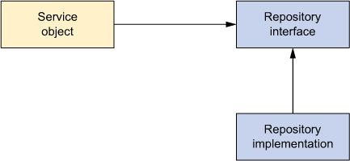
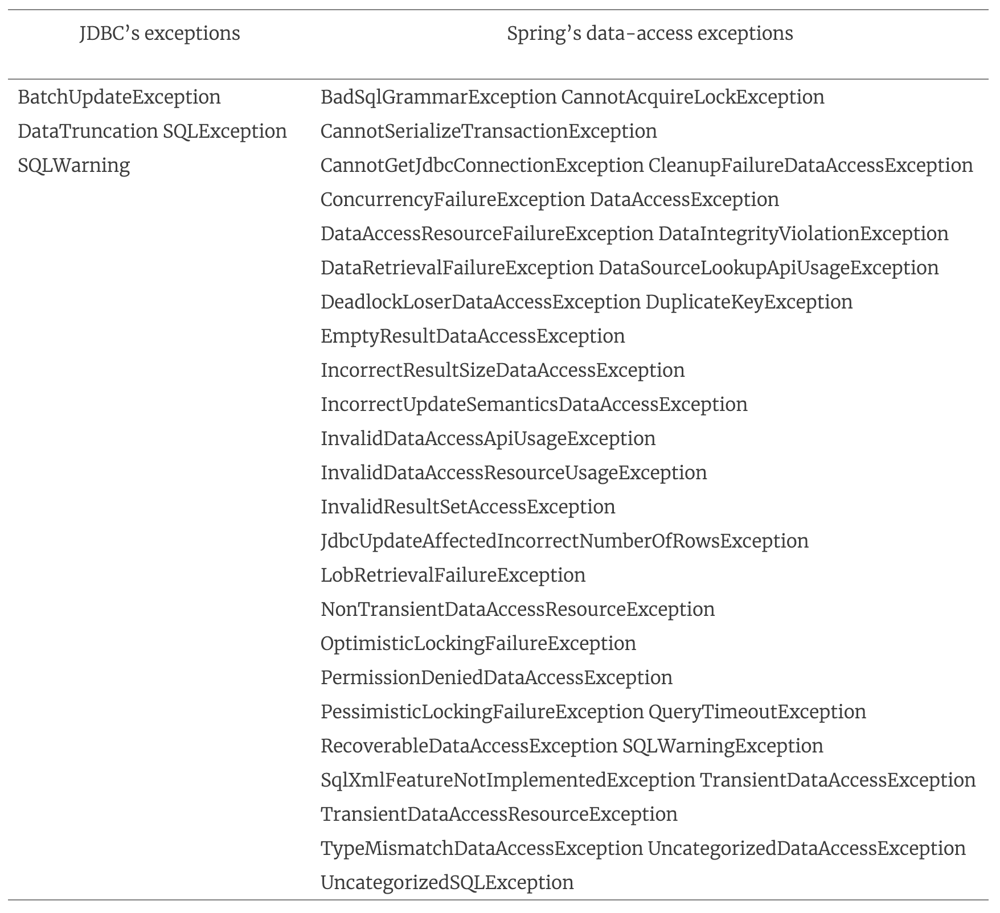
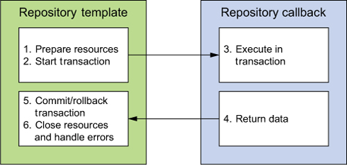

# 10강
[[toc]]
## 1. 스프링의 데이터 액세스 철학
- 어플리케이션 내 모든 컴포넌트에 걸쳐 퍼시스턴트 로직이 산란되는 것을 피하기 위해, 데이터 액세스는 해당 태스크에 집중된 하나 이상의 컴포넌트로 이루어진다. 보통 DAO라고 부른다.



- 서비스 객체는 자신의 데이터 액세스를 처리하지 않고, 데이터 액세스를 저장소에 위임한다.
- 저장소의 인터페이스는 서비스 객체에 루즈 커필링 한다.
- 스프링은 데이터 액세스 계층을 모든 퍼시스턴스 옵션을 가지는 일관적인 예외 계층 구조를 사용하여 어플리케이션의 나머지와 격리시킨다.

### 1-1. 스프링의 데이터 액세스 예외 계층 구조
- SQLException은 데이터 접근시 문제가 있다는 것은 알려주지만, 어떻게 해결하는지는 안알려준다.
- SQLException을 발생시키는 대표적인 문제들

```java
1. 어플리케이션이 데이터베이스에 연결될 수 없다.
2. 수행할 쿼리 문장에 문법적인 오류가 있다.
3. 쿼리 문장에서 참조하는 테이블이나 컬럼이 존재하지 않는다.
4. 레코드 삽입이나 업데이트 시도가 데이터베이스 제약 사항을 위배한다.
```

- 이런식으로 뭐가 잘못됐는지는 알려주긴 하지만, catch에서 해결 된다던가 할 수가 없다.
- 하이버네이트의 경우 20개 이상의 다양한 예외를 제공하고, catch에서 처리할 수 있지만, 그건 하이버네이트에만 특화된 예외 처리이다.
#
- 이러한 문제들을 해결해 주는게 스프링에서 제공해주는 퍼시스턴트 플랫폼이다.
- 스프링 JDBC는 앞에서 언급한 두가지 문제점을 해결하는 데이터 액세스 예외 계층을 제공한다.



- 이런식으로 엄청나게 많은 예외를 제고한다.

#

- 위의 예외들은 모두 DataAccessException을 확장한다.
- 이 예외들은 전부다 비검사형 예외라, 모두다 캐치를 안해도 상관없다.
- 스프링의 철학 같은 건데, 대부분의 예외들은 catch내에서 해결을 못하는 부분에서 나온다고 보고, 예외처리의 유무는 개발자에게 위임한다.

::: tip 검사형 예외가 throws 된다고 선언된 메소드는 호출 시 반드시 try-catch로 묶어줘야 한다.
SQL Exception이나 IOException 같은 경우가 대표적인 검사형 예외이다.
RuntimeException , NullPointException은 비검사형 예외이다.
보통 검사형 예외보단 비검사형 예외가 더 좋다는게 대세.
스프링이 좋은 이유중에 하나
:::

### 1-2. 데이터 액세스 템플릿화
- 비행기 수하물 예시
- [템플릿 메소드 패턴](https://zetawiki.com/wiki/Template_Method_%ED%8C%A8%ED%84%B4)을 이용한다.
- 템플릿 메소드는 어떤 알고리즘의 골격을 정의한다.
- 이 알고리즘 구조는 절대 변하지 않는다. 하지만 그 세부사항이 변경됨.
- 특정 메인 기능이 있으면, 그 기능에 대한 실제 세부 정의는 하위 클래스에 맡겨버린다.
- 스프링 데이터 액세스에 적용한 것이 바로 이 패턴
#
- 어떤 기술이나 디비를 사용하던지 간에 특정 데이터베이스 액세스 단계는 필수적이다. (메인 알고리즘)
- 하지만 작성할 데이터 액세스 메소드는 다르게 구현이 되어야 한다. (세부사항)
- 스프링은 데이터 액세스 절차상에서 고정된 단계와 가변적인 단계를 *템플릿* 과 *콜백* 이라는 별도 클래스로 분리한다.
- 템플릿은 고정된 부분을 처리하고, 콜백은 맞춤 데이터 액세스 코드를 처리한다.



- 위의 그림을 보면, 트랜잭션 제어나 리소스 관리, 예외처리같은 부분은 템플릿에서 처리해주고, 어플리케이션단에서는 쿼리생성이나, 결과 추출같은 부분을 담당한다.
- 이런 템플릿들을 스프링에선 여러가지를 제공해 준다.

|템플릿 클래스 | 용도 |
| --- | --- |
| CciTemplate | JCA CCI 연결 |
| JdbcTemplate | JDBC 연결 |
| NamedParameterJdbcTemplate | 명명된 파라미터가 지원되는 JDBC 연결 |
| SimpleJdbcTemplate | 스프링 3.1 이후부터 미제공 |
| HibernateTemplate | Hibernate 3.x 세션 |
| SqlMapClientTemplate | iBATIS SqlMap 클라이언트 |
| JdoTemplate | Java Data Object 구현체 |
| JpaTemplate | JPA 엔티티 관리자 |

## 2. 데이터 소스 설정
- 스프링 어플리케이션에 데이터 소스 빈 설정 방법

```java
1. JDBC 드라이버
2. JNDI
3. 커넥션을 풀링하는 데이터 소스
```

### 2-1. JNDI 데이터 소스
- 데이터 소스가 어플리케이션 외부에서 관리 되는 장점이 있다. (톰캣, JBoss..)

```java
@Bean
public JndiObjectFactoryBean dataSource() {
  JndiObjectFactoryBean jndiObjectFB = new JndiObjectFactoryBean();
  jndiObjectFB.setJndiName("jdbc/SpittrDS");
  jndiObjectFB.setResourceRef(true);
  jndiObjectFB.setProxyInterface(javax.sql.DataSource.class);
  return jndiObjectFB;
}
```

- 스프링에선 이런식으로 자바빈으로 설정이 가능하다

### 2-2. 풀링 기능이 있는 데이터 소스 사용하기
- 스프링은 풀링 긴으을 가진 데이터 소스를 제공하진 않고, 다른 라이브러리를 사용해야 한다.
```java
1. Apache 공통 DBCP
2. c3p0
3. BoneCP
```

- 아래는 DBCP의 BasicDataSource 설정 방법이다.

```java
@Bean
  public BasicDataSource dataSource() {
  BasicDataSource ds = new BasicDataSource();
  ds.setDriverClassName("org.h2.Driver");
  ds.setUrl("jdbc:h2:tcp://localhost/~/spitter");
  ds.setUsername("sa");
  ds.setPassword("");
  ds.setInitialSize(5);
  ds.setMaxActive(10);
  return ds;
}
```

- 이런식으로 BasicDataSource를 사용하여 풀링이 가능하다.

| 풀 설정 프로퍼티 | 설명 |
| ---- | ---- |
| initialSize | 해당 풀이 시작될 때 생성할 커넥션 수 |
| maxActive | 해당 풀에서 동시에 제공할 수 있는 최대 커넥션 수 |
| maxIdle | 해당 풀에서 동시에 휴면 상태로 유지될 수 있는 최대 커넥션 수 |
| maxOpenPreparedStatements | 질의객체 풀에서 동시에 제공할 수 있는 최대 PreparedStatement 수|
| maxWait | 해당 풀에 커넥션을 요청 했을때 대기가능한 최대 시간 |
| minEvictableIdleTimeMillis | 해당 풀에서 커넥션을 제거하기 전에 휴면 상태로 남아 있을 수 있는 시간 |
| minIdel | 해당 풀에서 동시에 휴면 상태로 유지될 수 있는 최소 커넥션 수 |
| poolPreparedStatements | PreparedStatement의 풀링 여부를 나타내는 boolean값 |

### 2-3. JDBC 드라이버 기반 데이터 소스
```java
1. DriverManagerDataSource : 어플리케이션이 커넥션을 요청할 때마다 새로운 커넥션 반환. 풀링은 안된다.
2. SimpleDriverDataSource : OSGi 컨테이너같은 특정 환경에서 발생하는 클래스 로딩문제를 극복하기 위한 데이터 소스
3. SingleConnectionDataSource : 항상 동일한 커넥션 반환
```

- 빈생성 방법은 BasicDataSource와 비슷하다.

```java
@Bean
public DataSource dataSource() {
  DriverManagerDataSource ds = new DriverManagerDataSource();
  ds.setDriverClassName("org.h2.Driver");
  ds.setUrl("jdbc:h2:tcp://localhost/~/spitter");
  ds.setUsername("sa");
  ds.setPassword("");
  return ds;
}
```

- 상용에서 쓰긴 별로이다.

### 2-4. 임베디드 데이터 소스 사용
- 개발이나 테스트할때 쓰기엔 좋음

```java
@Bean
public DataSource dataSource() {
  return new EmbeddedDatabaseBuilder()
      .setType(EmbeddedDatabaseType.H2)
      .addScript("classpath:schema.sql")
      .addScript("classpath:test-data.sql")
      .build();
}
```

### 2-5. 데이터 소스 선택을 위한 프로파일링하기
- 개발 환경에 따라 여러종류의 데이터소스들 중 적절한 것을 선택해주면 좋다.
```java
@Configuration
public class DataSourceConfiguration {

  @Profile("development")	
  @Bean
  public DataSource embeddedDataSource() {
    return new EmbeddedDatabaseBuilder()
        .setType(EmbeddedDatabaseType.H2)
        .addScript("classpath:schema.sql")
        .addScript("classpath:test-data.sql")
        .build();
  }

  @Profile("qa")	
  @Bean
  public DataSource Data() {
    BasicDataSource ds = new BasicDataSource();
    ds.setDriverClassName("org.h2.Driver");
    ds.setUrl("jdbc:h2:tcp://localhost/~/spitter");
    ds.setUsername("sa");
    ds.setPassword("");
    ds.setInitialSize(5);
    ds.setMaxActive(10);
    return ds;
  }

  @Profile("production")	
  @Bean
  public DataSource dataSource() {
    JndiObjectFactoryBean jndiObjectFactoryBean
                                          = new JndiObjectFactoryBean();
    jndiObjectFactoryBean.setJndiName("jdbc/SpittrDS");
    jndiObjectFactoryBean.setResourceRef(true);
    jndiObjectFactoryBean.setProxyInterface(javax.sql.DataSource.class);
    return (DataSource) jndiObjectFactoryBean.getObject();
  }
}
```

## 3. 스프링과 JDBC
### 3-1. 지저분한 JDBC 코드 해결
- JDBC가 데이터베이스와 밀접하게 동작하는 API를 제공하지만, 액세스 처리는 전부 개발자가 해야한다.

```java
private static final String SQL_INSERT_SPITTER =
 "insert into spitter (username, password, fullname) values (?, ?, ?)";
private DataSource dataSource;
public void addSpitter(Spitter spitter) {
  Connection conn = null;
  PreparedStatement stmt = null;
  try {
    conn = dataSource.getConnection();	
    stmt = conn.prepareStatement(SQL_INSERT_SPITTER);	
    stmt.setString(1, spitter.getUsername());	
    stmt.setString(2, spitter.getPassword());
    stmt.setString(3, spitter.getFullName());
    stmt.execute();	
  } catch (SQLException e) {
    // do something...not sure what, though	
  } finally {
    try {
      if (stmt != null) {	
        stmt.close();
      }
      if (conn != null) {
        conn.close();
      }
    } catch (SQLException e) {
      // I'm even less sure about what to do here
    }
  }
}
```

- 굉장히 너저분하다.
- 실제 필요한 로직은 얼마 안되는데, 기타 잡다한 부분에 대한 처리가 넘처난다.

```java
private static final String SQL_UPDATE_SPITTER =
      "update spitter set username = ?, password = ?, fullname = ?"
      + "where id = ?";
public void saveSpitter(Spitter spitter) {
  Connection conn = null;
  PreparedStatement stmt = null;
  try {
    conn = dataSource.getConnection();	
    stmt = conn.prepareStatement(SQL_UPDATE_SPITTER)	
    stmt.setString(1, spitter.getUsername());	
    stmt.setString(2, spitter.getPassword());
    stmt.setString(3, spitter.getFullName());
    stmt.setLong(4, spitter.getId());
    stmt.execute();	
  } catch (SQLException e) {
    // Still not sure what I'm supposed to do here	
  } finally {
    try {
      if (stmt != null) {	
        stmt.close();
      }
      if (conn != null) {
        conn.close();
      }
    } catch (SQLException e) {
      // or here
    }
  }
}
```

- 이건 비슷한 쿼리인데, 일부분을 제외하고 그전과 다를바가 없다.
- 단순반복적인 코드가 너무 많다

### 3-2 JDBC Template
- 위와 같은 더러운 문제를 해결하기 위해 JDBC Template을 사용해 보자
- 모든 JdbcTemplate은 DataSource가 있어야 작동한다.

```java
@Bean
public JdbcTemplate jdbcTemplate(DataSource dataSource) {
    return new JdbcTempalte(dataSource);
}
```

```java
@Repository
public class JdbcSpitterRepository implements SpitterRepository {
    private JdbcOperations jdbcOperations;

    @Inject
    public JdbcSpitterRepository(JdbcOperations jdbcOperations) {
        this.jdbcOperations = jdbcOperations;
    }
...
}

or

@Bean
public SpitterRepository spitterRepository(JdbcTemplate jdbcTemplate) {
    return new JdbcSpitterRepository(jdbcTemplate);
}
```

- 이런식으로 JdbcTemplate을 사용할 수 있도록 설정을 해준다.
#
- 이제 add 하는 메소드를 작성해보면

```java
public void addSpitter(Spitter spitter) {
    jdbcOperations.update(INSERT_SPITTER,	
        spitter.getUsername(),
        spitter.getPassword(),
        spitter.getFullName(),
        spitter.getEmail(),
        spitter.isUpdateByEmail());
}
```

- 커넥션, 질의객체 생성같은 삽질을 안해도 된다.
#
- 데이터 읽기 역시 간단해 진다.

```java
public Spitter findOne(long id) {
    return jdbcOperations.queryForObject(	// Spitter에 대한 쿼리
            SELECT_SPITTER_BY_ID, new SpitterRowMapper(), id	 // 객체로 매핑
        );
}

...

private static final class SpitterRowMapper implements RowMapper<Spitter> {
  public Spitter mapRow(ResultSet rs, int rowNum) throws SQLException {
    return new Spitter(	
        rs.getLong("id"),
        rs.getString("username"),
        rs.getString("password"),
        rs.getString("fullName"),
        rs.getString("email"),
        rs.getBoolean("updateByEmail"));
  }
}
```
#
- 자바 8 람다와 사용해 보자

```java
public Spitter findOne(long id) {
  return jdbcOperations.queryForObject(
    SELECT_SPITTER_BY_ID,
    (rs, rowNum) -&gt; {
      return new Spitter(
        rs.getLong("id"),
        rs.getString("username"),
        rs.getString("password"),
        rs.getString("fullName"),
        rs.getString("email"),
        rs.getBoolean("updateByEmail"));
    },
    id);
}
```

```java
public Spitter findOne(long id) {
  return jdbcOperations.queryForObject(
    SELECT_SPITTER_BY_ID, this::mapSpitter, id);
}

private Spitter mapSpitter(ResultSet rs, int row) throws SQLException {
    return new Spitter(
      rs.getLong("id"),
      rs.getString("username"),
      rs.getString("password"),
      rs.getString("fullName"),
      rs.getString("email"),
      rs.getBoolean("updateByEmail"));
}
```
#
- 명명된 파라미터를 사용할 수도 있다.
- 명명된 파라미터를 사용하면, SQL읭 각 파라미터에 명시적인 이름을 부여하게 되어, 질의객체 파라미터로 던저준다.
- 이름에 맞춰 넣어주니까 순서도 물론 필요가 없다.

```java
@Bean
public NamedParameterJdbcTemplate jdbcTemplate(DataSource dataSource) {
  return new NamedParameterJdbcTemplate(dataSource);
}
```

```java
private static final String INSERT_SPITTER =
        "insert into Spitter " +
        " (username, password, fullname, email, updateByEmail) " +
        "values " +
        " (:username, :password, :fullname, :email, :updateByEmail)";

public void addSpitter(Spitter spitter) {
    Map<String, Object> paramMap = new HashMap<String, Object>();
    paramMap.put("username", spitter.getUsername());	
    paramMap.put("password", spitter.getPassword());
    paramMap.put("fullname", spitter.getFullName());
    paramMap.put("email", spitter.getEmail());
    paramMap.put("updateByEmail", spitter.isUpdateByEmail());

    jdbcOperations.update(INSERT_SPITTER, paramMap);	
}
```