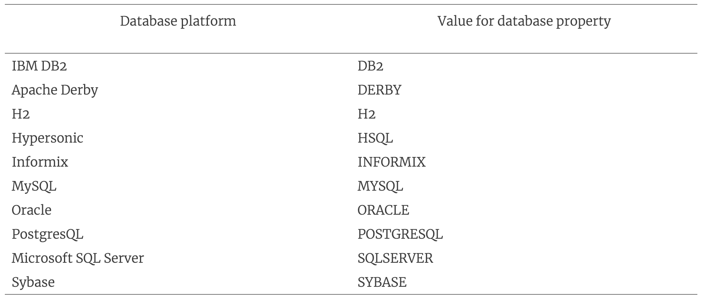
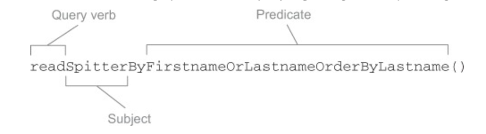

# 11강

[[toc]]

## Intro
- 퍼시스턴스 기술에서 필요한 복잡한 기술들
    - 지연 로딩 (lazy loading) : 필요한 데이터만 불러오고 로딩을 최대한 늦추는 기능
    - 조기 인출 (eager fetching) : 지연 로딩의 반대 개념. 한번의 쿼리로 전체 객체 구조를 가져오는 것. 한번의 연산으로 모든 데이터를 가져와서 매번 DB <-> 어플리케이션 비용을 줄임
    - 캐스케이딩 (cascading) : DB 테이블에 변경이 있을 때, 다른 테이블도 동일하게 변경되어야 하는 경우가 존재한다.

<hr />

- 이런 서비스들을 객체 관계 매핑 (ORM, Obeject-Relational-Mapping) 라고 부른다.
- 어플리케이션의 퍼시스턴스 계층에 ORM 도구를 사용하면 많은 양의 코드를 줄이고 개발 시간을 단축한다.
- SQL문도 안써서 오류를 줄일 수도 있어 요구사항에 좀더 집중하게 만들어준다.

<hr />

- 스프링은 ORM 프레임워크를 지원하기 위해 다음과 같은 부가적인 서비스를 제공한다.
    - 스프링의 선언적 트랜잭션에 대한 통합된 지원
    - 투명한 예외 처리
    - 스레드 안정성을 갖춘 경량의 템플릿 클래스
    - DAO 지원 클래스
    - 자원 관리

## 1. 스프링과 하이버네이트 통합
### 1-1. 하이버네이트 세션 팩토리 선언
- org.hibernate.Session은 하이버네이트 작업에 가장 중심이 되는 인터페이스
- Session 인터페이스는 데이터베이스로부터 객체에대한 저장, 업데이트, 삭제, 로드같은 기본적인 데이터 엑세스 기능을 제공한다.
- Session 객체 레퍼런스를 얻으려면 SessionFactory 인터페이스를 사용해야 한다.
- 스프링에서 하이버네이트 Session 설정하는 팩토리 빈
    - org.springframework.orm.hibernate3.LocalSessionFactoryBean
    - org.springframework.orm.hibernate3.annotation.AnnotationSession-FactoryBean
    - org.springframework.orm.hibernate4.LocalSessionFactoryBean
- 이러한 세션 팩토리 빈은 스프링의 FactoryBean 인터페이스의 구현체이다.

<hr />

- 하이버네이트 3.2 ~ 4.0 사이의 버전을 XML로 매핑한다면, 스프링의 org.springframework.orm.hibernate3.LocalSessionFactoryBean 을 사용해 빈 설정을 해준다.

```java
@Bean
public LocalSessionFactoryBean sessionFactory(DataSource dataSource) {
  LocalSessionFactoryBean sfb = new LocalSessionFactoryBean();
  sfb.setDataSource(dataSource);
  sfb.setMappingResources(new String[] { "Spitter.hbm.xml" });
  Properties props = new Properties();
  props.setProperty("dialect", "org.hibernate.dialect.H2Dialect");
  sfb.setHibernateProperties(props);
  return sfb;
}
```

- 하이버네이트 4가 아니고 어노테이션을 사용하면 AnnotationSessionFactoryBean 을 사용한다.
```java
@Bean
public AnnotationSessionFactoryBean sessionFactory(DataSource ds) {
  AnnotationSessionFactoryBean sfb = new AnnotationSessionFactoryBean();
  sfb.setDataSource(ds);
  sfb.setPackagesToScan(new String[] { "com.habuma.spittr.domain" });
  Properties props = new Properties();
  props.setProperty("dialect", "org.hibernate.dialect.H2Dialect");
  sfb.setHibernateProperties(props);
  return sfb;
}
```

- 하이버네이트 4를 사용한다면 org.springframework.orm.hibernate4.LocalSessionFactoryBean
```java
@Bean
public LocalSessionFactoryBean sessionFactory(DataSource dataSource) {
  LocalSessionFactoryBean sfb = new LocalSessionFactoryBean();
  sfb.setDataSource(dataSource);
  sfb.setPackagesToScan(new String[] { "com.habuma.spittr.domain" });
  Properties props = new Properties();
  props.setProperty("dialect", "org.hibernate.dialect.H2Dialect");
  sfb.setHibernateProperties(props);
  return sfb;
}
```

- 3버전과 차이점은 하이버네이트 매핑 파일을 나열하는 대신, packagesToScan으로 패키징을 검사한다.
- JPA 의 @Entity나 @MappingSuperclass, 하이버네이트의 @Entity 가 포함된다.
- class 명으로도 가능하다.

```java
sfb.setAnnotationClasses(new Class<?>[] { Spitter.class, spittle.class });
```
- 몇 개 안되는 도메인 설정을 할 땐 annotatedClass 가 나쁘진 않다.
- 많거나, 모두 나열하고 싶지 않으면 pacakgesToScan 이 더 적합하다.

### 1-2. 스프링으로부터 해방된 하이버네이트 구성
- 하이버네이트 상황 세션을 이용한다.
- 하이버네이트 SessionFactory를 직접 저장소에 와이어링한다.

```java
@Repository
public class HibernateSpitterRepository implements SpitterRepository {

    private SessionFactory sessionFactory;

    @Inject
    public HibernateSpitterRepository(SessionFactory sessionFactory) {
        this.sessionFactory = sessionFactory;	
    }

    private Session currentSession() {
        return sessionFactory.getCurrentSession();	
    }

    public long count() {
        return findAll().size();
    }

    public Spitter save(Spitter spitter) {
        Serializable id = currentSession().save(spitter);	

        return new Spitter((Long) id,
                spitter.getUsername(),
                spitter.getPassword(),
                spitter.getFullName(),
                spitter.getEmail(),
                spitter.isUpdateByEmail());
    }

    public Spitter findOne(long id) {
        return (Spitter) currentSession().get(Spitter.class, id);
    }

    public Spitter findByUsername(String username) {
        return (Spitter) currentSession()
                .createCriteria(Spitter.class)
                .add(Restrictions.eq("username", username))
                .list().get(0);
    }

    public List<Spitter> findAll() {
        return (List<Spitter>) currentSession()
                .createCriteria(Spitter.class).list();
    }

}
```

## 2. 스프링과 자바 퍼시스턴스 API

### 2-1. 엔티티 관리자 팩토리 설정
- JPA로 만든 어플리케이션은 EntityManagerFactory의 구현 객체를 이용해 EntityManager의 인스턴스를 획득해야 한다.
- JPA 명세서의 2가지 엔티티 관리자

```java
1. 어플리케이션 관리형 (application managed)
어플리케이션이 엔티티 관리자 팩토리에서 직접 엔티티 관리자를 요청함으로써 엔티티 관리자가 생성되는 유형이다.
해당 엔티티 관리자를 사용하면, 어플맄이션이 엔티티 관리자를 열고 닫고를 해야하고, 트랜잭션에 엔티티 관리자를
연관시키는 일까지 직접 해야됨.
-> 자바 EE 컨테이너 없이 실행되는 독립형 어플리케이션에 적합

2. 컨테이너 관리형 (container-managed)
자바 EE 컨테이너에 의해 생성되고 관리되는 엔티티 관리자.
어플리케이션은 엔티티 관리자 팩토리와 직접 상호작용하지 않고, 대신 엔티티 관리자를 종속객체주입(DI)나 
JNDI를 통해 직접적으로 획득하는 방식. 
이 유형의 엔티티 관리자는 단순히 persistence.xml로 지정한 것 이상의 자바 EE 컨테이너 서비스를 제공받을때 유리
```

- 유형은 다르더라도 모든 엔티티 관리자는 동일한 EntityManager 인터페이스를 구축한다.
- 차이는 EntityManager가 생성되고 관리되는 방식
- 근데 스프링 쓰면 뭐 알아서 관리해줘서 별 큰 차이가 없다.
    - LocalEntityManagerFactoryBean : 어플리케이션 관리형 EntityManagerFactory 생성
    - LocalContainerEntityManagerFactoryBean : 컨테이너 관리형 EntityManagerFactory 생성

#### 어플리케이션 관리형 JPA 구성하기
- 어플리케이션 관리형 엔티티 팩토리 설정은 대부분 META-INF 안의 persistence.xml 설정파일에서 가저온다.

```xml
<persistence xmlns="http://java.sun.com/xml/ns/persistence"
      version="1.0">
    <persistence-unit name="spitterPU">
      <class>com.habuma.spittr.domain.Spitter</class>
      <class>com.habuma.spittr.domain.Spittle</class>
      <properties>
        <property name="toplink.jdbc.driver"
            value="org.hsqldb.jdbcDriver" />
        <property name="toplink.jdbc.url" value=
            "jdbc:hsqldb:hsql://localhost/spitter/spitter" />
        <property name="toplink.jdbc.user"
            value="sa" />
        <property name="toplink.jdbc.password"
            value="" />
      </properties>
    </persistence-unit>
  </persistence>
```

- 이런식으로 persistence unit을 설정해주고

```java
@Bean
public LocalEntityManagerFactoryBean entityManagerFactoryBean() {
    LocalEntityManagerFactoryBean emfb = new LocalEntityManagerFactoryBean();
    emfb.setPersistenceUnitName("spitterPU");
    return emfb;
}
```

- 이렇게 빈으로 등록해준다.
- 하지만 이런건 스프링에서 쓰기가 어렵다.

#### 컨테이너 관리형 JPA 구성하기
- 데이터소스 세부 정보를 persistence.xml에 설정하는 대신, 자바 빈으로 설정해준다.

```java
@Bean
public LocalContainerEntityManagerFactoryBean entityManagerFactory(
    DataSource dataSource, JpaVendorAdapter jpaVendorAdapter) {
        LocalContainerEntityManagerFactoryBean emfb = 
            new LocalContainerEntityManagerFactoryBean();
        emfb.setDataSource(dataSource);
        emfb.setJpaVendorAdapter(jpaVendorAdapter);      
        return emfb;
}
```

- 스프링에서 설정한 dataSource를 사용하고, jpaVenderAdapter로 특정 JPA 구현체에 대해 특화된 정보를 제공한다.

```java
@Bean
public JpaVendorAdapter jpaVendorAdapter() {
    HibernateJpaVendorAdapter adapter = new HibernateJpaVendorAdapter();
    adapter.setDatabase("HSQL");
    adapter.setShowSql(true);
    adapter.setGenerateDdl(false);
    adapter.setDatabasePlatform("org.hibernate.dialect.HSQLDialect");
}
```

- 어댑터 설정에 제일 중요한 것은 database 프로퍼티로 사용할 데이터베이스를 정하는 것이다.



- LocalContainerEntityManagerFactoryBean으로 트릭키하게 사용도 가능하다.
- persistence.xml의 주목적은 퍼시스턴스 유닛에서 엔티티 클래스를 구별하는것이다.
- 하지만 pacakageToScan 프로퍼티를 사용해 LocalContainerEntityManagerFactoryBean을 직접 사용하면 편하다.

```java
@Bean
public LocalContainerEntityManagerFactoryBean entityManagerFactory(
        DataSource dataSource, JpaVendorAdapter jpaVendorAdapter) {
  LocalContainerEntityManagerFactoryBean emfb =
      new LocalContainerEntityManagerFactoryBean();
  emfb.setDataSource(dataSource);
  emfb.setJpaVendorAdapter(jpaVendorAdapter);
  emfb.setPackagesToScan("com.habuma.spittr.domain");
  return emfb;
}
```

- 이런식으로 ~.domian 패키지안의 @Entity를 스캔한다.
- 따라서 그지같은 xml은 필요없다.
- *LocalContainerEntityManagerFactoryBean*을 적극 활용하자

#### JNDI에서 EntityManagerFactory 가져오기
- 서버에 JNDI 설정을 해주다.

```xml
<jee:jndi-lookup id="emf" jndi-name="persistence/spitterPU" />
```

- 자바 빈설정 

```java
@Bean
public JndiObjectFactoryBean entityManagerFactory() {
    JndiObjectFactoryBean jndiObjectFB = new JndiObjectFactoryBean();
    jndiObjectFB.setJndiName("jdbc/SpittrDS");
    return jndiObjectFB;
}
```

### 2-2. JPA 기반 저장소 작성
- 스프링의 JpaTemplate에 의존하지 않는 JPA 저장소 개발하는 방법 기반

```java
@Repository
@Transactional
public class JpaSpitterRepository implements SpitterRepository {

    @PersistenceUnit
    private EntityManagerFactory emf;	// EntityManagerFactory 주입

    public void addSpitter(Spitter spitter) {
      emf.createEntityManager().persist(spitter);	// EntityManager 생성 및 사용
    }

    public Spitter getSpitterById(long id) {
      return emf.createEntityManager().find(Spitter.class, id);
    }

    public void saveSpitter(Spitter spitter) {
      emf.createEntityManager().merge(spitter);
    }
  ...
}
```

- EntityManagerFactory 를 사용해서 데이터베이스 대상 동작을 수행하도록 소스 구성
- EntityManager가 스레드 세이프하지 않아 계속 생성되어 문제가 복잡해 질 수 있다.

```java
@Repository
@Transactional
public class JpaSpitterRepository implements SpitterRepository {

  @PersistenceContext
  private EntityManager em;	// EntityManager 주입

  public void addSpitter(Spitter spitter) {
    em.persist(spitter);	// EntityManager 사용
  }

  public Spitter getSpitterById(long id) {
    return em.find(Spitter.class, id);
  }

  public void saveSpitter(Spitter spitter) {
    em.merge(spitter);
  }
...
}
```

- 새로운 소스는 EntityManager를 직접 주입되어 사용되어지다. EntityManagerFactory에서 계속 생산할 필요 X
- 하지만 여전히 쓰레드 세이프 하지않는다.
- 그래서 쓰는게 @PersistenceContext
- @PersistenceContext는 EntityManager를 주입하지 않고, 저장소에 EntityManager를 주고, 실제로는 EntityManager에 대한 프록시를 제공하는 형태이다. -> 스레드 세이프하다.
- @PersistenceUtil & @PersistenceContext는 스프링께 아니다. 
- 스프링이 EntityManagerFactory || EntityManager를 주입하려면, PersistenceAnnotationBeanPostProcessor를 구성해야한다.

```java
@Bean
public PersistenceAnnotationBeanPostProcessor paPostProcessor() {
  return new PersistenceAnnotationBeanPostProcessor();
}
```

## 3. 스프링 데이터를 사용한 자동 JPA 저장소
- 위의 소스들은 메소드가 매우 간단해 보이지만, 데이터베이스에 쿼리를 하기 위해서 EntityManager와 직접 상호연동을 한다.
- 근데 보면 좀 쓸모없는 부분 탐색도 하고 그런다.

```java
public void addSpitter(Spitter spitter) {
    entityManger.persist(spitter);
}
```

```java
public interface SpitterRepository extends JpaRepository<Spitter, Long> {}
```
- 스프링 데이터 JPA 저장소 작성 키는 인터페이스 중 하나의 확장이다.
- 여기서 SpitterRepository는 스프링 데이터 JPA의 JpaRepository를 확장한다.
- 이제 스프링 데이터 JPA를 설정해 본다.
- @EnableJpaRepositories를 사용해 설정이 가능하다.

```java
// 스프링 데이터 JPA 설정
@Configuration
@EnableJpaRepositories(basePackages="com.habuma.spittr.db")
public class JpaConfiguration {
  ...
}
```

- 저장소는 스프링 어플리케이션 컨텍스트가 생성되는 것처럼, 어플리케이션 시작 시간에 저장소가 구현이 된다.
- JpaRepository 를 확장해서 구현했기 때문에, 자동으로 SpitterRepository 구현을 진행한다.
- 스프링 데이터 JPA는 퍼시스턴스 코드를 따로 작성할 필요 없이 Spitter객체의 일반 JPA 동작을 위한 18개의 메소드를 제공한다.
- 즉 자동설정이 가능하다는 소리.

### 3-1. 쿼리 메소드 정의하기

```java
public interface SpitterRepository extends JpaRepository<Spitter, Long> {
    Spitter findByUsername(String username);
}
```

- SpitterRepository에서 findByUsername()을 추가하기 위해 구현할 것은 없다. 
- 메소드 시그니처는 메소드 구현체를 만들기 위해 알아야 할 모든 것을 스프링 데이터 JPA에 알려준다.
- 저장소를 만들때, 스프링데이터는 메소드들을 검증하고 파싱하고 하면서 메소드가 무슨 역할을 하는지 이해하고 알아서 만든다..(?)
- JpaRepository가 Spitter로 파라미터화 되므로 스프링 데이터는 이 메소드의 용도가 Spitter를 찾는걸 알아낸다.(..!)
- 신기

<hr />

- 저장소 메소드는 
    - 동사
    - 선택대상
    - 단어 By 및 조건
- 으로 구성된다.
- findByUsername()은 찾는 동작을 나타내고, 조건은 사용자명을 나타내고, 대상은 지정안되도 Spitter임을 안다.



- 결국 JPA 레파지토리내 메소드는 동사 + 선택대상 + 단어 및 조건으로 알아서 메소드를 생성해준다.
- OrderBy 같은거 넣어서 순서 정렬도 된다
```java
List<Spitter> readByFirstnameOrLastnameOrderByLastnameAsc(String first, String last);
```

- 조건은 And Or 로 분리된다.

### 3-2 맞춤형 쿼리 선언하기
- 물론 가끔은 메소드 선언으로 쿼리를 나타내는데 한계가 있을 수 있다.

```java
List<Spitter> findAllGmailSpitters();
```

- 위의 메소드 명은 스프링 데이터의 메소드 명명 규칙을 준수하지 않는다.
- 스프링 데이터가 이 메소드를 위한 구현체를 만들고자 할 때, 메소드 명의 내용과 Spitter 메타 모델이 매칭이 되지 않으면서 예외가 발생한다.
- 이런상황에선 @Query 메소드를 쓴다.

```java
@Query("select s from Spitter s where s.email like '%gmail.com'")
List<Spitter> findAllGmailSpitters();
```

- 아직은 메소드 구현을 만들 순 없다, 단지 스프링 데이터 JPA에 메소드 구현에 대한 힌트를 주기 위해 쿼리를 수행했을 뿐
- 아주 긴 이름에도 쓰기 좋다.

```java
List<Order>
  findByCustomerAddressZipCodeOrCustomerNameAndCustomerAddressState();
```

- 이런건 이름이 너무 길어 이해하기 어려우니 @Query 어노테이션을 사용해 보자

### 3-3. 맞춤형 기능 혼합
- @Query도 안먹히는게 있다.
- 옛날 방식, 즉 EntityManager를 직접 사용할 필요가 있을수도 있다.
- 이렇게되면 JPA를 버려야 하는가 싶지만, 그럴 필요없이 설정이 가능하다.

<hr/>

1. 스프링 데이터 JPA는 저장소 인터페이스 구현체를 생성하고, Impl 접미어를 가지는 인터페이스의 이름과 같은 클래스를 찾는다.

2. 클래스가 존재하는 경우, 스프링 데이터 JPA는 스프링 데이터 JPA에 의해 생성된 방법과 병합된다.

3. SpitterRepository 인터페이스의 경우, 그것을 찾는 클래슨느 SpitterRepositoryImpl이라는 이름으로 지정된다.

4. 1000회 이상의 spittle을 게시한 모든 Spitter를 업데이트하는 SpitterRepository 메소드가 필요하다고 가정하고, Spitter는 엘리트 상태로 설정한다.

5. 기존처럼 JPA의 메소드 명명법을 따르거나, @Query로 명명해도 되지만, eliteSweep() 메소드를 사용하는 방법이 있다.

```java
public class SpitterRepositoryImpl implements SpitterSweeper {

  @PersistenceContext
  private EntityManager em;

  public int eliteSweep() {
    String update =
        "UPDATE Spitter spitter " +
        "SET spitter.status = 'Elite' " +
        "WHERE spitter.status = 'Newbie' " +
        "AND spitter.id IN (" +
        "SELECT s FROM Spitter s WHERE (" +
        "  SELECT COUNT(spittles) FROM s.spittles spittles) > 10000" +
        ")";
    return em.createQuery(update).executeUpdate();
  }
}
```

- 특별하진 않다. 주입된 EntityManager를 사용한다.
- SpitterRepositoryImpl은 SpitterRepository를 구현하지 않는다, 스프링 데이터 JPA가 책임을 짐
- 대신 SpitterSweeper를 구현하며, 다음과 같이 나타낼 수 있다.

```java
public interface SpitterSweeper {
    int eliteSweep();
}
```

```java
public interface SpitterRepository extends JpaRepository<Spitter, Long>, SpitterSweeper{
    ...
}
```

- 언급한 대로, 구현체 명이 인터페이스 명에 기반을 두므로 스프링 데이터 JPA는 인터페이스와 구현 클래스를 연관시킨다.
- Impl 접미어는 기본적으로 사용된다.
- 만약 다른거 원하면 repositoryImplementationPostfix 어트리뷰트를 설정하여 @EnableJpaRepositories에 넣는다.

```java
@EnableJpaRepositories(
  basePackages="com.habuma.spittr.db",
  repositoryImplementationPostfix="Helper")
```

- 이렇게 하면 스프링 데이터 JPA는 SpitterRepository 인터페이스를 매칭하기 위해 SpitterRepositoryHelper 클래스를 찾게 된다.