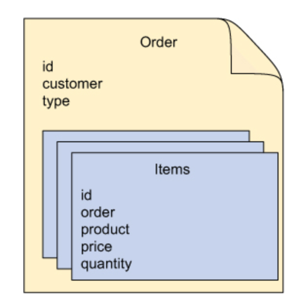
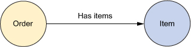
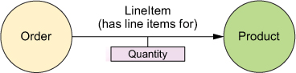

# 12강

[[toc]]

## 1. MongoDB의 유지성 도큐먼트
- MongoDB는 오픈소스 도큐먼트 데이터 베이스
- 스프링 데이터 MongoDB는 스프링 어플리케이션이 MongoDB를 사용하는 다음과 같은 세가지 기능을 지원해준다.
    - 객체 도큐먼트 매핑을 위한 어노테이션
    - MongoTemplate을 사용한 템플릿 기반의 데이터베이스 액세스
    - 자동 런타임 저장소 생성
- MongoDB도 스프링 데이터 JPA와 비슷하게 자동 저장소 생성 설정을 해준다.

:::tip
도큐먼트 데이터베이스를 언제 써야될지 확실하게 판단해야 한다. 도큐먼트 데이터베이스는 일반적인 목적의 디비가 아니며, 
문제를 해결하기 위한 좁은 범위의 세트를 가진다.

도큐먼트 데이터베이스는 중요 관계성을 가지는 데이터를 저장히기 위한 튜닝이 잘 되어있진 않다.
예를 들어 SNS의 사용자 사이에 어떠한 연관이 있는지 같은 데이터 저장엔 좋지 않다.
:::

### 1-1. MongoDB 활성화
- 스프링에서 필수적으로 설정해야할 빈
    - MongoClient 빈
    - MongoTemplate 빈

```java
@Configuration
@EnableMongoRepositories(basePackages="order.db") // MongoDB 저장소 활성화
public class MongoConfig {

    @Bean
    public MongoFactoryBean mongo() {  // MongoClient 빈
        MongoFactoryBean mongo = new MongoFactoryBean();
        mongo.setHost("localHost");
        return mongo;
    }

    @Bean
    public MongoOperations mongoTemplate(Mongo mongo) { // MongoTemplate 빈
        return new MongoTemplate(mongo, "OrdersDB");
    }
}
```

- @EnableMongoRepositories 는 JPA의 @EnableJpaRepositories와 비슷한 역할
- MongoFactoryBean은 스프링 데이터 MongoDB와 데이터베이스 간의 다리 역할을 한다.
    - 관계형 DB에서의 DataSource와는 역할이 다르다.
- 데이터베이스에 쿼리하기 위해서 MongoTemplate이 필요하다
    - 직접적으로 사용하지 않더라도, 자동생성된 저장소를 사용할 수 있으므로 이 빈은 필요하다.
- 직접 이 빈을 선언하는 것 보다는 설정클래스를 AbstractMongoConfiguration을 확장하고, getDatabaseName(), mongo()를 오버라이드 한다.

```java
@Configuration
@EnableMongoRepositories("orders.db")
public class MongoConfig extends AbstractMongoConfiguration {
    
    @Overrride
    protected String getDatabaseName() {  // 데이터베이스 명 지정
        return "OrdersDB"
    }

    @Override
    public Mongo mongo() throws Exception {  // Mongo 클라이언트 생성
        return new MongoClient();
    }
}
```

- 위의 설정과 차이점은 MongoTemplate 빈을 선언하지 않는다.
- 대신 데이터베이스 명을 제공하기 위한 getDatabaseName()을 오버라이드 한다.
- mongo()는 MongoClient를 설정한다.
- MongoDB가 다른 서버에서 동작을 한다면 다음과 같이 설정한다.

```java
public Mongo mongo() throws Exception {
    return new MongoClient("mongodbserver", 37017);
}
```
- MongoDB 서버가 제품 세팅으로 동작할 경우, 인증이 필요하다.

```java
@Autowired
private Environment env;

@Override
public Mongo mongo() throws Exception {
    MongoCredential credential = MongoCredential.createMongoCRCredential(
        env.getProperty("mongo.username"),
        "OrdersDB",
        env.getProperty("mongo.password").toCharArray());
    
    return new MongoClient(
        new ServerAddress("localhost", 37017),
        Arrays.asList(credential));
}
```

- 찾아보니까 현재 [AbstractMongoConfiguration](https://docs.spring.io/spring-data/data-mongodb/docs/current/api/org/springframework/data/mongodb/config/AbstractMongoConfiguration.html)은 deprecated 됐고, [AbstractMongoClientConfiguration](https://docs.spring.io/spring-data/data-mongodb/docs/current/api/org/springframework/data/mongodb/config/AbstractMongoClientConfiguration.html) 이거로 쓰는 듯 하다.

### 1-2. MongoDB 퍼시스턴트를 위한 어노테이션 모델 타입
- 객체 - 도큐먼트 매핑을 위한 스프링 데이터 MongoDB 어노테이션

| 어노테이션 | 내용 |
| --- | --- |
| @Document | MongoDB 도큐먼트로 매칭될 수 있는 도메인 객체 구별 |
| @Id | ID 필드임을 표시 |
| @DbRef | 다른 데이터베이스의 다른 도큐먼트를 참조하기 위한 필드임을 표시 |
| @Field | 도큐먼트 필드를 위한 맞춤형 메타데이터 정의 |
| @Version | 버전 필드로 사용되는 프로퍼티 구별 |

- @Document와 @Id 어노테이션은 JPA 의 @Entity와 @Id 어노테이션과 유사하다.
- MongoDB에 있는 Order 클래스 예시

```java
@Document
public class Order {

    @Id
    private String id;

    @Field("client")
    private String customer; // 기본 필드명 오버라이드

    private String type;

    private Collection<Item> items = new LinkedHashSet<Item>();

    public String getCustomer() {
        return customer;
    }

    public void setCustomer(String customer) {
        this.customer = customer;
    }

    public String getType() {
        return type;
    }

    public void setType(String type) {
        this.type = type;
    }

    public Collection<Item> getItem() {
        return items;
    }

    public void setItems(Collection<Item> items) {
        this.items = items;
    }

    public String getId() {
        return id;
    }
}
```

- Order는 @Document로 어노테이션 되며, MongoTemplate을 사용하여 지속성을 가질 수 있고, 자동으로 저장소를 생성한다.
- @ID는 도큐먼트의 ID를 나타내고, @Field로 매핑된 customer는 도큐먼트가 지속 유지될 때 field로 명명된 클라이언트로 매핑된다.
- 다른 프로퍼티들은 어노테이션되지 않는다.
- 프로퍼티들이 일시적인 상태로 마킹되지 않는다면, 자바 객체의 모든 필드는 도큐먼트 필드로 지속된다.



- 도큐먼트는 데이터 관계를 가지지만, 비정규화 되어있다.
- 위의 그림을 보면, 그림의 순서대로 아이템 컬렉션을 갖는다.
- 전형적인 관계형 데이터 세팅을 가지고, 아이템들은 외래 키로 참조된 독립 데이터베이스 테이블에서 관리되고, 아이템 필드는 @OneToMany로 JPA 어노테이션을 사용한다.
- 도큐먼트는 다른 도큐먼트와 관련이 있지만, 어떤 도큐먼트 데이터 베이스가 적합한지를 알기가 어렵다.
- 구매 순서와 라인 아이템 사이의 관계에서 라인 아이템들은 동일 주문 도큐먼트의 중첩된 파트에 속한다.(...)

```java
package orders;

public class Item {

  private Long id;
  private Order order;
  private String product;
  private double price;
  private int quantity;

  public Order getOrder() {
    return order;
  }

  public String getProduct() {
    return product;
  }

  public void setProduct(String product) {
    this.product = product;
  }

  public double getPrice() {
    return price;
  }

  public void setPrice(double price) {
    this.price = price;
  }

  public int getQuantity() {
    return quantity;
  }

  public void setQuantity(int quantity) {
    this.quantity = quantity;
  }

  public Long getId() {
    return id;
  }
}
```

- items는 순수한 pojo다.
- @Field 어노테이션을 사용해 도큐먼트에 어떻게 저장되는지 나타낼 수도 있긴하다.

### 1-3. MongoTemplate을 사용하여 MongoDB 액세스하기
```java
@Autowired
MongoOperations mongo;
```

- 이렇게 MongoOperations 타입으로 주입해준다.
- MongoOperations는 MongoDB 도큐먼트 데이터베이스를 사용하기 위한 메소드를 제공한다.

```java
// 주문 컬렉션으로 카운트를 하는 메소드
long orderCount = mongo.getCollection("order").count();
```

```java
// 새 주문을 추가하는 메소드
Order order = new Order();
... // 프로퍼티를 설정하고, 라인 아이템을 추가한다.
mongo.save(order, "order");
```

- save()의 첫번째 파라미터는 새로 생성된 order 객체이고, 두번째는 저장해야 할 도큐먼트 저장명이다.

```java
// orderId 로 찾는 메소드
String orderId = ...;
Order order = mongo.findById(orderId, Order.class);
```

```java
List<Order> chucksOrders = mongo.find(Query.query(Criteria.where("client")
    .is("Chuck Wagon").and("type").is("WEB")), Order.class);
```

```java
// document 삭제
mongo.remove(order);
```

### 1-4. MongoDB 저장소 작성하기.
- JPA와 비슷하게, 저장소 구현체 폼을 만들 수 있는 인터페이스를 만들면 된다.

```java
// 스프링 데이터 MongoDB의 자동 저장소 인터페이스 구현
public interface OrderRepository extends MongoRepository<Order, String> {

}
```

- OrderRepository는 MongoRepository를 확장하므로 저장소 마커 인터페이스를 확장한다.
- OrderRepository의 구현체가 런타임시에 생성되어 MongoDB 도큐먼트 데이터베이스에 읽기/쓰기를 한다.
- MongoRepository는 @Document 어노테이션된 객체타입과, @Id 가 매핑된 변수 타입을 파라미터로 받는다.
- 즉 따로 OrderRepository가 자신의 메소드를 정의하지 않아도, 여러개의 메소드를 자동 상속한다.

| 메소드 | 내용 |
| --- | --- |
| long count() | 저장소 타입용 도큐먼트 카운트 반환 |
| void delete(Iterable<? extends T>) | 주어진 객체와 관련된 모든 모든 도큐먼트 삭제 |
| void delete(T) | 주어진 객체와 관련된 도큐먼트 삭제 |
| void delete(ID) | ID 로 도큐먼트 삭제 |
| void deleteAll() | 주어진 저장소 타입의 모든 도큐먼트 삭제 |
| boolean exists(Object) | 주어진 객체와 관련된 도큐먼트가 존재하면 참 반환 |
| boolean exists(ID) | 주어진 ID에 대한 도큐먼트가 존재하면 참 반환 |
| List<T> findAll() | 저장소 타입별 모든 도큐먼트 반환 |
| List<T> findAll(Iterable<ID>) | 주어진 도큐먼트 ID 별 모든 도큐먼트 반환 |
| List<T> findAll(Pageable) | 저장소 타입에 대한 페이징과 정렬된 도큐먼트 리스트 반환 |
| T findOne(ID) | 주어진 ID에 대한 단일 도큐먼트 반환 |
| < S extends T > Iterable< S> save(Iterable< S >) | 주어진 Iterable의 모든 도큐먼트 저장 |
| < S extends T > S save(S) | 주어진 객체에 대한 단일 도큐먼트 저장 |


#### 맞춤형 쿼리 메소드 추가
- MongoDB도 JPA와 비슷하게 명명 규칙을 사용해 맞춤형 메소드를 지원한다.

```java
public interface OrderRepository extends MongoRepository<Order, String> {
    List<Order> findByCustomer(String c);
    List<Order> findByCustomerLike(String c);
    List<Order> findByCustomerAndType(String c, String t);
    List<Order> findByCustomerLikeAndType(Stirng c, String t);
}
```

- Order에서 Customer를 찾는데, 타입이라던가, Like 같은거로 찾는다.

```java
List<Order> getByCustomer(String c);
```

- find 쿼리문은 get을 사용해도 된다.

```java
List<Order> readByCustomer(String c);
```

- 또는 read로 바꿔도된다.

```java
int countByCustomer(String c);
```

```java
List<Order> findOrderByCustomer(String c);
```

```java
Order findASingleOrderByCustomer(String c);
```

#### 쿼리 지정하기
- @Query사용도 가능하다

```java
@Query("{'customer': 'Chuck Wagon', 'type': ?0}")
List<Order> findChucksOrders(String t);
```

- @Query의 json은 모든 Order 도큐먼트를 대상으로 매칭되는지 파악하며, 매칭되는 도큐먼트가 반환된다.
- type 프로퍼티는 ?0에 매핑된다. 0번째 파라미터라는 뜻

#### 맞춤형 저장소 동작의 혼합
- JPA와 마찬가지로 섞어 쓸 수있다. [link](http://gwegwe1234.github.io/study-collection/book/spring-in-action/011.html#_3-3-%EB%A7%9E%EC%B6%A4%ED%98%95-%EA%B8%B0%EB%8A%A5-%ED%98%BC%ED%95%A9)
- 맞춤형 메소드와 맞춤형 메소드에 대한 구현 클래스를 선언하는 중간 버전의 인터페이스를 생성하고, 중간 버전의 인터페이스를 확장하기 위한 자동 저장소 인터페이스를 변경한다.

```java
// 중간 버전 인터페이스
public interface OrderOperations {
    List<Order> findOrdersByType(String t);
}
```

```java
// 자동 저장소에 맞춤형 저장소 기능 혼합하기
public class OrderRepositoryImpl implements OrderOperations {
    
    @Autowired
    private MongoOperations mongo; // MongoOperations 주입

    public List<Order> findOrdersByType(String t) {
        String type = t.equals("NET") ? "WEB" : t;

        Criteria where = Criteria.where("type").is(t);
        Query query = Query.query(where);

        return mongo.find(query, Order.class);
    }
}
```

- 믹싱 구현체는 MongoOperations가 주입된다.
- findOrdersByType() 은 MongoOperations에서 도큐먼트의 데이터베이스에 쿼리하는 쿼리를 실행한다(..)

```java
// 중간 버전의 OrderOperations 인터페이스를 확장하기 위해 OrderRepository 변경
public interface OrderRepository extends MongoRepository<Order, String>, OrderOperations {
    ...
}
```

- 이 모든것을 엮는 것은 OrderRepositoryImpl 이라는 구현체 클래스를 통해서다.
- OrderRepository 인터페이스의 이름에 Impl이 붙는다.
- Impl이 싫으면 @EnableMongoRepositories의 repositoryImplementationPostfix를 설정한다.

## 2. Neo4j로 그래프 데이터 사용하기
- 그래프 데이터베이스로 도큐먼트 데이터베이스보다 더 일반적인 목적을 가지고, 관계형 데이터베이스보단 스키마가 없는 대안을 제공

### 2-1. 스프링 데이터 Neo4j 설정하기

[그래프데이터베이스](https://novemberde.github.io/database/2018/04/12/Neo4j.html)

```java
@Configuration
@EnableNeo4jRepositories(basePacakges="orders.db")  // 자동 저장소 활성화
public class Neo4jConfig extends Neo4jConfiguration {

    public Neo4jConfig() {
        setBasePacakge("orders"); // 모델 베이스 패키지 세팅
    }

    @Bean(destroyMethod="shutdown")
    public GraphDatabaseService graphDatabaseService() {
        return new GraphDatabaseFactory()
            .newEmebeddedDatabase("/tmp/graphdb");
    }
}
```

- @EnableNeo4jRepositories 어노테이션은 스프링 데이터 Neo4j를 활성화하여 자동 Neo4j 저장소 구현체를 생성한다.
- GraphDatabaseService 는 임베디드 Neo4j 데이터베이스를 생성하기 위해 GraphDatabaseFactory를 사용한다.
- 외부 Neo4j 서버를 참조하려면 spring-data-neo4j-rest 라이브러리를 사용한다.

```java
@Bean(destroyMethod="shutdown")
public GraphDatabaseService graphDatabaseService(Environment env) {
  return new SpringRestGraphDatabase(
      "http://graphdbserver:7474/db/data/",
      env.getProperty("db.username"), env.getProperty("db.password"));
}
```

### 2-2. 그래프 엔티티 어노테이션하기
- Neo4j는 두가지 엔티티를 정의한다.
    - 노드 엔티티 : 어플리케이션의 요소 
    - 관계 엔티티 : 요소들이 어떻게 관게를 가지고 있는지 나타냄
- 스프링 데이터 Neo4j는 퍼시스턴스용 도메인 타입과 필드에 적용 가능한 여러개의 어노테이션을 제공한다.

| 어노테이션 | 내용 |
| ------- | --- |
| @NodeEntity | 노드 엔티티로 자바 타입 선언 |
| @RelationshipEntity | 관계 엔티티로 자바 타입 선언 |
| @StartNode | 관계 엔티티의 시작 노드로 프로퍼티 선언 |
| @EndNode | 관계 엔티티의 종단 노드로 프로퍼티 선언 |
| @Fetch | 로드된 엔티티의 프로퍼티 선언 |
| @GraphId | 엔티티의 ID 필드로 프로퍼티 선언 (필드는 Long 타입) |
| @GraphProperty | 프로퍼티를 명시적으로 선언 |
| @GraphTraversal | 그래프를 통해 자동 반복이 가능한 프로퍼티 선언 |
| @Indexed | 인덱스화된 프로퍼티 선언 |
| @Labels | @NodeEntity를 위한 레이블 선언 |
| @Query | 주어진 Cypher 쿼리를 실행하여 만들어진 반복이 가능한 프로퍼티 선언 |
| @QueryResult | 쿼리 결과를 보유할 수 잇는 자바 클래스 또는 인터페이스 선언 |
| @RelatedTo | 프로퍼티를 통해 @NodeEntity와 @NodeEntity 사이의 관계를 선언 |
| @RelatedToVia | 노드가 속하는 @RelationshipEntity를 참조할 때, @NodeEntity의 필드를 선언 |
| @RelationshipType | 관계 엔트리의 타입으로 필드를 선언 |
| @ResultColumn | 쿼리 결과에서 특정 필드를 캡쳐하기 위해 @QueryResult 어노테이션 된 타입의 프로퍼티를 선언 |



- 두 개 노드의 간단한 관계, 자신의 프로퍼티는 가지지 않는다.

```java
@NodeEntity
public class Order {

    @GraphId
    private Long id;
    private String customer;
    private String type;

    @RelatedTo(type="HAS_ITEMS") // 아이템의 관계
    private Set<Item> items = new LinkedHashSet<item>();
}
```

- items 프로퍼티는 @RelatedTo로 어노테이션 되고, Order는 Item의 Set에 관계된다.

```java
@NodeEntity
public class Item {

    @GraphId
    private Long id;
    private String product;
    private double price;
    private int quantity;

    ...
}
```

- Order에서 Item은 노드로 사용되기 위해 @NodeEntity로 어노테이션 된다.
- ID 프로퍼티는 그래프 ID로 @GraphId를 사용하는 노드로 어노테이션 된다.
- product, price, quantity 프로퍼티는 그래프 데이터베이스의 노드 프로퍼티로 유지된다.



- 조금더 복잡한 관계 구성도.
- 관계 엔티티는 자신의 프로퍼티를 가지는 관계를 나타낸다.

```java
@RelationshipEntity(type="HAS_LINE_ITEM_FOR")	
public class LineItem {

  @GraphId	
  private Long id;

  @StartNode	
  private Order order;

  @EndNode	
  private Product product;

  private int quantity;

  ...

}
```

- Order는 노드로 지정되기 위해 @NodeEntity로 어노테이션 되며, LineItem은 @RelationshipEntity로 어노테이션 된다.
- LineItem은 @GraphId로 어노테이션 되는 id 프로퍼티를 가진다.

### 2-3. Neo4jTemplate 사용하기

```java
@Autowired
private Neo4jOperations neo4j;
```
```java
Order order = ...;
Order savedOrder = neo4j.save(order);
```

- find, delete.. 등등 많다.
- 특이한건 createReationshipBetween()

```java
Order order = ...;
Product prod = ...;
LineItem lineItem = neo4j.createRelationshipBetween(
    order, prod, LineItem.class, "HAS_LINE_ITEM_FOR", false);
    lineItem.setQuantity(5);
    neo4j.save(lineItem);
```

### 2-4. 자동 Neo4j 저장소 만들기
- JPA / MongoDB 랑 거의 비슷하다

```java
package orders.db;
import orders.Order;
import org.springframework.data.neo4j.repository.GraphRepository;

public interface OrderRepository extends GraphRepository<Order> {}
```

- 비슷비슷.. 책보고하던가 공홈을 찾자.

## 3. Redis에서 키-값 데이터 사용하기

