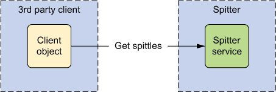
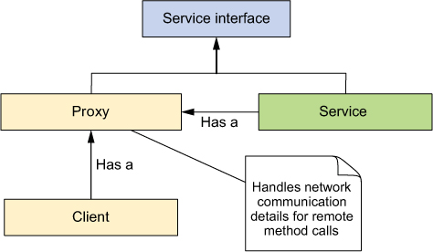
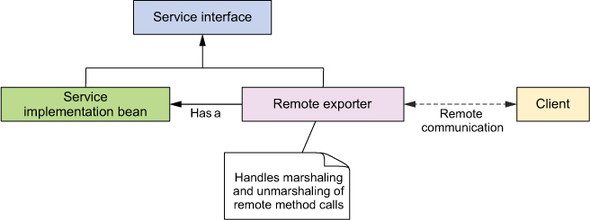
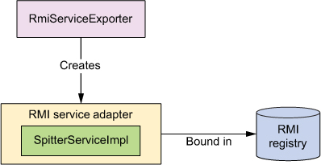
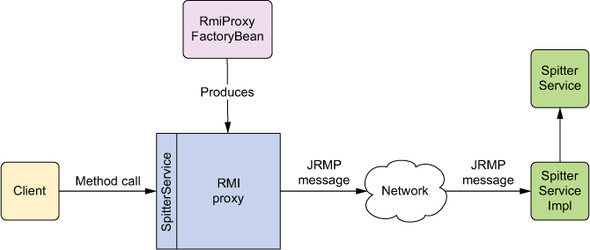
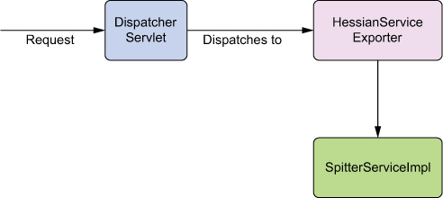
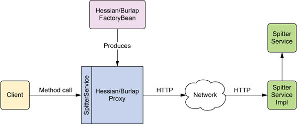
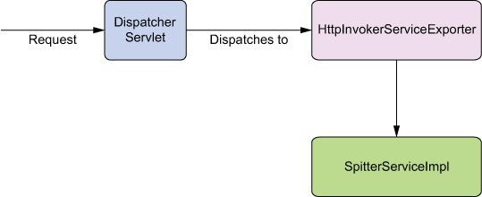
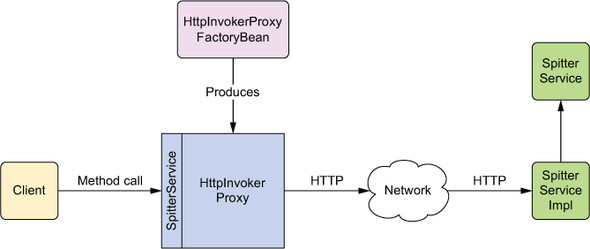
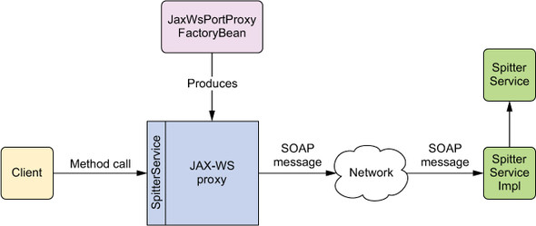

# 15강
- 리모팅 기술
    - 원격 메소드 호출 (RMI : Remote Method Invocation)
    - 카우초의 Hessian과 Burlap
    - 스프링 자체의 HTTP 호출자
    - JAX-RPC와 JAX-WS를 이용한 웹 서비스
## 1. 스프링 리모팅 개요
- 리모팅 : 클라이언트 어플리케이션과 서비스간 대화
- 다른 어플리케이션과 기존 어플리케이션간의 통신은 원격 프로시저 호출(Remote Procedure Call, RPC)로 시작
- 기본적으로 블록킹 동기식 작업



- 서드파티 클라이언트는 Spittr가 노출한 서비스를 원격으로 호출항 Spittr 어플리케이션과 상호작용

| RPC 모델 | 유용한 경우 |
| --- | --- |
| 원격 메소드 호출(RMI) | 방화벽과 같은 네트워크 제약이 고려 대상이 아닐 경우, 자바 기반 서비스에 접속하거나 노출시킬 때 |
| Hessian 또는 Burlap | 네트워크 제약이 고려대상 일 경우, HTTP를 거쳐 자바기반 서비스에 접속하거나 노출시킬 때, Hessian은 바이너리 프로토콜이고, Burlap은 XML 기반 |
| HTTP 호출자 | 네트워크 제약이 고려 대상이고 XML이나 독자적인 직렬화를 통한 자바 직렬화를 원하는 경우, 스프링 기반 서비스에 접속하거나 서비스를 노출시킬 때 |
| JAX-RPC와 JAX-WS | 플랫폼 중립적인 SOAP 기반 웹 서비스에 접속하거나 서비스를 노출 시킬 때 |



- 스프링에서 원격 서비스는 마치 다른 스프링 빈인 것처럼 클라이언트 코드에 와이어링 될 수 있도록 프록시가 만들어짐



- 스프링 관리 빈은 원격 익스포터를 이용해 원격 서비스로 익스포트 된다.

<hr/>

- 처음 그림에서 보면 클라이언트는 마치 프록시가 해당 서비스 기능을 제공하고 있는 것처럼 프록시를 호출한다.
- 프록시가 클라이언트를 대신해 원격 서비스와 통신을 한다.
- 즉 프록시가 원격 서비스를 호출
- java.rmi.RemoteException은 호출시 발생할 수 있는 에러로, 비검사형 에러
- 두번째 그럼에선 원격 익스포터를 사용하여, 빈 메소드를 원격 서비스로 노출하는 것을 보여준다.
- 이러한 설정들은 스프링의 설정 문제이므로, 실제로 원격 통신을 위한 설정을 하기 위한 자바 소스 설정은 필요없다.

## 2. RMI 활용
### 2-1. RMI 서비스 익스포트
RMI 서비스 만드는 과정
1. java.rmi.RemoteException을 던지는 메소드가 포함된 서비스 구현 클래스를 작성
2. java.rmi.Remote를 확장해 서비스 인터페이스를 만든다.
3. RMI 컴파일러(rmic)를 실행해 클라이언트 스텁(stub)과 서버 스켈레톤 클래스를 생성한다.
4. 서비스를 호스트하기 위해 RMI 레지스트리를 시작한다.
5. 서비스를 RMI 레지스트리에 등록한다.

#### 스프링에서 RMI 서비스 구성하기
- 스프링에선 좀더 편리하게 개발이 가능하게 해준다.
- RMI 종속적인 클래스를 작성하는 대신, 제공할 서비스의 기능을 수행하는 POJO를 작성하면 된다.
- 나머지는 스프링이 처리

```java
public interface SpitterService {
  List<Spittle> getRecentSpittles(int count);
  void saveSpittle(Spittle spittle);
  void saveSpitter(Spitter spitter);
  Spitter getSpitter(long id);
  void startFollowing(Spitter follower, Spitter followee);
  List<Spittle> getSpittlesForSpitter(Spitter spitter);
  List<Spittle> getSpittlesForSpitter(String username);

  Spitter getSpitter(String username);
  Spittle getSpittleById(long id);
  void deleteSpittle(long id);
  List<Spitter> getAllSpitters();
}
```

- SpitterSerivce 인터페이스 : Spittr 어플리케이션 서비스 계층 정의
- 기존의 RMI를 사용해 이 서비스를 노출하면, 모든 메소드는 RemoteException를 던져줘야 한다.
- 이러한 귀찮음을 없애기위해 RmiServiceExporter를 사용한다.

```java
@Bean
public RmiServiceExporter rmiExporter(SpitterService spitterService) {
  RmiServiceExporter rmiExporter = new RmiServiceExporter();
  rmiExporter.setService(spitterService);
  rmiExporter.setServiceName("SpitterService");
  rmiExporter.setServiceInterface(SpitterService.class);
  rmiExporter.setRegistryHost("rmi.spitter.com");
  rmiExporter.setRegistryPort(1199);
  return rmiExporter;
}
```

- 이렇게 설정하면 RmiServiceExporter가 이 빈을 RMI 서비스로 익스포트 한다.



- RMI Service adpater가 pojo를 래핑해서 RMI 레지스트리에 바인딩해서 RMI 서비스로 전환시킨다.

### 2-2. RMI 서비스 와이어링
- RMI 클라이언트는, RMI 레지스트리에서 서비스를 검색하려면, RMI API의 Naming 클래스를 사용해야 한다.

```java
try {
  String serviceUrl = "rmi:/spitter/SpitterService";
  SpitterService spitterService =
          (SpitterService) Naming.lookup(serviceUrl);
  ...
}
catch (RemoteException e) { ... }
catch (NotBoundException e) { ... }
catch (MalformedURLException e) { ... }
```

- 위 코드는 서비스 레퍼런스는 얻지만 문제점이 존재한다.
    - 일반적인 RMI lookup은 처리되거나 다시 던져야만 하는 세가지 검사형 예외중 하나를 일으킬 수 있다. (위의 3개)
    - Spitter 서비스를 필요로 하는 모든 코드는 해당 서비스 자체에 대한 레퍼런스를 획득해야 한다. 이는 plumbing 코드이며, 클라이언트 기능이랑은 상관이 없다.
- 쓸모없이 검사형 예외로 쳐넣어서 귀찮고 쓸모가 없다.
- 추가로 DI에 정면으로 위반하는 소스이다.
- 이런 문제들이 있으니 스프링에서 제공하는 RmiProxyFactoryBean을 사용하자

```java
@Bean
public RmiProxyFactoryBean spitterService() {
  RmiProxyFactoryBean rmiProxy = new RmiProxyFactoryBean();
  rmiProxy.setServiceUrl("rmi://localhost/SpitterService");
  rmiProxy.setServiceInterface(SpitterService.class);
  return rmiProxy;
}
```



```java
@Autowired
SpitterService spitterService; // 일반 빈처럼 오토와이어링 가능
```

- 이런식으로 실제 RMI 서비스를 프록시에다가 맡겨버리면, 클라이언트 코드가 RMI를 어떻게 처리할지 따로 관심을 가질 필요가 없다.
- 추가로 모든 RemoteException 예외를 잡아서, 비검사형 에러로 바꿔서 던져버려서 따로 예외처리에 신경 쓸 필요도 없다.

<hr />

::: warning
RMI는 Java to Java 통신이라는 약점이 있다.

또한 RMI는 직렬화를 사용하는데, 이것 역시 양 편에서 모두 동일해야 하는 문제가 있다.
:::

## 3. Hessian과 Burlap을 이용한 리모트 서비스 노출
| 종류 | 내용 |
| --- | --- |
| Hssian | 바이너리 메시지 이용. PHP, Python, C++, C# 등 자바외의 언어에 이식 가능
| Burlap | XML기반으로 XML 파싱이 가능한 언어는 자동 이식. 인간이 보기에 편함 |

### 3-1. Hessian과 Burlap을 이용한 빈 기능 노출
- 위의 예제처럼 SpitterServiceImpl 클래스의 기능을 노출 시킨다고 가정해보자
- Hessian은 단순하게 com.caucho.hessian.server.HessianServlet을 확장해서 서비스 클래스를 작성하고 메소드를 public으로 해주면 된다. -> 매우 단순
- 이미 설정자체가 단순해서, 스프링은 Hessian 모델 단순화는 관심이 없고, 좀더 잘 사용할 수 있는 방법을 제공한다. (ex. AOP)

#### Hessian 서비스 export
- RMI와 유사하게 HessianServiceExporter를 사용한다. 
- HessianServiceExporter는 POJO의 public 메소드를 Hessian 서비스의 메소드로 노출시킨다.



- HessianServiceExporter는 Hessian 요청을 받아 그 요청을 POJO 메소드 호출로 변환하는 스프링 MVC

```java
@Bean
public HessianServiceExporter
      hessianExportedSpitterService(SpitterService service) {
  HessianServiceExporter exporter = new HessianServiceExporter();
  exporter.setService(service);
  exporter.setServiceInterface(SpitterService.class);
  return exporter;
}
```

#### Hessian 컨트롤러 구성하기
- Hessian은 HTTP 기반으로 HessianServiceExporter는 스프링 MVC 컨트롤러로 구현됨
- 두가지 추가 설정 필요
    - web.xml에 스프링 DispatcherServlet을 설정하고 어플리케이션을 웹 어플리케이션으로 적용
    - Hessian 서비스 URL을 적절한 Hessian 서비스 빈으로 디스패치하도록 스프링 설정 파일에서 URL 핸들러 설정

```xml
<servlet-mapping>
  <servlet-name>spitter</servlet-name>
  <url-pattern>*.service</url-pattern>
</servlet-mapping>
```

```java
ServletRegistration.Dynamic dispatcher = container.addServlet(
        "appServlet", new DispatcherServlet(dispatcherServletContext));
    dispatcher.setLoadOnStartup(1);
    dispatcher.addMapping("/");
    dispatcher.addMapping("*.service");
```

```java
@Override
  protected String[] getServletMappings() {
    return new String[] { "/", "*.service" };
  }
```

- URL이 .service로 끝나는 모든 요청은 Dispatcher 서블릿에 전달되게 위 세가지 방법중 하나로 설정한다.

```java
@Bean
public HandlerMapping hessianMapping() {
  SimpleUrlHandlerMapping mapping = new SimpleUrlHandlerMapping();
  Properties mappings = new Properties();
  mappings.setProperty("/spitter.service",
                       "hessianExportedSpitterService");
  mapping.setMappings(mappings);
  return mapping;
}
```

- 핸들러 설정도 해준다.

#### Burlap 서비스 익스포트하기
- Hessian이랑 xml인거 빼면 다 똑같다.

```java
@Bean
public BurlapServiceExporter
      burlapExportedSpitterService(SpitterService service) {
  BurlapServiceExporter exporter = new BurlapServiceExporter();
  exporter.setService(service);
  exporter.setServiceInterface(SpitterService.class);
  return exporter;
}
```

## 3-2. Hessian/Burlap 서비스에 액세스하기
- RMI 와 거의 비슷하다.
- RmiProxyFactoryBean 설정만 Hessian(Burlap)ProxyFactoryBean으로 바뀐다.

```java
@Bean
public HessianProxyFactoryBean spitterService() {
  HessianProxyFactoryBean proxy = new HessianProxyFactoryBean();
  proxy.setServiceUrl("http://localhost:8080/Spitter/spitter.service");
  proxy.setServiceInterface(SpitterService.class);
  return proxy;
}
```

```java
@Bean
public BurlapProxyFactoryBean spitterService() {
  BurlapProxyFactoryBean proxy = new BurlapProxyFactoryBean();
  proxy.setServiceUrl("http://localhost:8080/Spitter/spitter.service");
  proxy.setServiceInterface(SpitterService.class);
  return proxy;
}
```



## 4. 스프링의 HttpInvoker 사용하기
### 4-1. 빈을 HTTP 서비스로 익스포트하기
- HttpInvokerServiceExporter 사용

```java
@Bean
public HttpInvokerServiceExporter
      httpExportedSpitterService(SpitterService service) {
  HttpInvokerServiceExporter exporter =
           new HttpInvokerServiceExporter();
  exporter.setService(service);
  exporter.setServiceInterface(SpitterService.class);
  return exporter;
}
```



```java
@Bean
public HandlerMapping httpInvokerMapping() {
  SimpleUrlHandlerMapping mapping = new SimpleUrlHandlerMapping();
  Properties mappings = new Properties();
  mappings.setProperty("/spitter.service",
                       "httpExportedSpitterService");
  mapping.setMappings(mappings);
  return mapping;
}
```

- 죄다 똑같음

### 4-2. HTTP를 거쳐 서비스에 액세스 하기


- HttpInvokerProxyFactoryBean을 사용해 프록싱을 하는 빈 선언

```java
@Bean
public HttpInvokerProxyFactoryBean spitterService() {
  HttpInvokerProxyFactoryBean proxy = new HttpInvokerProxyFactoryBean();
  proxy.setServiceUrl("http://localhost:8080/Spitter/spitter.service");
  proxy.setServiceInterface(SpitterService.class);
  return proxy;
}
```

::: warning
스프링 HttpInvoker는 오로지 스프링 프레임워크에 의해서만 제공되는 리모팅 솔루션이다.

즉, 클라이언트 서버 둘다 스프링을 사용할 수 있는 어플리케이션이어야 한다.
:::

## 5. 웹 서비스의 발행과 소비
### 5-1. 스프링을 사용할 수 있는 JAX-WS 엔드포인트 생성
#### 스프링에서의 JAX-WS 엔드포인트 오토와이어링
- @WebService 어노테이션이 적용된 클래스는 웹 서비스 엔드포인트로 여기며, @WebMethod 어노테이션 된 메소드는 작업으로 간주한다.
- 엔드포인트의 생명주기는 스프링이 아닌 JAX-WS 런타임에 의해 관리되어, 스프링에서 와이어링이 불가능해 보이지만, SpringBeanAutowiringSupport를 상송하면 가능하다.

```java
@WebService(serviceName="SpitterService")
public class SpitterServiceEndpoint
    extends SpringBeanAutowiringSupport {	// 오토와이어링 활성화
  @Autowired
  SpitterService spitterService;	// 오토와이어링 가능해짐
  
  @WebMethod
  public void addSpittle(Spittle spittle) {
    spitterService.saveSpittle(spittle);	// spittleService에 위임
   }
  
  @WebMethod
  public void deleteSpittle(long spittleId) {
    spitterService.deleteSpittle(spittleId);	
   }
  
  @WebMethod
  public List<Spittle> getRecentSpittles(int spittleCount) {
    return spitterService.getRecentSpittles(spittleCount);	
   }
  
  @WebMethod
  public List<Spittle> getSpittlesForSpitter(Spitter spitter) {
    return spitterService.getSpittlesForSpitter(spitter);	
   }
}
```

#### 독립형 JAX-WS 엔드포인트 익스포트하기
- 그냥 따로 익스포트를 하기 위해선, SImpleJaxWsServiceExporter를 설정해 주면 된다.
- 따로 레퍼런스를 부여할 필요는 없고, JAX-WS 어노테이션을 적용한 모든 빈을 JAX-WS 서비스로 발행한다.

```java
@Bean
public SimpleJaxWsServiceExporter jaxWsExporter() {
  return new SimpleJaxWsServiceExporter();
}
```

- 다른 Exporter처럼 잡다한 설정이 필요없다.

```java
@WebService(serviceName="SpitterService")
public class SpitterServiceEndpoint {	
  @Autowired
  SpitterService spitterService;	// 오토와이어링 
  
  @WebMethod
  public void addSpittle(Spittle spittle) {
    spitterService.saveSpittle(spittle);	// spittleService에 위임
   }
  
  @WebMethod
  public void deleteSpittle(long spittleId) {
    spitterService.deleteSpittle(spittleId);	
   }
  
  @WebMethod
  public List<Spittle> getRecentSpittles(int spittleCount) {
    return spitterService.getRecentSpittles(spittleCount);	
   }
  
  @WebMethod
  public List<Spittle> getSpittlesForSpitter(Spitter spitter) {
    return spitterService.getSpittlesForSpitter(spitter);	
   }
}
```

- SimpleJaxWsServiceExporter는 빈을 JAX-WS 엔드포인트로 변환한다.
- 위에처럼 설정하면, 상속 없이 오토와이어링 설정이 가능하다.
- 위의 주소는 결국 @WebService(serviceName="SpitterService") 인 localhost:8080/SpitterService가 된다.
- 주소 설정을 좀더 디테일하게 해주려면 익스포터를 수정해주면 된다.

```java
@Bean
public SimpleJaxWsServiceExporter jaxWsExporter() {
  SimpleJaxWsServiceExporter exporter =
          new SimpleJaxWsServiceExporter();
  exporter.setBaseAddress("http://localhost:8888/services/");
}
```

### 5-2. 클라이언트 측에서 JAX-WS 서비스 프록시하기

- 비슷하다.



```java
@Bean
public JaxWsPortProxyFactoryBean spitterService() {
  JaxWsPortProxyFactoryBean proxy = new JaxWsPortProxyFactoryBean();
  proxy.setWsdlDocument(
          "http://localhost:8080/services/SpitterService?wsdl");
  proxy.setServiceName("spitterService");
  proxy.setPortName("spitterServiceHttpPort");
  proxy.setServiceInterface(SpitterService.class);
  proxy.setNamespaceUri("http://spitter.com");
  return proxy;
}
```

- 조금 특이하게 wsdlDocument라는게 필요하다.
- 이런저런 값들을 설정해준다.

```xml
<wsdl:definitions targetNamespace="http://spitter.com">
...
  <wsdl:service name="spitterService">
    <wsdl:port name="spitterServiceHttpPort"
            binding="tns:spitterServiceHttpBinding">
...
    </wsdl:port>
  </wsdl:service>
</wsdl:definitions>
```