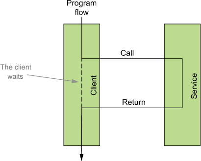
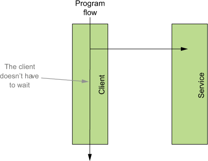
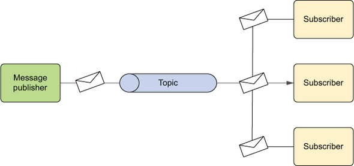
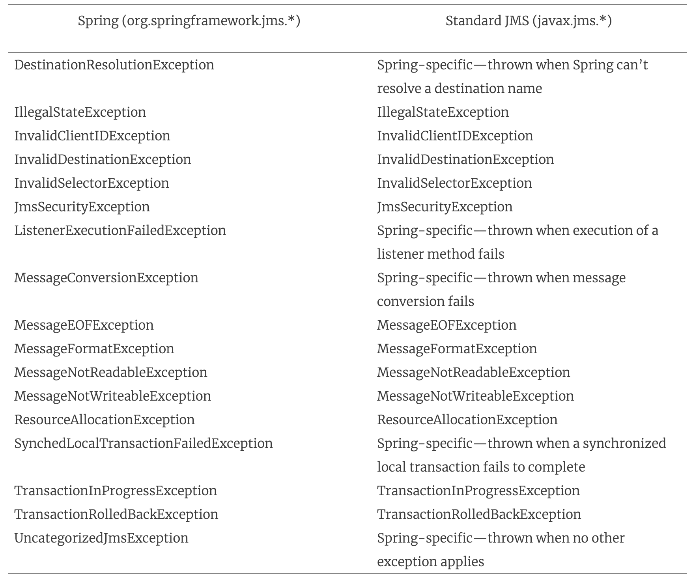
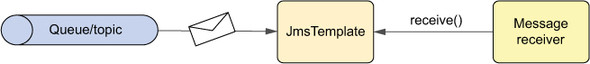
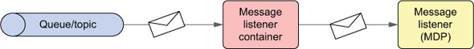

# 17강

[[toc]]

## 1. 비동기 메시징에 대한 간단한 소개
- RMI나 Hessian/Burlap 같은 리모팅 옵션은 동기식이다.
- 클라이언트가 원격 메소드를 호출하면 클라이언트는 이 호출이 완료 될 때까지 기다린다.
- 비동기식으로 메시지가 전달되면 클라이언트는 기다리지 않고 그냥 다음 일을 진행한다.



 

### 1-1. 메시지 보내기
- 비동기 메시징은 우편 보내는 것과 비슷하다.
- 우편은 보내놓고 우편이 돌아올떄까지 멍청하게 우체통 앞에 서있지 않는다.
- 이렇게 비동기는 간접성이 핵심이다.
- 비동기 메시징의 핵심 개념 두 가지는 메시지 중개자(message broker)와 목적지(destination) 이다.
- 메시지 중개자는 우체국이라고 보면된다.
- 목적지를 우편에다 적듯이, 비동기 전송 메시지에도 '목적지'를 적어야 한다.
- 메시징 시스템에는 큐와 토픽이라는 두 종류의 목적지가 있다.
- 큐는 지점대 지점 (point to point) 모델이 사용되고, 토픽에는 발행 구독 (pub-sub) 모델이 사용된다.

#### 지점 대 지점 메시징 모델 (point-to-point)

- 위의 그림처럼 point to point 모델에서 각 메세지는 정확히 하나의 전송자와 수신자를 가진다.
- 메세지 브로커가 메세지를 받으면 해당 메세지를 큐에 넣어둔다.
- 그리고 수신자가 해당 메세지를 요청하면, 큐에서 메세지를 꺼내 수신자에게 전달을 한다.
- 메세지 전송이 완료되면 큐에서 메세지가 삭제되므로 메세지는 반드시 하나의 수신자에게만 전달된다.
- 실제로 메세지는 하나의 수신자에게 전달되지만, 수신자 자체가 하나라는 뜻은 아님
- 은행 창구 번호표를 생각하면 되는데, 은행 자리가 비게되면, 번호표를 들고있는 사람은 순서에 맞춰 은행 창구로 가게된다.
- 똑같이 브로커는 어느 수신자에게 갈지는 모르지만, 먼저 요청하는 수신자(listen중)에게 메세지를 전달해 준다.

#### 발행 - 구독 메시징 모델 (pub-sub)

- point to point 모델과는 다르게 pub-sub 모델은 메세지가 토픽에 전송되고, 구독자는 이걸 기다린다.
- 메세지를 하나의 수신자에게 전달하는 큐와는 달리, 토픽은 모든 구독자에게 같은 메세지의 사본을 보낸다.
- 이름에서 알듯이 잡지 구독처럼, 구독하는 모두에게 잡지를 주는거라고 보면된다.
- 조금 다른점이라면 발행자는 자신의 메세지가 어느 구독자에게 발행이 되었는지 전혀 모른다.

### 1-2. 비동기 메시징의 장점
- 동기식 통신은 매우 직관적이지만, 단점이 몇가지 존재한다.
    - 동기식 통신은 대기가 필요 : 클라이언트가 특정 원격 API를 호출하면, 응답이 올 때까지 기다려야 한다.
    - 클라이언트와 원격 서비스의 인터페이스가 결합 : 서비스의 인터페이스가 변경되면 이 서비스의 모든 클라이언트 또한 변경되어야 한다.
    - 클라이언트와 원격 서비스의 위치가 결합 : 클라이언트는 서비스를 연결하려면 반드시 네트워크상의 위치를 알아야 한다. 네트워크 구성이 변화되면 재설정 필요
    - 클라이언트는 원격 서비스의 이용 가능성에 영향을 받음 : 서비스가 갑자기 이용불가가 되면 클라이언트도 할게 없다.
- 비동기 통신은 이러한 문제를 해결해 준다.
    - 대기 없음 : 비동기 메시징은 메세지가 처리되는건 물론이고 보내는것도 기다릴 필요가 없다. 브로커에다가 메세지만 보내면, 그 이후 일은 관심이 없다. -> 성능향상
    - 메시지 기반과 결합도 제거 : 메소드 기반인 동기 통신과는 달리, 비동기로 전송하는 메세지는 데이터 중심이다. 즉 특정 메소드의 규격과는 상관이 없다. 클라이언트에서 브로커로 메세지 전달이 잘 되면, 구독자나 수신자도 해당 메세지를 잘 처리할 수 있으므로, 구독자나 수신자의 형식에 얽매이지 않는다.
    - 위치 독립성 : 동기식은 목적지 IP가 바뀌면 클라이언트도 변경을 해줘야한다. 비동기는 누가 뭘처리하는지따윈 관심도없고 몰라서 서비스가 큐나 토픽에서 메세지를 잘 가져올수만 있다면, IP 주소같은건 관심이 없다. 
    - 전달 보증 : 동기식 통신은 원격서비스가 다운되면, 전달이 불가능하다. 비동기 방식은 원격 서비스가 내려가도, 메세지를 서비스가 다시 올라올 떄까지 들고 있어서 반드시 전달이 보증된다.

## 2. JMS로 메시지 보내기
### 2-1. 스프링에서 메시지 브로커 셋업하기
- ActiveMQ (Apache 제공) 오픈소스 메시지 브로커 사용
#### 커넥션 팩토리 생성
- 메세지 브로커를 통해 메세지를 전송하기 위해선 JMS 커넥션 팩토리가 필요하다.
- 현재 사용할 브로커는 ActiveMQ이므로 JMS 팩토리에 ActiveMQ를 연결해야 한다.

```xml
<bean id="connectionFactory"
      class="org.apache.activemq.spring.ActiveMQConnectionFactory"
      p:brokerURL="tcp://localhost:61616"/>
```

- 스프링 설정 XML 파일에도 amq 네임스페이스를 선언해 준다.

```xml
<?xml version="1.0" encoding="UTF-8"?>
  <beans xmlns="http://www.springframework.org/schema/beans"
   xmlns:xsi="http://www.w3.org/2001/XMLSchema-instance"
   xmlns:jms="http://www.springframework.org/schema/jms"
   xmlns:amq="http://activemq.apache.org/schema/core"
   xsi:schemaLocation="http://activemq.apache.org/schema/core
     http://activemq.apache.org/schema/core/activemq-core.xsd
     http://www.springframework.org/schema/jms
     http://www.springframework.org/schema/jms/spring-jms.xsd
     http://www.springframework.org/schema/beans
     http://www.springframework.org/schema/beans/spring-beans.xsd">
   ...
  </beans>
```

- amq 요소를 통해 컨넥션 팩토리를 생성

```xml
<amq:connectionFactory id="connectionFactory"
                       brokerURL="tcp://localhost:61616"/>
```

#### ActiveMQ 메세지 목적지 선언
- 커넥션 설정이 완료되었으므로, 큐나 토픽과 같은 목적지 설정이 필요하다.

```xml
<bean id="queue"
      class="org.apache.activemq.command.ActiveMQQueue"
      c:_="spitter.queue" />
```

- 큐 설정

```xml
<bean id="topic"
      class="org.apache.activemq.command.ActiveMQTopic"
      c:_="spitter.queue" />
```

- 토픽 설정

### 2-2. 스프링의 JMS 템플릿 사용
- JMS는 메세지 브로커와의 상호작용 및 메세지 전송/수신을 위한 표준 자바 API를 제공한다.
- 대부분의 오픈소스 메세지 브로커는 JMS를 지원하므로 특정 솔류션만의 독자적인 메세진 API를 따로 익힐 필요는 없다.

#### 지저분한 JMS 코드 공략
- JDBC 설정마냥 JMS 설정도 매우 더럽다

```java
ConnectionFactory cf =
      new ActiveMQConnectionFactory("tcp://localhost:61616");
Connection conn = null;
Session session = null;
try {
  conn = cf.createConnection();
  session = conn.createSession(false, Session.AUTO_ACKNOWLEDGE);
  Destination destination = new ActiveMQQueue("spitter.queue");
  MessageProducer producer = session.createProducer(destination);
  TextMessage message = session.createTextMessage();

  message.setText("Hello world!");
  producer.send(message);	// 메세지 전송
 } catch (JMSException e) {
  // handle exception?
} finally {
  try {
    if (session != null) {
      session.close();
    }
    if (conn != null) {
      conn.close();
    }
  } catch (JMSException ex) {
  }
}
```

- 메세지 전송 로직

```java
ConnectionFactory cf =
      new ActiveMQConnectionFactory("tcp://localhost:61616");
Connection conn = null;
Session session = null;
try {
  conn = cf.createConnection();
  conn.start();
  session = conn.createSession(false, Session.AUTO_ACKNOWLEDGE);
  Destination destination =
      new ActiveMQQueue("spitter.queue");

  MessageConsumer consumer = session.createConsumer(destination);
  Message message = consumer.receive();
  TextMessage textMessage = (TextMessage) message;
  System.out.println("GOT A MESSAGE: " + textMessage.getText());
  conn.start();
} catch (JMSException e) {
  // handle exception?
} finally {
  try {
    if (session != null) {
      session.close();
    }
    if (conn != null) {
      conn.close();
    }
  } catch (JMSException ex) {
  }
}
```

- 메세지 수신 로직
- 보는바와 같이 핵심로직은 몇줄 안되고 기타 잡설정들이 매우 길다.
- 이럴 때 이용하는게 JMS 템플릿이다.

#### JMS 템플릿 활용
- jmsTemplate은 커넥션을 생성하고 세션을 획득하고, 메세지 전송 수신 작업을 실행한다.
- 실제로 개발자가 할 작업은 전송할 메세지를 생성하는 일과, 수신한 메세지를 처리하는 일만 하면 된다.
- 또한 JMSException 또한 알아서 처리해주는 장점이 있다.



- jmsTemplate 설정을 위해 스프링 빈 설정이 필요하다.

```xml
<bean id="jmsTemplate"
      class="org.springframework.jms.core.JmsTemplate"
      c:_-ref="connectionFactory" />
```

#### 메세지 전송
- spittle에서 비동기로 메세지를 전송하는 예시
- AlertService 인터페이스를 생성한다.

```java
package com.habuma.spittr.alerts;
import com.habuma.spittr.domain.Spittle;

public interface AlertService {
  void sendSpittleAlert(Spittle spittle);
}
```

```java
public class AlertServiceImpl implements AlertService {

  private JmsOperations jmsOperations;

  @Autowired
  public AlertServiceImpl(JmsOperations jmsOperatons) {	// JMS 템플릿 주입
     this.jmsOperations = jmsOperations;
  }

  public void sendSpittleAlert(final Spittle spittle) {
    jmsOperations.send(	 // 메세지 전송
       "spittle.alert.queue",	// 목적지 지정
       new MessageCreator() {
        public Message createMessage(Session session)
                throws JMSException {
          return session.createObjectMessage(spittle);	// 메세지 생성
         }
      }
    );
  }
}
```

- JmsTemplate의 send 메소드의 첫 번째 파라미터는 메세지가 전송될 목적지다.
- send() 메소드가 호출되면 JmsTemplate은 JMS 커넥션과 세션을 획득하고, 이를 이용해 전송자 대신 메세지를 전송한다.


- 두번쨰 파라미터는 메세지로, MessageCreator로 특정 메세지를 만들어 준다.

#### 기본 목적지 설정
- 위의 소스는 목적지를 명시적으로 지정해 주었다.
- 매번 명시적인 목적지를 설정해주기 보단 default 설정을 해주면 ㅍ녀하다.

```xml
<bean id="jmsTemplate"
      class="org.springframework.jms.core.JmsTemplate"
      c:_-ref="connectionFactory"
      p:defaultDestinationName="spittle.alert.queue" />
``` 

- 만약 보낼 목적지인 큐나 토픽이 기생성되어 있다면, 해당 목적지 빈 또는 큐에 대한 레퍼런스로 와이어링 해도 된다.

```xml
<bean id="jmsTemplate"
      class="org.springframework.jms.core.JmsTemplate"
      c:_-ref="connectionFactory"
      p:defaultDestination-ref="spittleTopic" />
```
 
- 이렇게 목적지를 설정해 주면, 조금더 간단하게 send() 메소드를 쓸 수 있다.

```java
jmsOperations.send(
  // 목적지 정보 필요 없음
  new MessageCreator() {
  ...
  }
);
```

#### 전송 시 메세지 변환
- jmsTemplate은 convertAndSend() 메소드를 제공한다.
- MessageCreator가 아닌 사용자를 위한 메세지를 생성하기 위해 빌트인 메세지 변환기를 사용한다.

```java
public void sendSpittleAlert(Spittle spittle) {
  jmsOperations.convertAndSend(spittle);
}
```

- 이렇게 설정하면, spittle 객체는 전송되기 전에 메세지로 변환된다.
- 객체를 메세지로 변환하기 위해서는 MessageConverter 구현체를 사용해야 한다.

```java
public interface MessageConverter {
  Message toMessage(Object object, Session session)
                   throws JMSException, MessageConversionException;
  Object fromMessage(Message message)
                   throws JMSException, MessageConversionException;
}
```

- 스프링은 다음과 같은 메세지 컨버터를 제공한다.

| 메세지 변환기 | 동작 내용 |
| --- | --- |
| MappingJacksonMessageConverter | 메세지를 JSON으로 변환하기 위해서 또는 그 역으로 동작하기 위해서 Jackson JSON 라이브러리를 사용한다 |
| MappingJackson2MessageConverter | 메세지를 JSON으로 변환하기 위해서 또는 그 역으로 동작하기 위해서 Jackson 2 JSON 라이브러리를 사용한다 |
| MarshallingMessageConverter | 메세지를 XML로 변환하기 위해서 또는 그 역으로 동작하기 위해서 JAXB를 사용한다 |
| SimpleMessagConverter | 문자열을 TextMessage로 변환하거나 그 역으로 변환한다. 바이트 배열을 ByteMessage로 변환하거나 그 역으로 변환한다. 맵을 MapMessage로 변환하거나 그 역으로 변환한다. 직렬화 가능 객체를 ObjectMessage로 변환하거나 그 역으로 변환한다 |

- convertAndSend() 에서 메세지를 전송할 때 JmsTemplate은 기본적으로 SimpleMessagConverter를 사용한다.
- 다른걸 쓰고싶으면 메세지 변환기를 빈으로 선언하고 messageConverter에 해당 빈을 주입해주면 된다.

```xml
<bean id="messageConverter"
      class="org.springframework.jms.support.converter.
                             MappingJacksonMessageConverter" />
```

```xml
<bean id="jmsTemplate"
      class="org.springframework.jms.core.JmsTemplate"
      c:_-ref="connectionFactory"
      p:defaultDestinationName="spittle.alert.queue"
      p:messageConverter-ref="messageConverter" />
```

#### 메세지 소비
- JmsTemplate을 수신에도 쓸 수 있다.

```java
public Spittle receiveSpittleAlert() {
  try {
    ObjectMessage receivedMessage =
        (ObjectMessage) jmsOperations.receive();	// 메세지 수신

    return (Spittle) receivedMessage.getObject();	// 객체 얻기
   } catch (JMSException jmsException) {
    throw JmsUtils.convertJmsAccessException(jmsException);	// 변환된 예외 던지기
   }
}
```

- JmsTemplate의 receive() 메소드가 호출되면 메세지 브로커로부터 메세지 조회를 시도한다
- 도착한게 없으면 올때까지 대기하게 된다.



- 발신과 마찬가지로, 수신도 메세지 컨버터를 사용 할 수 있다.

```java
public Spittle retrieveSpittleAlert() {
  return (Spittle) jmsOperations.receiveAndConvert();
}
```

- 이렇게 사용하면 따로 캐스팅할 필요도 없고, JMSException을 사용할 필요도 없고 훨씬 깔끔해진다.
- JmsTemplate을 이용한 메세지 소비의 문제는 receive()와 receiveAndConvert() 메소드가 동기식이라는 점이다.
- 이러한 문제를 해결하기 위해 메시지 드리븐 POJO를 사용한다.

### 2-3. 메세지 드리븐 POJO 작성
#### 메세지 리스너 생성
- 민액 EJB의 메세지 드리븐 모델을 이용해 알람 핸들러를 만들면, @MessageDriven 어노테이션을 적용해야 한다.

```java
@MessageDriven(mappedName="jms/spittle.alert.queue")
public class SpittleAlertHandler implements MessageListener {
  @Resource
  private MessageDrivenContext mdc;

  public void onMessage(Message message) {
     ...
  }
}
```

- 이러면 결합도가 너무 높아지는 문제가 있다.
- 스프링 MDP는 POJO만 구현하면 된다.

```java
package com.habuma.spittr.alerts;
import com.habuma.spittr.domain.Spittle;

public class SpittleAlertHandler {
  public void handleSpittleAlert(Spittle spittle) {	// 핸들러 메소드
     // ... implementation goes here...
  }
}
```

#### 메세지 리스너 설정
- 메세지 수신 기능을 POJO에 부여하는 방법은 스프링에 메세지 리스너로 설정하는 것
- jms 네임스페이스를 사용한다.

```xml
<bean id="spittleHandler"
      class="com.habuma.spittr.alerts.SpittleAlertHandler" />
```

- 해당 POJO를 메세지 리스너로 되도록 선언

```xml
<jms:listener-container connection-factory="connectionFactory">
  <jms:listener destination="spitter.alert.queue"
       ref="spittleHandler" method="handleSpittleAlert" />
</jms:listener-container>
```

- 메세지 리스너 컨테이너 안에 메세지 리스너가 생성된다.
- 메세지 리스너 컨테이너는 메세지 도착을 기다리다가 메세지가 도착하면 검색해서 메세지 리스너에게 메세지를 던져준다.



### 2-4. 메세지 기반의 RPC 활용
#### JMS 기반의 서비스 익스포팅
- JmsInvokerServiceExporter는 다른 서비스 익스포터와 거의 비슷하다.

```java
@Component("alertService")
public class AlertServiceImpl implements AlertService {

  private JavaMailSender mailSender;
  private String alertEmailAddress;
  public AlertServiceImpl(JavaMailSender mailSender,
                          String alertEmailAddress) {
    this.mailSender = mailSender;
    this.alertEmailAddress = alertEmailAddress;
  }

  public void sendSpittleAlert(final Spittle spittle) {	
     SimpleMailMessage message = new SimpleMailMessage();
    String spitterName = spittle.getSpitter().getFullName();
    message.setFrom("noreply@spitter.com");
    message.setTo(alertEmailAddress);
    message.setSubject("New spittle from " + spitterName);
    message.setText(spitterName + " says: " + spittle.getText());
    mailSender.send(message);
  }  

}

public interface AlertService {
  void sendSpittleAlert(Spittle spittle);
}
```

- AlertServiceImpl을 구현하고

```xml
<bean id="alertServiceExporter"
    class="org.springframework.jms.remoting.JmsInvokerServiceExporter"
    p:service-ref="alertService"
    p:serviceInterface="com.habuma.spittr.alerts.AlertService" />
```

- JmsInvokerServiceExporter는 이 빈을 참조하게 된다.

```xml
<jms:listener-container connection-factory="connectionFactory">
  <jms:listener destination="spitter.alert.queue"
                   ref="alertServiceExporter" />
</jms:listener-container>
```

- JmsInvokerServiceExporter를 JMS 리스너로 등록해준다.

#### JMS 기반의 서비스 소비
- 클라이언트는 JmsInvokerProxyFactoryBean을 이용해 서비스에 액세스 한다.
- RMI 와 거의 동일하다.
- 해당 알람 서비스를 소비하려면 다음과 같이 JmsInvokerProxyFactoryBean 을 설정해 줘야 한다.

```xml
<bean id="alertService"
  class="org.springframework.jms.remoting.JmsInvokerProxyFactoryBean"
  p:connectionFactory-ref="connectionFactory"
  p:queueName="spittle.alert.queue"
  propp:serviceInterface="com.habuma.spittr.alerts.AlertService" />
```

## 3. AMQP를 이용한 메세징
- JMS는 API 규격을 정의하고, AMQP는 메세징을 위한 와이어 수준의 프로토콜을 정의한다.
- 좀더 유연하고, 투명 메세징 모델을 가지고 있다.

### 3-1. AMQP에 대한 간략한 소개
- AMQP 메세징 모델의 생산자는 큐에 직접 발행(pub) 하지 않는다.
- 생산자와 큐 사이에 메세지를 전달하기 위한 새로운 간접적인 방법을 제시한다.


- 메세지 생성자는 교환을 위해 메세지를 발행한다.
- 교환은 하나 이상의 큐에 적용되고, 메세지는 큐로 전달되게 된다.
- 소비자는 그 큐에서 메세지를 가져와 처리한다.
- AMQP는 큐에 메세지를 배치할지에 대한 여부를 결정하는 다른 라우팅 알고리즘을 사용하여 교환의 네가지 유형을 정의한다.
- 해당 알고리즘에 따라 큐로 라우팅이 되거나, 혹은 되지 않는다.

```
AMQP 교환의 네 가지 표준 유형

1. 다이렉트 : 라우팅 키가 바인딩을 위한 라우팅 키 대상으로 다이렉트 매칭이 될 경우, 메세지가 큐에 연결된다.
2. 토픽 : 라우팅 키가 바인딩을 위한 라우팅 키 대상으로 와일드카드 매칭이 될 경우에 메세지가 큐에 연결된다.
3. 헤더 : 인자의 테이블 내 값과 헤더가 인자의 바인딩 테이블과 일치하는 경우에 메세지가 큐에 연결된다.
         x-match라는 특별 헤더는 모든 값이 매칭되거나 아니면 일부분 만이 매칭되는지를 지정하기 위해 사용된다.
4. 팬아웃 : 인자의 테이블 내 헤더/값 또는 라우팅 키에 상관없이 메세지는 교환될 모든 큐에 연결된다.
```

### 3-2. AMQP 메세징을 위한 스프링 설정하기
- 커넥션 팩토리를 설정해 스프링 AMQP를 사용한다.

::: tip
RabbitMQ란 ?

RabbitMQ는 AMQP를 지원하는 오픈소스 메세지 브로커. 스프링 AMQP는 RabbitMQ를 지원하며, RabbitMQ 커넥션 팩토리, 템플릿등을 지원한다.
:::

- RabbitMQ 팩토리 설정을 위해 xml 네임스페이스를 추가해준다.

```xml
<?xml version="1.0" encoding="UTF-8"?>
<beans:beans xmlns="http://www.springframework.org/schema/rabbit"
  xmlns:beans="http://www.springframework.org/schema/beans"
  xmlns:xsi="http://www.w3.org/2001/XMLSchema-instance"
  xsi:schemaLocation="http://www.springframework.org/schema/rabbit
   http://www.springframework.org/schema/rabbit/spring-rabbit-1.0.xsd
    http://www.springframework.org/schema/beans
    http://www.springframework.org/schema/beans/spring-beans.xsd">

...

</beans:beans>
```

```xml
<connection-factory id="connectionFactory"
    host="${rabbitmq.host}"
    port="${rabbitmq.port}"
    username="${rabbitmq.username}"
    password="${rabbitmq.password}" />
```

#### 큐의 선언, 교환, 바인딩
- rabbit 네임스페이스는 큐의 선언, 교환, 상호 간에 엮기 위한 바인딩 선언을 지원하기 위한 요소들을 지원한다.

| 요소 | 동작 |
| --- | --- |
| `<`queue`>` | 큐 생성 |
| `<`fanout-exchange`>` | 팬아웃 교환 생성 |
| `<`header-exchange`>` | 헤더 교환 생성 |
| `<`topic-exchange`>` | 토픽 교환 생성 |
| `<`direct-exchange`>` | 다이렉트 교환 생성 |
| `<`bindings`>` | bindings 요소는 하나이상의 binding 요소 세트를 정의 |

- 위의 설정 요소는 `<`admin`>` 요소와 함꼐 쓰인다.

```xml
<admin connection-factory="connectionFactory"/>
 <queue id="spittleAlertQueue" name="spittle.alerts" />
```

### 3-3. RabbitTemplate으로 메세지 전송하기
- RabbitMQ 커넥션 팩토리는 RabbitMQ와 연결하기 위해 필요하다.
- 귀찮은 짓을 없애기 위해 역시나 RabbitTemplate을 제공한다.

```xml
<template id="rabbitTemplate"
           connection-factory="connectionFactory" />
```

```java
public class AlertServiceImpl implements AlertService {

  private RabbitTemplate rabbit;

  @Autowired
  public AlertServiceImpl(RabbitTemplate rabbit) {
    this.rabbit = rabbit;
  }

  public void sendSpittleAlert(Spittle spittle) {
    rabbit.convertAndSend("spittle.alert.exchange",
                          "spittle.alerts",
                          spittle);
  }
}
```

- JMS와 동일하게 convertAndSend() 메소드를 제공해 준다.
- 세개의 파라미터를 전송하는데, 교환명, 라우팅 키, 전송 객체를 넘겨준다.
- 때에 따라 교환명, 라우팅 키는 생략 될 수있다. -> 디폴트 설정 필요
- JMS와 마찬가지로 메세지 컨버터를 지원해 준다.

```java
Message helloMessage =
    new Message("Hello World!".getBytes(), new MessageProperties());
rabbit.send("hello.exchange", "hello.routing", helloMessage);
```

- send()도 물론 사용 가능

### 3-4. AMQP 메세지 수신하기
#### RabbitTemplate을 사용하여 메세지 수신하기
- 비슷하게 receive()를 사용한다.

```java
Message message = rabbit.receive("spittle.alert.queue");
```

- queue를 기본 설정으로 빼주기도 가능

```xml
<template id="rabbitTemplate"
    connection-factory="connectionFactory"
    exchange="spittle.alert.exchange"
    routing-key="spittle.alerts"
    queue="spittle.alert.queue" />
```

- 따로 receive() 메소드에서 큐 설정이 필요 없다.

```java
Message message = rabbit.receive();
```

- receiveAndConvert() 사용도 가능

```java
Spittle spittle =
    (Spittle) rabbit.receiveAndConvert("spittle.alert.queue");
```

- receive()와 receiveAndConvert()에 대한 호출은 규에 대기중인 메세지가 없을 경우 null을 반환한다.
- 역시나 동기방식이라 JMS와 동일하게 POJO형태로 비동기를 지원해준다.

#### 메세지 구동형 AMQP POJO 정의하기

- 수신 역할을 할 핸들러 POJO를 생성한다.

```java
package com.habuma.spittr.alerts;
import com.habuma.spittr.domain.Spittle;

public class SpittleAlertHandler {

  public void handleSpittleAlert(Spittle spittle) {
    // ... implementation goes here ...
  }
}
```

- 리스너 컨테이너와 리스터 설정을 해준다.

```xml
<bean id="spittleListener"
      class="com.habuma.spittr.alert.SpittleAlertHandler" />
```

```xml
<listener-container connection-factory="connectionFactory">
    <listener ref="spittleListener"
          method="handleSpittleAlert"
          queue-names="spittle.alert.queue" />
</listener-container>
```