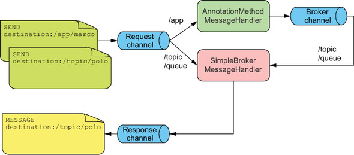
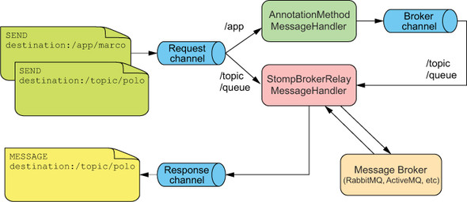
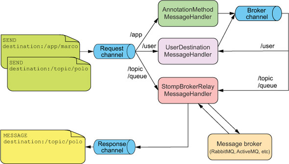

# 18강

[[toc]]

## 1. 스프링의 하위 레벨 웹 소켓 API 사용하기
- 간단한 형태의 웹소켓은 두 어플리케이션 사이의 통신 채널이다.
- 웹 소켓의 한쪽 긑에서 어플리케이션은 메세지를 보내고, 다른 쪽에서는 그 메세지를 처리한다.
- 대부분의 웹 소켓은 서버와 브라우저 기반 어플리케이션 사이의 통신을 용이하기 위해 사용된다.


- 웹 소켓은 두 개의 어플리케이션 사이에서 풀 듀플렉스 통신을 지원한다.
- 하위 레벨 웹 소켓을 지원하는 마르코 - 폴로 예제를 생성해보면

```java
public interface WebSocketHandler {
  void afterConnectionEstablished(WebSocketSession session)
                                                      throws Exception;
  void handleMessage(WebSocketSession session,
                     WebSocketMessage<?> message) throws Exception;
  void handleTransportError(WebSocketSession session,
                            Throwable exception) throws Exception;
  void afterConnectionClosed(WebSocketSession session,
                             CloseStatus closeStatus) throws Exception;
  boolean supportsPartialMessages();
}
```

- WebSockerHandler 인터페이스는 5개의 메소드를 구현해야 한다.

```java
public class MarcoHandler extends AbstractWebSocketHandler {

  private static final Logger logger =
      LoggerFactory.getLogger(MarcoHandler.class);

  @Override  
  protected void handleTextMessage(	
       WebSocketSession session, TextMessage message) throws Exception {
    logger.info("Received message: " + message.getPayload());

    Thread.sleep(2000);	

    session.sendMessage(new TextMessage("Polo!"));	
   }
}
```

- MarcoHandler는 웹 소켓을 통해서 전송되는 텍스트 메세지를 처리한다.
- 확장하는 AbstractWebSocketHandler는 3개의 추가 메소드를 제공한다
    - handleBinaryMessage()
    - handlePongMessage()
    - handleTextMessage()
- MarcoHandler는 handleTextMessage를 오버라이딩한다.
- AbstractWebSocketHandler 대신 TextWebHandler를 상속받아도 된다.

```java
public class MarcoHandler extends TextWebSocketHandler {}
```

- TextWebSocketHandler는 AbstractWebSocketHandler를 상속받고, handleBinaryMessage 를 추가로 구현하는 핸들러이다.
- 텍스트메세지, 바이너리 메세지 처리와는 상관없이 연결과 종료를 하고싶으면 afterConnectionEstablished()와 afterConnectionClosed를 오버라이드 해야한다.

```java
public void afterConnectionEstablished(WebSocketSession session)
    throws Exception {
  logger.info("Connection established");
}

@Override
public void afterConnectionClosed(
    WebSocketSession session, CloseStatus status) throws Exception {
  logger.info("Connection closed. Status: " + status);
}
```

- 이러한 설정들을 완료하면 메세지 핸들러 클래스를 사용할 수 있고, 스프링에서는 메세지를 핸들러로 보낼 수 있다.
- 스프링의 자바 설정에서 @EnableWebSocket을 사용해 설정 클래스를 세팅하고, WebSocketConfigurer 인터페이스를 구현하면 된다

```java
@EnableWebSocket
public class WebSocketConfig implements WebSocketConfigurer {

  @Override
  public void registerWebSocketHandlers(
                                 WebSocketHandlerRegistry registry) {
    registry.addHandler(marcoHandler(), "/marco");	
   }

  @Bean
  public MarcoHandler marcoHandler() {	
     return new MarcoHandler();
  }
}
```

- registerWebSocketHandlers는 핸들러를 등록시켜주는 메소드로, 빈으로 등록한 marcoHandler()를 넣어준다.
- 이제 "Marco!" 텍스트 메세지를 서버로 전송하는 클라이언트 자바스크립트 소스를 짜면 된다.

```javascript
var url = 'ws://' + window.location.host + '/websocket/marco';
var sock = new WebSocket(url);	

sock.onopen = function() {	
   console.log('Opening');
  sayMarco();
};

sock.onmessage = function(e) {	
   console.log('Received message: ', e.data);
  setTimeout(function(){sayMarco()}, 2000);
};

sock.onclose = function() {	
   console.log('Closing');
};

function sayMarco() {
  console.log('Sending Marco!');
  sock.send("Marco!");	
}
```

- WebSocket()을 사용해 웹소켓 인스턴스를 생성해 서버로 보내주는 로직이다.

## 2. 웹 소켓 지원 부족에 대해 대응하기
- 웹 소켓은 상대적으로 최신 스펙으로 지원하는 브라우저 스펙이 꽤나 높다
    - 익스플로러 10.0 이상
    - .. 등등
- 이런식으로 제약이 많다보니, 웹 소켓을 대체할 수 있는 SockJS가 나왔다.
- SockJS는 외견상 가장 가까운 웹 소켓 API를 미러링하는 웹 소켓 에뮬레이터이다.
- 스프링 서버에서 약간의 소스 수정을 하면 사용할 수 있다.

```java
@Override
public void registerWebSocketHandlers(
                                 WebSocketHandlerRegistry registry) {
  registry.addHandler(marcoHandler(), "/marco").withSockJS();
}
```

- withSockJS()를 통해 브라우저에서 웹소켓을 사용 못할때를 대비한다.
- 클라이언트단에도 SockJS 설정을 추가해 주면된다.

```javascript
<script src="http://cdn.sockjs.org/sockjs-0.3.min.js"></script>
```

- 클라에서 SockJS 를 사용하기 위해 소스를 수정해야 한다.

```javascript
var url = 'marco';
var sock = new SockJS(url);
```

- ws:// 프로토콜 대신 http:// 을 사용한다.
- SockJS는 너무 하위레벨단으로 사용하는 통신형태 이므로 STOMP를 많이 쓴다.

## 3. STOMP 메세징 작업하기
- 웹 소켓(또는 SockJS)를 직접 사용하는 것은, TCP 소켓만을 사용하는 웹 어플리케이션을 개발하는 것 처럼 너무 하위 단 개발이다.
- 이럴때 STOMP를 사용하는데, HTTP 요청과 응답처럼 STOMP 프레임은 명령어, 한 개 이상의 헤더, 페이로드로 구성된다.

```java
// 데이터 전송을 위한 STOMP 프레임
SEND
destination:/app/marco
content-length:20

{\"message\":\"Marco!\"}
```

- destination / length /payload 를 나타낸다.
- destination은 STOMP가 JMS 또는 AMQP처럼 메세징 프로토콜이라는 것을 알려 준다.
- 실제로 목적지로 전달되는 메세지는 실제 메세지 브로커에 의해서 지원된다.
- 메세지 핸들러는 메세지를 수신하기 위해 수신 대기를 한다.

### 3-1. STOMP 메세징 사용하기
- RequestMapping 어노테이션 메소드가 HTTP 요청을 처리하는것과 비슷하게, 스프링 MVC에서 STOMP 메세지를 처리하기 위해 @MessageMapping을 쓴다.

```java
@Configuration
@EnableWebSocketMessageBroker	
 public class WebSocketStompConfig
       extends AbstractWebSocketMessageBrokerConfigurer {

  @Override
  public void registerStompEndpoints(StompEndpointRegistry registry) {
    registry.addEndpoint("/marcopolo").withSockJS();	
   }

  @Override
  public void configureMessageBroker(MessageBrokerRegistry registry) {
    registry.enableSimpleBroker("/queue", "/topic");
    registry.setApplicationDestinationPrefixes("/app");
  }
}
```

- @EnableWebSocketMessageBroker 어노테이션으로 config 파일을 생성한다.
- STOMP 엔드포인트로 클라이언트가 연결해야 할 엔드포인트인 /marcopolo를 등록해준다.
- 브로커 목적지로 /queue, /topic을 가지고 어플리케이션 목적지로 /app 을 가진다.
- /topic, /queue 로 오는건 브로커로 바로 전달이 된다.
- /app으로 오는건 @MessageMapping 어노테이션된 컨트롤러 메소드로 바로가게 되고, 브로커로 전달이 되는 형태이다.



#### STOMP 브로커 릴레이 사용하기
- 인메모리 브로커르 사용하면 간단하게 사용하긴 좋지만, 제한이 많다.
- 제대로된 제품 적용을 위해선 RabbitMQ나 ActiveMQ 같이 실제 STOMP 적용이 가능한 브로커를 사용하는게 더 좋다.
- 확장성이 좋아지고, 견고한 메세지 전송이 가능해진다.
- STOMP 명령어 전체 셋을 지원하는게 아니므로, STOMP에 대한 브로커를 세팅을 해 주어야 한다.

```java
@Override
public void configureMessageBroker(MessageBrokerRegistry registry) {
  registry.enableStompBrokerRelay("/topic", "/queue");
  registry.setApplicationDestinationPrefixes("/app");
}
```

- enableStompBrokerRelay 를 사용해, 기존 인메모리 브로커를 사용하던걸 바꿔준다.



- STOMP 브로커 릴레이는 STOMP 메세지를 처리하기 위한 실제 메세지를 위임한다.
- 즉 브로커 릴레이는 처리를 할 수 있는 실제 메세지 브로커쪽으로 메세지를 보낸다.
- 목적지는 여러개 설정도 가능하고 좀더 자세한 설정도 가능하다.

```java
@Override
public void configureMessageBroker(MessageBrokerRegistry registry) {

  registry.enableStompBrokerRelay("/topic", "/queue")
          .setRelayHost("rabbit.someotherserver")
          .setRelayPort(62623)
          .setClientLogin("marcopolo")
          .setClientPasscode("letmein01");
  registry.setApplicationDestinationPrefixes("/app", "/foo");
}
```

### 3-2. 클라이언트로부터의 STOMP 메세지 처리
- 스프링은 STOMP 처리를 위한 어노테이션을 제공한다.

```java
@Controller
public class MarcoController {

  private static final Logger logger =
      LoggerFactory.getLogger(MarcoController.class);

  @MessageMapping("/marco")	 // /app/marco 목적지에 대한 메세지 처리
   public void handleShout(Shout incoming) {
    logger.info("Received message: " + incoming.getMessage());
  }
}
```

- 모양새가 스프링 MVC와 유사하다.
- @MessageMapping 어노테이션을 통해 목적지 설정을 해주고 받아서, 메세지 페이로드는 메세지 변환기로 Shout 형태로 변경된다.

```java
package marcopolo;
public class Shout {
  private String message;
  public String getMessage() {
    return message;
  }
  public void setMessage(String message) {
    this.message = message;
  }
}
```

- Shout 객체 변환을 처리하는 컨버터는 스프링의 HttpMessageConverter는 아니고 아래의 표중 하나로 사용된다.

| 메세지 변환기 | 내용 |
| --- | --- |
| ByteArrayMessageConverter | application/octet-stream의 MIME 타입 메세지를 byte[]로 변환 또는 역으로 변환 |
| MappingJackson2MessageConverter | application/json 의 MIME 타입 메세지를 자바 객체로 변환 또는 역으로 변환 |
| StringMessageConverter | text/plain 의 MIME 타입 메세지를 문자열로 변환 또는 역으로 변환 |

- 만약 Shout가 application/json 타입이면 MappingJackson2MessageConverter가 사용되어 JSON -> Shout 객체로 전환된다.

#### 구독 처리
- @SubscribeMapping 어노테이션도 제공한다.
- STOMP 구독 메세지가 도착할 때 @SubscribeMapping 어노테이션이 달린 메소드가 실행된다.
- @MessageMapping 처럼 AnnotationMethodMessageHandler를 통해 메세지를 수신 받는다.
- @SubscribeMapping은 /app은 처리하지만 /topic, /queue는 처리를 못한다.
- @SubscribeMapping은 보통 요청-응답 패턴을 구현하는데 사용해서 1회 응답이 예상되는 구독만을 한다.

```java
@SubscribeMapping({"/marco"})
public Shout handleSubscription() {
  Shout outgoing = new Shout();
  outgoing.setMessage("Polo!");
  return outgoing;
}
```

#### 자바스크립트 클라이언트 작성하기
- 클라이언트에서 /marcopolo 엔드포인트로 "Marco!" 메세지를 보내면 된다.

```javascript
var url = 'http://' + window.location.host + '/stomp/marcopolo';
var sock = new SockJS(url);	

var stomp = Stomp.over(sock);	

var payload = JSON.stringify({ 'message': 'Marco!' });

stomp.connect('guest', 'guest', function(frame) {	
   stomp.send("/marco", {}, payload);	
 });
```

- 이전과 차이점은 SockJS를 직접 사용하지 않고, Stomp를 사용한다는 점이다.

### 3-3. 클라이언트로 메세지 보내기
- 스프링은 클라이언트로 데이터를 보내기 위해 두 가지 방법을 사용한다
    - 메세지 또는 구독의 side-effect
    - 메세징 템플릿 사용하기

#### 메세지 처리 이후에 메세지 전송하기
- 메세지 수신에 대한 응답 메세지를 보내고자 한다면, void 보다는 다른 반환 형식을 사용한다.

```java
@MessageMapping("/marco")
public Shout handleShout(Shout incoming) {
  logger.info("Received message: " + incoming.getMessage());

  Shout outgoing = new Shout();
  outgoing.setMessage("Polo!");
  return outgoing;
}
```

- 이제 void가 아닌 Stout 객체가 반환된다. 
- @MessageMapping 어노테이션이 있을때, 반환되는 객체는 메세지 컨버터로 변환되어 STOMP 프레임의 페이로드에 놓이며, 브로커로 전달된다.
- 전달되는 목적지는 접두어로 /topic을 가져서, 해당 사오항의 경우엔 /topic/marco 목적지로 전달된다.
- 목적지는 @SendTo를 사용하여 메소드를 어노테이션하여 오버로드 된다.

```java
@MessageMapping("/marco")
@SendTo("/topic/shout")
public Shout handleShout(Shout incoming) {
  logger.info("Received message: " + incoming.getMessage());

  Shout outgoing = new Shout();
  outgoing.setMessage("Polo!");
  return outgoing;
}
```

- @SubscribeMapping 을 사용할 수도 있다.

```java
@SubscribeMapping("/marco")
public Shout handleSubscription() {
  Shout outgoing = new Shout();
  outgoing.setMessage("Polo!");
  return outgoing;
}
```

#### 어디서나 메세지 보내기
- SimpMessagingTemplate을 이용하면 메세지를 먼저 받지 않아도 어플리케이션 내의 어느 곳에서든지 메세지를 전송이 가능하다.

```java
@Service
public class SpittleFeedServiceImpl implements SpittleFeedService {

  private SimpMessageSendingOperations messaging;

  @Autowired
  public SpittleFeedServiceImpl(
        SimpMessageSendingOperations messaging) {	// 메세징 템플릿 주입
     this.messaging = messaging;
  }

  public void broadcastSpittle(Spittle spittle) {
    messaging.convertAndSend("/topic/spittlefeed", spittle);	// 메세지 전송
   }
}
```

## 4. 사용자 타깃 메시지 사용하기
- 위의 방법들은 사용자가 누군질 몰라, 메세지가 담고 있는 토픽을 구독한 모든 클라이언트에게 전달한다.
- 특정 사용자에게 알기 위해선 인증 절차를 통해 알 수 있다. -> Spring Security
- 다음과 같은 장점이 있다.
    - @MessageMapping과 @SubscribeMapping 메소드는 인증된 사용자를 위한 Principal을 받는다.
    - @MessageMapping, @SubscribeMapping, @MessageException 메소드로부터 반환된 값은 인증된 사용자에게로 메세지가 전송된다.
    - SimpMessagingTemplate은 특정 사용자에게 메세지를 전송한다.

### 4-1. 컨트롤러에서 사용자 메세지 사용하기

```java
@MessageMapping("/spittle")
@SendToUser("/queue/notifications")
public Notification handleSpittle(
      Principal principal, SpittleForm form) {

  Spittle spittle = new Spittle(
      principal.getName(), form.getText(), new Date());

  spittleRepo.save(spittle);

  return new Notification("Saved Spittle");
}
```

- principal은 STOMP헤더에서 얻을 수 있다.
- 인증된 사용자만 SpittleForm 메세지가 만들어진다.
- 반환되는 Notification이 발생하는 곳은 @SentToUser 어노테이션이 처리해 준다.



### 4-2. 특정 사용자에게 메세지 보내기
- convertAndSend()와 더불어 SimpMessagingTemplate은 convertAndSendToUser()를 제공한다.

```java
@Service
public class SpittleFeedServiceImpl implements SpittleFeedService {

  private SimpMessagingTemplate messaging;
  private Pattern pattern = Pattern.compile("\\@(\\S+)");	// 사용자가 언급한 Regex 패턴

  @Autowired
  public SpittleFeedServiceImpl(SimpMessagingTemplate messaging) {
    this.messaging = messaging;
  }

  public void broadcastSpittle(Spittle spittle) {

    messaging.convertAndSend("/topic/spittlefeed", spittle);

    Matcher matcher = pattern.matcher(spittle.getMessage());
    if (matcher.find()) {
      String username = matcher.group(1);
      messaging.convertAndSendToUser(	// 사용자에게 Notification 보내기
           username, "/queue/notifications",
          new Notification("You just got mentioned!"));
    }
  }
}
```

## 5. 예외 상황 메세지 처리하기
- 예외 상황에 대한 메세지 처리가 필요하다.
- MVC에서 @ExceptionHandler 처럼 @MessageExceptionHandler를 제공해준다.

```java
@MessageExceptionHandler(SpittleException.class)
@SendToUser("/queue/errors")
public SpittleException handleExceptions(SpittleException e) {
  logger.error("Error handling message: " + e.getMessage());
  return e;
}
```