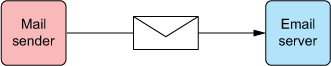

# 19강

[[toc]]

## 1. 이메일 전송을 위해 스프링 설정하기
- 스프링 이메일 추상화의 핵심은 MailSender 인터페이스
- MailSender 구현체는 이메일 서버에 연결하여 이메일 전송
- 스프링은 MailSender 인터페이스의 구현체 중 하나인 JavaMailSenderImpl을 제공하며, 이메일을 보내기 위해 JavaMail API를 사용한다.



### 1-1. 메일 전송자 설정하기
```java
@Bean
public MailSender mailSender(Environment env) {
    JavaMailSenderImpl mailSender = newJavaMailSenderImpl();
    mailSender.setHost(env.getPorperty("mailserver.host"));
    mailSender.setPort(env.getPorperty("mailserver.port"));
    mailSender.setUsername(env.getProperty("mailserver.username"));
    mailSender.setPassword(env.getProperty("mailserver.password"));
    return mailSender;
}
```

- JavaMailSenderImpl 빈 설정
- JavaMailSenderImpl은 자신의 메일 세션을 생성하기 위해서 설정된다.

```java
@Bean
public JndiObjectFactoryBean mailSession() {
    JndiObjectFactoryBean jndi = new JndiObjectFactoryBean();
    jndi.setJndiName("mail/Session");
    jndi.setProxyInterface(MailSession.class);
    jndi.setResourceRef(true);
    return jndi;
}
```

```java
@Bean
public MailSender mailSender(MailSession mailSession) {
    JavaMailSenderImpl mailSender = new JavaMailSenderImpl();
    mailSender.setSession(mailSession);
    return mailSender;
}
```

- 만약 JavaMailSenderImpl이 JNDI에서 구성되면, 전체 서버 상세 설정을 사용하여 설정하는 방식은 맞지 않다.
- JNDI에서 사용할 MailSession을 위와 같이 설정한다.
- 메일 세션을 JavaMailSenderImpl의 session 프로퍼티에 연결하여, 명시적으로 설정했던 부분을 JNDI로 관리하도록 변경이 된다.

### 1-2. 메일 서버를 와이어링하고 사용하기
- 메일 발송자가 구성되었으므로, 이제 사용할 빈에 메일 발송자를 연결할 차례이다.
- Spittr 어플리케이션에서 SpitterEmailServiceImpl 클래스는 이메일을 보내는 곳으로, 그 안에 와이어링을 해준다.

```java
@Autowired
JavaMailSender mailSender;
```

- 실제 메세지를 보내는 메소드

```java
public void sendSimpleSpittleEmail(String to, Spittle spittle) {
    SimpleMailMessage message = new SimpleMailMessage();	// 메세지 구성
    String spitterName = spittle.getSpitter().getFullName();
    message.setFrom("noreply@spitter.com");	// 이메일 주소
    message.setTo(to);
    message.setSubject("New spittle from " + spitterName);
    message.setText(spitterName + " says: " +	// 메세지 텍스트 작성
            spittle.getText());

    mailSender.send(message);	// 메일 발송
}
```

## 2. 이메일 메세지를 풍부하게 꾸미기
### 2-1. 첨부파일 추가하기
- 첨부파일이 포함된 이메일을 전송하기 위해서 멀티파트 메세지를 생성한다.
- 멀티파트 이메일을 보내기 위해서는 MIME(Multipurpose Internet Mail Extensions) 메세지를 생성해야한다.

```java
MimeMessage message = mailSender.createMimeMessage();
```

- 설정이 끝났으니 이제 제목, 내용, 첨부파일만 있으면 되지만 API 자체를 사용하는게 어려우므로 스프링에서 제공하는 MimeMessageHelper를 사용해 보자

```java
MimeMessageHelper helper = new MimeMessageHelper(message, true); 
// 위에 생성한 메세지를 생성자 인자로 넘겨줌
```

- 이제 메세지 대신, 헬퍼를 통해 이메일 세부사항을 설정한다.

```java
String spitterName = spittle.getSpitter().getFullName();
helper.setFrom("noreply@spitter.com");
helper.setTo(to);
helper.setSubject("New spittle from " + spitterName);
helper.setText(spitterName + " says: " + spittle.getText());
```

- 첨부 파일을 추가하기 위해 addAttachment() 메소드를 사용하자

```java
FileSystemResource couponImage =
    new FileSystemResource("/collateral/coupon.png");
helper.addAttachment("Coupon.png", couponImage);
```

- 전체적인 소스는 다음과 같다.

```java
public void sendSpittleEmailWithAttachment(
         String to, Spittle spittle) throws MessagingException {
    MimeMessage message = mailSender.createMimeMessage();
    MimeMessageHelper helper =
        new MimeMessageHelper(message, true);

    String spitterName = spittle.getSpitter().getFullName();
    helper.setFrom("noreply@spitter.com");
    helper.setTo(to);
    helper.setSubject("New spittle from " + spitterName);
    helper.setText(spitterName + " says: " + spittle.getText());
    FileSystemResource couponImage =
        new FileSystemResource("/collateral/coupon.png");
    helper.addAttachment("Coupon.png", couponImage);	

    mailSender.send(message);
}
```

### 2-2. 리치 콘텐츠를 이용한 이메일 전송
- 메세지의 텍스트를 HTML로 줄 수 있는게 리치 이메일이다.

```java
helper.setText("<html><body>" +
  "<h4>" + spittle.getSpitter().getFullName() + " says...</h4>" +
  "<i>" + spittle.getText() + "</i>" +
      "</body></html>", true);
```

- 첨부파일 추가시엔 addAttachment() 대신 addInline()메소드를 사용하면 된다.

```java
ClassPathResource image =
               new ClassPathResource("spitter_logo_50.png");
helper.addInline("spitterLogo", image);
```

- 전체적인 소스

```java
public void sendRichSpitterEmail(String to, Spittle spittle)
                                  throws MessagingException {
    MimeMessage message = mailSender.createMimeMessage();
    MimeMessageHelper helper = new MimeMessageHelper(message, true);

    helper.setFrom("noreply@spitter.com");
    helper.setTo("craig@habuma.com");
    helper.setSubject("New spittle from " +
            spittle.getSpitter().getFullName());

    helper.setText("<html><body>" +	
        "<h4>" + spittle.getSpitter().getFullName() + " says...</h4>" +
        "<i>" + spittle.getText() + "</i>" +
            "</body></html>", true);

    ClassPathResource image =
        new ClassPathResource("spitter_logo_50.png");
    helper.addInline("spitterLogo", image);	

    mailSender.send(message);
}
```

## 3. 템플릿을 사용하여 이메일 생성하기
### 3-1. Velocity를 사용하여 이메일 메세지를 구성하기
- 이메일 메세지 레이아웃 배치를 위해 Velocity를 사용하려면, 먼저 VelocityEngine을 SpitterEmailServiceImpl에 연결해야 한다.
- 스프링에서 제공하는 VelocityEngineFactoryBean 설정

```java
@Bean
public VelocityEngineFactoryBean velocityEngine() {
    VelocityEngineFactoryBean velocityEngine =
            new VelocityEngineFactoryBean();

    Properties props = new Properties();
    props.setProperty("resource.loader", "class");
    props.setProperty("class.resource.loader.class",
            ClasspathResourceLoader.class.getName());
    velocityEngine.setVelocityProperties(props);
    return velocityEngine;
}
```

- 이 벨로시티 엔진을 SpitterEmailServiceImpl에 연결한다.

```java
@Autowired
VelocityEngine velocityEngine;
```

- 위 엔진을 통해 이메일 텍스트로 전송할 수 있는 String으로 변환한다.
- VelocityEngineUtils를 사용한다.

```java
Map<String, String> model = new HashMap<String, String>();
model.put("spitterName", spitterName);
model.put("spittleText", spittle.getText());
String emailText = VelocityEngineUtils.mergeTemplateIntoString(
          velocityEngine, "emailTemplate.vm", model );
```

- 이제 병합된 이메일 텍스트를 helper의 setText()에다가 넣어주자.

```java
helper.setText(emailText, true);
```

- 템플릿 자체는 클래스패스의 루트에 emailTemplate.vm 이라는 파일로 존재한다.

```html
<html>
<body>
  
  <h4>${spitterName} says...</h4>
  <i>${spittleText}</i>
</body>
</html>
```

- 앞에 했던 html 때려박는거보다 가독성도 높고 관리도 쉬워진다.

### 3-2. 이메일 메세지를 만들기 위해 Thymeleaf 사용하기
- 타임리프를 사용해 HTML 이메일 메세지를 전송하는 것은 Velocity와 비슷하다.

```java
Context ctx = new Context();
ctx.setVariable("spitterName", spitterName);
ctx.setVariable("spittleText", spittle.getText());
String emailText = thymeleaf.process("emailTemplate.html", ctx);

...

helper.setText(emailText, true);
mailSender.send(message);
```

- 타임리프 컨텍스트 인스턴스를 생성해 모델 데이터로 채운다.
- 이후 process 메소드를 호출하여 모델 데이터를 스트링으로 병합처리 해주고, setText에 넣어주면 된다.
- 타임리프 엔진은 6장 설정처럼 SpringTemplateEngine 설정 빈에서 생성된다.

```java
@Autowired
private SpringTemplateEngine thymeleaf;

@Autowired
public SpitterEmailServiceImpl(SpringTemplateEngine thymeleaf) {
  this.thymeleaf = thymeleaf;
}
```

- config에서 ClassLoaderTemplateResolver가 추가되면 된다.

```java
@Bean
public ClassLoaderTemplateResolver emailTemplateResolver() {
    ClassLoaderTemplateResolver resolver =
            new ClassLoaderTemplateResolver();
    resolver.setPrefix("mail/");
    resolver.setTemplateMode("HTML5");
    resolver.setCharacterEncoding("UTF-8");
    setOrder(1);
    return resolver;
}
```

- setOrder를 통해 우선순위를 나타내준다.

```java
@Bean
public ServletContextTemplateResolver webTemplateResolver() {
    ServletContextTemplateResolver resolver =
            new ServletContextTemplateResolver();
    resolver.setPrefix("/WEB-INF/templates/");
    resolver.setTemplateMode("HTML5");
    resolver.setCharacterEncoding("UTF-8");
    setOrder(2);
    return resolver;
}
```

- ClassLoaderTemplateResolver 는 1번이고, ServletContextTemplateResolver는 2번이다.
- 이후에 모든 템플릿 리졸버를 쓰도록 SpringTemplateEngine 빈 설정을 해준다.

```java
@Bean
public SpringTemplateEngine templateEngine(
    Set<ITemplateResolver> resolvers) {
    SpringTemplateEngine engine = new SpringTemplateEngine();
    engine.setTemplateResolvers(resolvers);
    return engine;
}
```