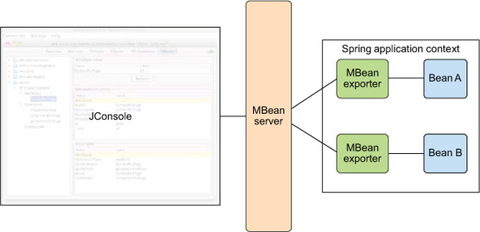
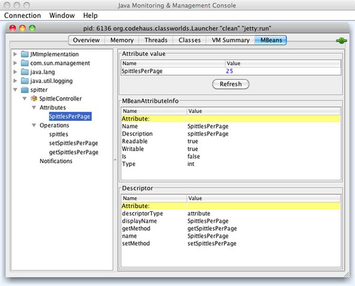
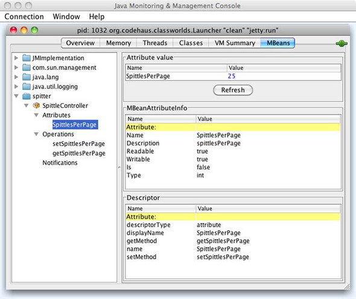
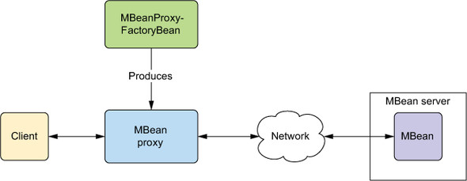
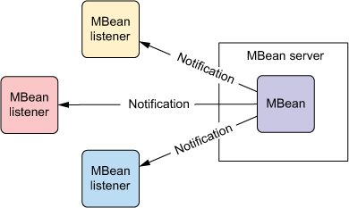

# 20강

[[toc]]

- 실해중인 어플리케이션 설정을 바꾸려면 JMX(Java Management Extensions)가 필요하다.
- JMX를 이용한 관리 목적에 특화되어 있는 어플리케이션의 핵심 구성요소는 관리 빈(MBean)
    - 표준 Mbean - 표준 MBean은 해당 빈 클래스가 구현하는 고정된 자바 인터페이스의 리플렉션에 의해 관리 인터페이스가 결정되는 MBean
    - 동적 Mbean - 다이나믹 MBean은 실행 시에 DynamicMBean 인터페이스의 메소드 호출에 의해 관리 인터페이스가 정해진다. 관리 인터페이스가 정적인 인터페이스에 의해 정의되지 않으므로 실행 시마다 달라질 수 잇다.
    - 오픈 Mbean - 오픈 MBean은 어트리뷰트와 오퍼레이션이 원시타입, 래퍼클래스, 원시타입이나 래퍼 클래스로 분해될수 있는 타입으로 제한한다.
    - 모델 Mbean - 모델 MBean은 관리 인터페이스를 관리 리소스로 넘기는 다이나믹 MBean. 일반적으로 메타 정보를 이용해 관리 인터페이스를 조립하는 팩토리에 의해 만들어짐.
- 스프링의 JMX 모듈을 이용하면 스프링 빈을 모델 MBean으로 익스포팅해 실행 중인 어플리케이션 내부 설정 변경이 가능하다.

## 1. 스프링 빈을 MBean으로 익스포트하기
- spittlePerPage 프로퍼티를 추가해 준다.

```java
public static final int DEFAULT_SPITTLES_PER_PAGE = 25;
private int spittlesPerPage = DEFAULT_SPITTLES_PER_PAGE;

public void setSpittlesPerPage(int spittlesPerPage) {
  this.spittlesPerPage = spittlesPerPage;
}

public int getSpittlesPerPage() {
  return spittlesPerPage;
}
```

- 빌드시점에 결정하지 않고, JMX를 이용해 실행 시점에 결정을 변경하게 된다.
- 위에선 spittlePerPage 프로퍼티로 가능하게 해준다.
- 하지만 spittlePerPage는 단순한 빈의 프로퍼티이므로, 위의 설정을 갖고있는 SpittleController 빈자체를 MBean으로 노출시켜주어야 한다.
- MBean으로 노출되면, spittlePerPage프로퍼티는 MBean의 관리 어트리뷰트가 되어 실행시점에 값 설정이 가능해진다.
- 스프링의 MBeanExporter는 MBean 서버에서 스프링 관리 빈을 모델 MBean으로 익스포트하는 빈이다.
- JMX MBean 으로 익스포트하면, JConsole이나 VisualVM 같은 JMX 기반의 관리도구를 이용해 실행 중인 어플리케이션 내부를 들여다보고, 그 빈의 프로퍼티를 살펴보면서 메소드 호출등을 하게 된다.



- 아래와 같은 설정을 통해 특정 빈을 모델 MBean으로 익스포트가 가능하다.

```java
@Bean
public MBeanExporter mbeanExporter(SpittleController spittleController) {
    MBeanExporter exporter = new MBeanExporter();
    Map<String, Object> beans = new HashMap<String, Object>();
    beans.put("spitter:name=SpittleController", spittleController);
    exporter.setBeans(beans);
    return exporter;
}
```

- 위와 같이 설정하면 JConsole을 통해 확인이 가능하다.



- 위와 같이 MBeanExpoert를 설정하면 spittleController 빈이 SpittleController라는 이름의 모델 MBean으로 MBean 관리 서버에 익스포트 된다.
- 위에서 setSpittlePerPage의 세밀한 설정이 필요한데, 스프링은 다음고 같은 옵션을 제공한다.
    - 이름을 사용하여 노출 또는 무시할 빈 메소드의 이름 선언
    - 인터페이스로 빈을 구성하여 노출 메소드 선택
    - 빈에 어노테이션을 적용하여 관리 어트리뷰트와 오퍼레이션 지정

### 1-1. 이름으로 메소드 노출시키기
- MBean의 노출을 제한하기 위해 MethodNameBasedMBeanInfoAssembler에게 MBean의 인터페이스에 있는 메소드만 포함하라고 알려줘야 한다.

```java
@Bean
public MethodNameBasedMBeanInfoAssembler assembler() {
    MethodNameBasedMBeanInfoAssembler assembler =
            new MethodNameBasedMBeanInfoAssembler();
    assembler.setManagedMethods(new String[] {
        "getSpittlesPerPage", "setSpittlesPerPage"
    });
    return assembler;
}
```

- managedMethods 프로퍼티는 MBean의 관리 오퍼레이션으로 노출된 메소드 명 목록을 받는다.
- 실제로 어셈블러가 동작하기 위해선 MBeanExporter에 와이어링 되어야 한다.

```java
@Bean
public MBeanExporter mbeanExporter(
      SpittleController spittleController,
      MBeanInfoAssembler assembler) {
    MBeanExporter exporter = new MBeanExporter();
    Map<String, Object> beans = new HashMap<String, Object>();
    beans.put("spitter:name=SpittleController", spittleController);
    exporter.setBeans(beans);
    exporter.setAssembler(assembler);
    return exporter;
}
```



- 위의 그림을 보면 spittles()는 더이상 관리되지 않는다.
- 또다른 메소드 이름 기반 어셈블러로는 MethodExclusionMBeanInfoAssembler가 있다.
- MethodNameBasedMBeanInfoAssembler 와는 반대로 노출하지 말아야할 메소드 목록을 추가해 줘야 한다.

```java
@Bean
public MethodExclusionMBeanInfoAssembler assembler() {
  MethodExclusionMBeanInfoAssembler assembler =
          new MethodExclusionMBeanInfoAssembler();
  assembler.setIgnoredMethods(new String[] {
      "spittles"
  });
  return assembler;
}
```

- 메소드 숫자가 얼마안되면 몇개만 추가하면 되지만, 양이 엄청나게 많아지면 이제 소스가 더러워진다.

### 1-2. 인터페이스를 이용한 MBean 오퍼레이션과 어트리뷰트 정의
- InterfaceBasedMBeanInfoAssembler는 인터페이스를 이용해 관리할 빈의 메소드 선택이 가능하다.
- 메소드 목록을 적어주는 대신, 익스포트할 메소드를 정의하는 인터페이스를 적어준다.

```java
public interface SpittleControllerManagedOperations {
    int getSpittlesPerPage();
    void setSpittlesPerPage(int spittlesPerPage);
}
```

- 위와 같이 인터페이스를 정으해주고, getSpittlesPerPage, setSpittlesPerPage를 적어줘서 spittlePerPage를 간접적으로 익스포트 해준다.

```java
@Bean
public InterfaceBasedMBeanInfoAssembler assembler() {
    InterfaceBasedMBeanInfoAssembler assembler =
            new InterfaceBasedMBeanInfoAssembler();
    assembler.setManagedInterfaces(
        new Class<?>[] { SpittleControllerManagedOperations.class }
    );
    return assembler;
}
```

- 위의 인터페이스를 만들었다고 해서, SpittleController 에서 인터페이스를 구현할 필요는 없다.
- 위의 인터페이스를 사용하면, 필요한 메소드명을 쫙 적어둘 순 있지만, 결국 중복 선언이라 보기 싫다.

### 1-3. 어노테이션 주도의 MBean을 이용한 작업
- 귀찮은 어셈블러 설정이나 MBeanExpoerter 빈사용 대신에 아래와 같이 설정해 준다.

```xml
<context:mbean-export server="mbeanServer" />
```

- 이후에 스프링 빈을 MBean으로 변환하기 위해선 아래와 같이 어노테이션을 사용하기만 하면 된다.

```java
@Controller
@ManagedResource(objectName="spitter:name=SpittleController") 
// Mbean으로 SpittleController 익스포트하기
public class SpittleController {
  
    ...

    @ManagedAttribute // 관리 어트리뷰트로 spittlePerPage 노출하기
    public void setSpittlesPerPage(int spittlesPerPage) {
        this.spittlesPerPage = spittlesPerPage;
    }

    @ManagedAttribute 
    public int getSpittlesPerPage() {
        return spittlesPerPage;
    }
}
```

### 1-4. MBean 충돌 처리
- 만약 이름 충돌이 발생하면 어떻게 될까?
- 기본적으로 동일한 이름으로 익스포트하면 에러가 발생하지만, 프로퍼티나 어트리뷰트를 통해 기본 동작 수정이 가능하다.
    - FAIL_ON_EXISTING : 동일한 이름의 기존 MBean이 있으면 실패한다 (기본 동작)
    - IGNORE_EXISTING : 충돌을 무시하고 새로운 빈도 등록하지 않는다.
    - REPLACING_EXISTING : 기존 빈을 새로운 빈으로 대체한다.

```java
@Bean
public MBeanExporter mbeanExporter(
      SpittleController spittleController,
      MBeanInfoAssembler assembler) {
    MBeanExporter exporter = new MBeanExporter();
    Map<String, Object> beans = new HashMap<String, Object>();
    beans.put("spitter:name=SpittleController", spittleController);
    exporter.setBeans(beans);
    exporter.setAssembler(assembler);
    exporter.setRegistrationPolicy(RegistrationPolicy.IGNORE_EXISTING); // 무시 설정
    return exporter;
}
```

## 2. MBean 리모팅
### 2-1. 원격 MBean 노출하기
- 간단하게는 스프링의 ConnectorServerFactoryBean을 구성하면 된다.

```java
@Bean
public ConnectorServerFactoryBean connectorServerFactoryBean() {
  return new ConnectorServerFactoryBean();
}
```

- RMI를 이용하려면, serviceUrl을 설정해 주면 된다.

```java
@Bean
public ConnectorServerFactoryBean connectorServerFactoryBean() {
    ConnectorServerFactoryBean csfb = new ConnectorServerFactoryBean();
    csfb.setServiceUrl(
        "service:jmx:rmi://localhost/jndi/rmi://localhost:1099/spitter");
    return csfb;
}
```

- rmi 팩토리도 설정해 준다.

```java
@Bean
public RmiRegistryFactoryBean rmiRegistryFB() {
    RmiRegistryFactoryBean rmiRegistryFB = new RmiRegistryFactoryBean();
    rmiRegistryFB.setPort(1099);
    return rmiRegistryFB;
}
```

### 2-2. 원격 MBean에 액세스하기
- MBeanServerConnectionFactoryBean을 설정해 준다.

```java
@Bean
public MBeanServerConnectionFactoryBean connectionFactoryBean() {
    MBeanServerConnectionFactoryBean mbscfb =
            new MBeanServerConnectionFactoryBean();
    mbscfb.setServiceUrl(
        "service:jmx:rmi://localhost/jndi/rmi://localhost:1099/spitter");
    return mbscfb;
}
```

- 빈 프로퍼티로 클라이언트에 연결

```java
@Bean
public JmxClient jmxClient(MBeanServerConnection connection) {
    JmxClient jmxClient = new JmxClient();
    jmxClient.setMbeanServerConnection(connection);
    return jmxClient;
}
```

- MBeanServerConnection에는 MBean 서버를 쿼리하고, MBean 메소드 호출을 할 수 있는 메소드가 존재한다.

```java
int mbeanCount = mbeanServerConnection.getMBeanCount();
System.out.println("There are " + mbeanCount + " MBeans");
```

- 원격 서버에 등록된 MBean의 어트리뷰트에 액세스하고 오퍼레이션을 호출이 가능하다.
- getAttribute와 setAttribute 를 사용한다.

```java
String cronExpression = mbeanServerConnection.getAttribute(
    new ObjectName("spitter:name=SpittleController"), "spittlesPerPage");
```

```java
mbeanServerConnection.setAttribute(
    new ObjectName("spitter:name=SpittleController"),
    new Attribute("spittlesPerPage", 10));
```

- 오퍼레이션 호출

```java
mbeanServerConnection.invoke(
    new ObjectName("spitter:name=SpittleController"),
    "setSpittlesPerPage",
    new Object[] { 100 },
    new String[] {"int"});
```

### 2-3. MBean 프록시 만들기
- MBeanProxyFactoryBean은 15장에서 설정한 팩토리와 같은 성질의 빈이다.
- MBeanProxyFactoryBean은 원격 관리 빈에 대한 프록시 기반 액세스를 제공하는 것이 아니라 원격 MBean에 직접 액세스 한다.

```java
@Bean
public MBeanProxyFactoryBean remoteSpittleControllerMBean(
        MBeanServerConnection mbeanServerClient) {
    MBeanProxyFactoryBean proxy = new MBeanProxyFactoryBean();
    proxy.setObjectName("");
    proxy.setServer(mbeanServerClient);
    proxy.setProxyInterface(SpittleControllerManagedOperations.class);
    return proxy;
}
```



## 3. 통지 처리
- 직접 디비에 붙지않고, MBean에서 정보를 줘서 통지하는게 모니터링 할 때 효율적이다.
- 스프링 통지 전송 지원 기능은 NotificationPublisherAware 인터페이스가 담당한다.



```java
@Component
@ManagedResource("spitter:name=SpitterNotifier")
@ManagedNotification(
        notificationTypes="SpittleNotifier.OneMillionSpittles",
        name="TODO")
public class SpittleNotifierImpl
    implements NotificationPublisherAware, SpittleNotifier {	
        // NotificationPublisherAware 구현

    private NotificationPublisher notificationPublisher;

    public void setNotificationPublisher(	// 주입
            NotificationPublisher notificationPublisher) {
        this.notificationPublisher = notificationPublisher;
    }

    public void millionthSpittlePosted() {
        notificationPublisher.sendNotification(	
                new Notification(
                        "SpittleNotifier.OneMillionSpittles", this, 0));
    }
}
```

### 3-1. 통지 듣기
- MBean 통지를 받는 표준 방식은 javax.managemnt.NotificationListener 인터페이스를 구현하는 것이다.

```java
public class PagingNotificationListener
       implements NotificationListener {

  public void handleNotification(
          Notification notification, Object handback) {
     // ...
  }
}
```

- handleNotification에 통지 관련 구현을 한다.
- 이제 MBeanExporter를 이용해 PagingNotificationListener를 등록하는 작업을 한다.

```java
@Bean
public MBeanExporter mbeanExporter() {
    MBeanExporter exporter = new MBeanExporter();
    Map<?, NotificationListener> mappings =
            new HashMap<?, NotificationListener>();
    mappings.put("Spitter:name=PagingNotificationListener",
                new PagingNotificationListener());
    exporter.setNotificationListenerMappings(mappings);
    return exporter;
}
```