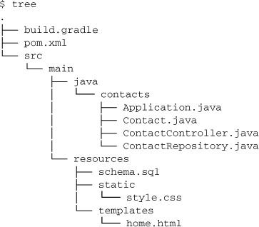

# 21강

[[toc]]

## 1. 스프링 부트 소개
- 스프링 부트 스타터 : 스프링 부트 스타터는 프로젝트의 메이븐에 추가 가능한 일반적인 그룹화된 의존을 단일 의존으로 모은다.
- 자동 설정 : 스프링 부트의 자동 설정 기능은 합리적으로 어플리케이션에서 필요한 빈을 추측하고 자동으로 설정하기 위한 조건부 설정 지원 활용
- 커맨드라인 언터페이스 : 스프링 부트의 CLI는 스프링 어플리케이션 개발을 더 간단하게 해주기 위해 자동 설정에서 그루비 프로그래밍 언어의 장점 활용
- 액추에이터 : 관리 기능 추가

### 1-1. 스타터 의존 추가하기
- 기존 스프링에선 여러개의 의존성이 필요하다.

```gradle
dependencies {
  compile("org.springframework:spring-web:4.0.6.RELEASE")
  compile("org.springframework:spring-webmvc:4.0.6.RELEASE")
  compile("com.fasterxml.jackson.core:jackson-databind:2.2.2")
  compile("org.springframework:spring-jdbc:4.0.6.RELEASE")
  compile("org.springframework:spring-tx:4.0.6.RELEASE")
  compile("com.h2database:h2:1.3.174")
  compile("org.thymeleaf:thymeleaf-spring4:2.1.2.RELEASE")
}
```

- 스프링 부트 스타터를 사용하면 좀더 간결해 진다.

```gradle
dependencies {
  compile("org.springframework.boot:spring-boot-starter-web:
           1.1.4.RELEASE")
  compile("org.springframework.boot:spring-boot-starter-jdbc:
           1.1.4.RELEASE")
  compile("com.h2database:h2:1.3.174")
  compile("org.thymeleaf:thymeleaf-spring4:2.1.2.RELEASE")
}
```

- 여러개의 라이브러리 의존성이 합쳐져 있다.

### 1-2. 자동 설정
- 6장에서 설정햇던 Thymeleaf 템플릿 활성화를 위해선 최소 세개의 빈, ThymeleafViewResolver, SpringTemplateEngine, TemplateResolver가 필요했지만, 스프링 부트 자동 설정을 사용하면 Thymeleaf를 프로젝트의 클래스 패스에 넣어주면 된다.
- 스프링 MVC에서 클래스패스에서 발견하면 자동으로 세개의 빈을 설정해준다.
- 스프링 MVC를 사용하기 위해서도, 웹 스타터만을 의존성에 추가해주면 끝난다.
- 이런식으로 자동 설정들을 지원해 준다.

### 1-3. 스프링 부트 CLI
- 스프링 부트 CLI는 그루비를 사용하여 그루비 스크립트를 실행할 수 있고 동작 확인도 가능하다.

```groovy
@RestController
class Hi {
  @RequestMapping("/")
  String hi() {
        "Hi!"
  }
}
```

```
$ spring run Hi.groovy
```

- 위의 소스가 아래와 같이 CLI에서 실행이 가능하다.

### 1-4. Actuator
- 스프링 부트 액츄에이터는 다음과 같은 기능들을 제공한다.
    - 엔드포인트 관리
    - 실용적인 오류 처리와 /error 엔드포인트에 대한 기본 매핑
    - 어플리케이션에 대한 정보를 전달할 수 있는 /info 엔드포인트
    - 스프링 시큐리티가 동작할 때의 검증 이벤트 프레임웤,

## 2. 스프링 부트로 어플리케이션 만들기
- 간단한 연락처 어플리케이션을 만들어 보자
- 그래들 및 메이븐 설정이다.

```gradle
buildscript {
  repositories {
    mavenLocal()
  }
  dependencies {
    classpath("org.springframework.boot:spring-boot-gradle-plugin:
               1.1.4.RELEASE")
  }
}

apply plugin: 'java'
apply plugin: 'spring-boot'	// 스프링 부트 플러그인 사용

jar {	
  baseName = 'contacts'
  version = '0.1.0'
}

repositories {
  mavenCentral()
}

dependencies {	

}

task wrapper(type: Wrapper) {
  gradleVersion = '1.8'
}
```

```xml
<?xml version="1.0" encoding="UTF-8"?>
<project xmlns="http://maven.apache.org/POM/4.0.0"
    xmlns:xsi="http://www.w3.org/2001/XMLSchema-instance"
    xsi:schemaLocation="http://maven.apache.org/POM/4.0.0
    http://maven.apache.org/xsd/maven-4.0.0.xsd">

  <modelVersion>4.0.0</modelVersion>
  <groupId>com.habuma</groupId>
  <artifactId>contacts</artifactId>
  <version>0.1.0</version>
  <packaging>jar</packaging>	

  <parent>
    <groupId>org.springframework.boot</groupId>	
    <artifactId>spring-boot-starter-parent</artifactId>
    <version>1.1.4.RELEASE</version>
  </parent>

  <dependencies>	

  </dependencies>

  <build>
    <plugins>
      <plugin>	
         <groupId>org.springframework.boot</groupId> <!-- 스프링 부트 플러그인 사용 -->
        <artifactId>spring-boot-maven-plugin</artifactId>
      </plugin>
    </plugins>
  </build>

</project>
```



- 프로젝트 구조

### 2-1. 요청 처리하기
- MVC를 사용하기 위해, 웹 스타터 의존이 필요하다.

```gradle
compile("org.springframework.boot:spring-boot-starter-web")
```

```xml
<dependency>
  <groupId>org.springframework.boot</groupId>
  <artifactId>spring-boot-starter-web</artifactId>
</dependency>
```

- 컨트롤러는 연락처를 보여주거나 폼제출 기능을 추가한다.
- 실제론 Repository클래스에 위임할 예정

```java
@Controller
@RequestMapping("/")
public class ContactController {
  private ContactRepository contactRepo;

  @Autowired
  public ContactController(ContactRepository contactRepo) {	
    this.contactRepo = contactRepo;
  }

  @RequestMapping(method=RequestMethod.GET)	
   public String home(Map<String,Object> model) {
    List<Contact> contacts = contactRepo.findAll();
    model.put("contacts", contacts);
    return "home";
  }

  @RequestMapping(method=RequestMethod.POST)	
   public String submit(Contact contact) {
    contactRepo.save(contact);
    return "redirect:/";
  }
}
```

- 일반적인 MVC 컨트롤러의 모습
- Contact객체는 단순한 VO이다.

```java
public class Contact {
  private Long id;	
  private String firstName;
  private String lastName;
  private String phoneNumber;
  private String emailAddress;

  public void setId(Long id) {	
    this.id = id;
  }

  public Long getId() {
    return id;
  }

  public void setFirstName(String firstName) {
    this.firstName = firstName;
  }

  public String getFirstName() {
    return firstName;
  }

  public void setLastName(String lastName) {
    this.lastName = lastName;
  }

  public String getLastName() {
    return lastName;
  }

  public void setPhoneNumber(String phoneNumber) {
    this.phoneNumber = phoneNumber;
  }

  public String getPhoneNumber() {
    return phoneNumber;
  }

  public void setEmailAddress(String emailAddress) {
    this.emailAddress = emailAddress;
  }

  public String getEmailAddress() {
    return emailAddress;
  }
}
```

### 2-2. 뷰 만들기
- 타임리프 모듈을 추가한다.

```gradle
compile("org.thymeleaf:thymeleaf-spring4")
```

```xml
<dependency>
  <groupId>org.thymeleaf</groupId>
  <artifactId>thymeleaf-spring4</artifactId>
</dependency>
```

- 자동 설정으로 인해 Thymeleaf 뷰 결정자, 템플릿 결정자, 템플릿 엔진 빈이 자동 생성된다.
- home.html을 작성해보면

```html
<!DOCTYPE html>
<html xmlns:th="http://www.thymeleaf.org">
  <head>
    <title>Spring Boot Contacts</title>
    <link rel="stylesheet" th:href="@{/style.css}" />	
   </head>
  <body>
    <h2>Spring Boot Contacts</h2>

    <form method="POST">	
       <label for="firstName">First Name:</label>
        <input type="text" name="firstName"></input><br/>
      <label for="lastName">Last Name:</label>
        <input type="text" name="lastName"></input><br/>
      <label for="phoneNumber">Phone #:</label>
        <input type="text" name="phoneNumber"></input><br/>
      <label for="emailAddress">Email:</label>
        <input type="text" name="emailAddress"></input><br/>
      <input type="submit"></input>
    </form>

    <ul th:each="contact : ${contacts}">	
       <li>
        <span th:text="${contact.firstName}">First</span>
      <span th:text="${contact.lastName}">Last</span> :
        <span th:text="${contact.phoneNumber}">phoneNumber</span>,
      <span th:text="${contact.emailAddress}">emailAddress</span>
    </li>
    </ul>
  </body>
</html>
```

- 파일 위치는 src/main/resources/templates 아래에 있어야한다.
- 파일 이름은 컨트롤러 리턴값에 맞는 home.html로 지어야한다.

### 2-3. 정적 아티팩트 추가하기
- 부트가 MVC 자동설정을 할때, 리소스 위치는 다음과 같은 위치를 찾는다.
    - /META-INF/resources/
    - /resources/
    - /static/
    - /public/
- 타임리프 템플릿의 기준을 맞추기 위한 style.css 파일의 위치는 아래중 하나여야 한다.
    - /META-INF/resources/style.css
    - /resources/style.css
    - /static/style.css
    - /public/style.css

### 2-4. 데이터 보존하기
- JDBC와 H2 디비를 쓰기 위해 다음과 같은 설정을 해줘야 한다.

```gradle
compile("org.springframework.boot:spring-boot-starter-jdbc")
compile("com.h2database:h2")
```

```xml
<dependency>
  <groupId>org.springframework.boot</groupId>
  <artifactId>spring-boot-starter-jdbc</artifactId>
</dependency>
<dependency>
  <groupId>com.h2database</groupId>
  <artifactId>h2</artifactId>
</dependency>
```

- ContactRepository에서 jdbcTemlpate을 사용하는 로직은 다음과 같다.

```java
@Repository
public class ContactRepository {
  private JdbcTemplate jdbc;
  @Autowired
  public ContactRepository(JdbcTemplate jdbc) {	
     this.jdbc = jdbc;
  }

  public List<Contact> findAll() {
    return jdbc.query(	
       "select id, firstName, lastName, phoneNumber, emailAddress " +
      "from contacts order by lastName",
      new RowMapper<Contact>() {
        public Contact mapRow(ResultSet rs, int rowNum)
              throws SQLException {
          Contact contact = new Contact();
          contact.setId(rs.getLong(1));
          contact.setFirstName(rs.getString(2));
          contact.setLastName(rs.getString(3));
          contact.setPhoneNumber(rs.getString(4));
          contact.setEmailAddress(rs.getString(5));
          return contact;
        }
      });
  }

  public void save(Contact contact) {
    jdbc.update(	
       "insert into contacts " +
        "(firstName, lastName, phoneNumber, emailAddress) " +
        "values (?, ?, ?, ?)",
      contact.getFirstName(), contact.getLastName(),
      contact.getPhoneNumber(), contact.getEmailAddress());
  }
}
```

- 일반적인 스프링 어플리케이션과 모습이 동일하다.
- 특이한 점으론 JdbcTemplate 빈을 따로 선언할 필요가 없다는 점이다.
- H2빈도 마찬가지로 설정이 필요없다. 
- 모든건 자동설정을 통해 해준다.

### 2-5. 실행하기
- 실행하기 위해, DispatcherServlet 이나 web.xml 따위는 필요없다.
- 부트스트래퍼 클래스를 설정해 주면 된다.

```java
@ComponentScan
@EnableAutoConfiguration	// 자동 설정 활성화
 public class Application {
  public static void main(String[] args) {
    SpringApplication.run(Application.class, args); // 어플리케이션 실행	
   }
}
```

- gradle이나 메이븐으로 빌드를 하고, 생서되는 JAR를 실행해주면 끝난다.

```
gradle build 

or

mvn package

-----------------

java -jar build/libs/contacts-0.1.0.jar
```

## 3. 스프링 부트 CLI로 그루비 사용하기
- 그루비는 접근자 (setter / getter)가 없고, 세미콜론도 없고 등등.. 편하게 쓸수 있는 언어
- 여튼 간단하게 사용이 가능하다.
- 책에 나온 그루비 예제는 따로 적지 않음.. 쓰게되면 보자

## 4. 액추에이터로 어플리케이션 파악하기
- 스프링 부트 액추에이터의 주된 역할은 스프링 부트 기반의 어플리케이션에 유용한 엔드포인트 관리 기능 추가이다.

| 엔드포인트 | 기능 |
| --- | --- |
| GET /autoconfig | 자동 설정이 적용될 때 스프링 부트에 의한 결정을 설명 |
| GET /beans | 어플리케이션을 실행하기 위해 설정되는 빈의 카탈로그 |
| GET /configprops | 현재 값으로 어플리케이션의 빈을 설정하기 위한 모든 프로퍼티 목록 |
| GET /dump | 각 스레드의 스택 추적을 포함한 어플리케이션의 스레드 목록 |
| GET /env | 어플리케이션 컨텍스트에서 사용 가능한 모든 환경변수와 시스템 프로퍼티 값의 목록 |
| GET /env/{name} | 특정 환경 변수나 프로퍼티의 값을 표시 |
| GET /health | 현재 어플리케이션의 상태 표시 |
| GET /info | 어플리케이션 상세 정보표시 |
| GET /metrics | 특정 엔드포인트에 대한 요청 개수를 포함한 어플리케이션에 관한 메트릭 목록 |
| GET /metrics{name} | 특정 어플리케이션 메트릭 키에 대한 메트릭 표시 |
| POST /shutdown | 강제로 어플리케이션 종료 |
| GET /trace | 요청과 응답을 포함한 어플리케이션을 통해 서비스된 최근 요청에 관한 메타데이터 목록 |

- 액추에이터 사용을 위해 의존성을 추가해 주어야 한다.

```gradle
compile("org.springframework.boot:spring-boot-starter-actuator")
```

```xml
<dependency>
  <groupId> org.springframework.boot</groupId>
  <artifactId>spring-boot-actuator</carlsbad>
</dependency>
```

- 사용해보면 다음과 같이 나온다.

```json
$ curl http://localhost:8080/beans

[
  {
    "beans": [
      {
        "bean": "contactController",
        "dependencies": [
          "contactRepository"
        ],
        "resource": "null",
        "scope": "singleton",
        "type": "ContactController"
      },
      {
        "bean": "contactRepository",
        "dependencies": [
          "jdbcTemplate"
        ],
        "resource": "null",
        "scope": "singleton",
        "type": "ContactRepository"
      },
      ...
      {
        "bean": "jdbcTemplate",
        "dependencies": [],
        "resource": "class path resource [...]",
        "scope": "singleton",
        "type": "org.springframework.jdbc.core.JdbcTemplate"
      },
      ...
    ]
  }
]
```

- 아이디가 contactController인 빈은 다른 빈인 contactRepository에 의존성이 있는것을 확인 할 수 있다.

```json
$ curl http://localhost:8080/autoconfig
{
"negativeMatches": {
  "AopAutoConfiguration": [
    {
      "condition": "OnClassCondition",
      "message": "required @ConditionalOnClass classes not found:
          org.aspectj.lang.annotation.Aspect,
          org.aspectj.lang.reflect.Advice"
    }
  ],
  "BatchAutoConfiguration": [
    {
      "condition": "OnClassCondition",
      "message": "required @ConditionalOnClass classes not found:
          org.springframework.batch.core.launch.JobLauncher"
    }
  ],
  ...
},
"positiveMatches": {
  "ThymeleafAutoConfiguration": [
    {
      "condition": "OnClassCondition",
      "message": "@ConditionalOnClass classes found:
          org.thymeleaf.spring4.SpringTemplateEngine"
    }
  ],
  "ThymeleafAutoConfiguration.DefaultTemplateResolverConfiguration":[
    {
      "condition": "OnBeanCondition",
      "message": "@ConditionalOnMissingBean
          (names: defaultTemplateResolver; SearchStrategy: all)
          found no beans"
    }
  ],
  "ThymeleafAutoConfiguration.ThymeleafDefaultConfiguration": [
    {
      "condition": "OnBeanCondition",
      "message": "@ConditionalOnMissingBean (types:
          org.thymeleaf.spring4.SpringTemplateEngine;
          SearchStrategy: all) found no beans"
    }

  ],
  "ThymeleafAutoConfiguration.ThymeleafViewResolverConfiguration": [
    {
      "condition": "OnClassCondition",
      "message": "@ConditionalOnClass classes found:
          javax.servlet.Servlet"
    }
  ],
  "ThymeleafAutoConfiguration.ThymeleafViewResolverConfiguration
          #thymeleafViewResolver": [
    {
      "condition": "OnBeanCondition",
      "message": "@ConditionalOnMissingBean (names:
          thymeleafViewResolver; SearchStrategy: all)
          found no beans"
    }
  ],
  ...
}
}
```

- /autoconfig 엔드포인트이다.
- 결과는 두 부분, 즉 일치와 불일치로 구서되어 있다.
- 불일치 부분은 AOP와 스프링 배치 자동 설정이 클래스를 클래스패스에서 찾지 못해 적용이 안된걸 알 수 있다.
- 일치된 건 SpringTemplateEngine이 클래스패스에서 찾아서 자동 설정이 된걸 확인할 수 있다.
- Actuator는 잘 활용하면 좋은 기능이니 쓸때 기능들을 찾아보자.