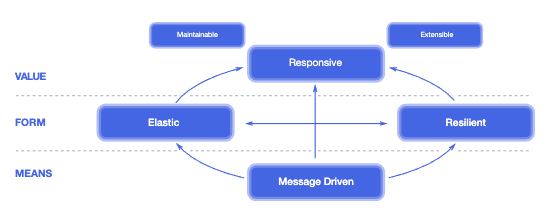

# 1장

[[toc]]

## 1. 왜 리액티브 스프링인가?
### 왜 리액티브인가?
- 시스템을 운영하다 보면 사람이 엄청 몰리면 서버가 터지는 경우가 아주 많다
- 어떻게 대응할 것인가?
- `탄력성` : 작업 부하가 몰리면 시스템 처리량이 자동으로 증가하고, 수요가 감소하면 자동으로 감소해야 한다
- 수평 또는 수직적인 확장을 통해 탄력성 달성이 가능
- 하지만 이런 시스템 구성은 매우 어려움
- 시스템 `복원력`을 잘 유지해야 사용자 경험을 좋게 할 수 있다

### 메시지 기반 통신
- 스프링 프레임워크 4에서 HTTP 통신을 수행하는 예제

```java
@RequestMapping("/resource")
public Object processRequest() {
    RestTemplate restTemplate = new RestTemplate();

    ExampleCollection result = template.getForObject(
        "http://abc.co.kr",
        ExamplesCollection.class
    );

    ...

    processResultFurther(result);
}
```

- 이런 블록킹 코드는 결과를 가져올 때까지 I/O에 의해 차단당해 다른 작업을 할 수가 없다
- 병렬 처리를 위해 추가 스레드를 할당할 수도 있지만, 부하가 높은 상태에선 그거도 비효율 적일 수 있다
- I/O 측면에서 리소스 활용도를 높이려면 `비동기 논블록킹` 모델을 사용해야 한다
- 일반적으로 분산 시스템에서 서비스간에 통신할 때 자원을 효율적으로 사용하기 위해선 `메세지 기반` 통신 원칙을 따라야 한다
- 메세지 기반 통신을 수행하는 방법으로는 메세지 브로커를 사용하는 것
- 이 경우 메세지 대기열을 모니터링해 시스템 부하 관리 및 탄력성 제어가 가능하다
- 추가로 메세지 통신의 흐름을 명확히 해서 설계를 단순화 할 수 있다



- [Reactive 선언문](https://www.reactivemanifesto.org/ko)
    - 응답성
    - 탄력성
    - 복원력
    - 메세지 기반
- 분산 시스템으로 구현되는 모든 비지니스의 핵심 가치는 `응답성`
- 즉 응답성을 확보하는것은 탄력성 및 복원력 같은 기본 기법을 따르고, 탄력성과 복원력을 확보하기 위한 방법은 메세지 기반 통신

### 반응성에 대한 유스케이스

- API 게이트웨이, 서비스 레지스트리를 포함한 분산 시스템 구축 패턴 [링크](https://microservices.io/patterns/)
- [배압(back-pressure)](https://www.reactivemanifesto.org/ko/glossary#Back-Pressure)

### 왜 리액티브 스프링인가?
- Akka / Vert.x 도 있다
- Akka 는 Scala 기반이고, Vert.x는 나온지 얼마안됨

### 서비스 레벨에서의 반응성
- 리액티브 시스템에 대한 수요 증가로 `스프링 클라우드`라는 새로운 스프링 프로젝트가 시작됨
- 분산 시스템 구축을 단순화하는 기반 프로젝트
- 자바의 기본 프로그래밍은 명령형 프로그래밍이다

```java
interface ShoppingCardService {
    Output calculate(Input value);
}

class OrderService {
    private final ShoppingCardService scService;

    void process() {
        Input input = ...;
        Output output = scService.calculate(input);
        ...
    }
}
```

- 자바 환경에서 scService.calculate(input) 메소드를 실행하면 OrderService 로직을 처리하는 동안 스레드가 차단된다
- 만약 OrderService 에서 별도의 독립적인 처리를 실행하려면 추가 스레드를 할당해야 한다
- 하지만 추가 스레드를 할당하는 것은 낭비일 수 있어서, 리액티스 시스템 관점으로 보다면 그런식의 동작은 허용되지 않는다
- 하지만 컴포넌트 사이의 통신을 위한 콜백을 사용하면 해결이 가능하다

```java
interface ShoppingCardService {
    void calculate(Input value, Consumer<Output> c);
}

class OrderService {
    private final ShoppingCardService scService;

    void process() {
        Input input = ...;
        Output output = scService.calculate(input, output -> {
            ...
        });
        ...
    }
}
```

- calculate는 설계 관점에서 호출하는 인스턴스가 즉시 대기상태에서 해제될 수 있으며, 그 결과는 나중에 지정된 Consumer<> 콜백으로 전달된다
- 이제 OrderService는 작업 완료 후에 반응할 콜백 함수를 전달한다.
- 이것은 OrderService가 ShoppingCardService로부터 분리(decoupled)됐음을 의미한다.
- 추가로 OrderService로 결과를 전달하는 함수형 콜백 호출을 위해 동기 또는 비동기적인 방식으로 calculate 메소드 구현이 가능하다

```java
class SyncShoppingCardService implements ShoppingCardService {
    public void calculate(Input value, Consumer<Output> c) {
        Output result =  new Output();
        c.accept(result);
    }
}

class AsyncShoppingCardService implements ShoppingCardService {
    public void calculate(Input value, Consumer<Output> c) {
        new Thread(() -> {
            Output result = template.getForObject(...);
            ...
            c.accept(result);
        }).start();
    }
}
```

- Sync는 I/O를 실행하지 않으므로 콜백함수에 전달해 즉시 반환한다
- Async는 I/O를 차단할 때 별도의 Thread로 래핑한다. 결과를 받으면 콜백함수를 호출해 결과를 전달
- 이런 방식은 공유 데이터 변경 및 콜백 지옥을 피하기 위해 개발자가 멀티 스레딩을 매우 잘 알아야 하는 단점이 있다
- 다른 대안은 Future를 사용하는 것

```java
interface ShoppingCardService {
    Future<Output> calculate(Input value);
}

class OrderService {
    private final ShoppingCardService csService;
    void process() {
        Input input = ...;
        Future<Output> future = scService.calculate(input);

        ...

        Output output = future.get();
    }
}
```

- caculate는 Future를 반환한다
- OrderService는 비동기적으로 ShoppingCardService를 호출하고, Future 인스턴스를 반환한다. 결과가 비동기적으로 처리되는 동안 다른 처리가 가능하다
- 위와 같이 Future를 사용해 결괏값 반환을 지연시킬 수 있다.
- 콜백 지옥도 피할 수 있고, Future 구현 뒤에 멀티 스레드의 복잡성을 숨길 수 있다.
- 어쨋든 필요한 결과를 얻으려면 현재 스레드를 차단하고 확장성을 현저하게 저하시키는 외부 실행과 동기화해야 한다
- 자바 8에선 이걸 개선한 CompletionStage 및 CompletableFuture를 제공

```java
public interface ShoppingCardService {
    CompletionStage<Output> calculate(Input value);
}

public class OrdersService {
    private final ShoppingCardService shoppingCardService;

    void process() {
        Input input = new Input();

        shoppingCardService.calculate(input)
                           .thenAccept(v -> System.out.println(shoppingCardService.getClass().getSimpleName() + " execution completed"));

        System.out.println(shoppingCardService.getClass().getSimpleName() + " calculate called");
    }
}
```

- 함수형 스타일 또는 선언형 스타일로 코드 작성이 가능해 코드는 깔끔하고 비동기적인 처리가 가능해 진다.
- 또한 결과를 기다리지 않고 결과가 나오면 이를 처리할 함수도 제공한다
- 하지만 Spring 4 MVC는 ListenableFuture를 자체 제공해서 문제가 많다

<hr>

- 리액티브 선언문은 논블로킹 작업을 사용하도록 권장했지만, 스프링 생태계에서는 누락돼 있었다
- 또한 컨텍스트 스위칭 문제를 해결한 네티와 같은 리액티브 서버와는 제대로된 통합을 이루지 못했었다
- 비동기 처리는 일반적인 요청-응답 패턴에만 국한되지 않고, 데이터의 연속적인 스트림으로 처리해야 하는 경우나 배압 지원이 있는 정렬된 변환 흐릅으로 처리할 때도 있다.
- 이런 리액티브 프로그래밍 적인 요소가 스프링엔 없었는데, 요걸 개선한게 Webflux

### 요약
- 리액티브 스프링 5를 이해하려면 리액티프 브로그램 기초를 확실하게 이해해야 한다.