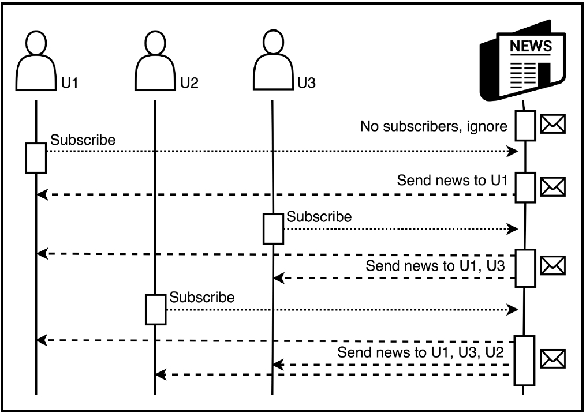
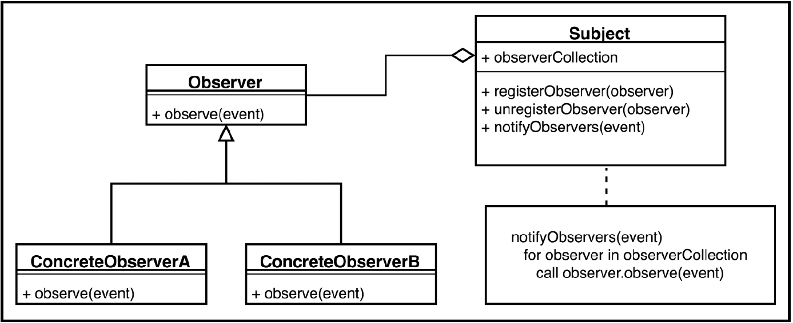
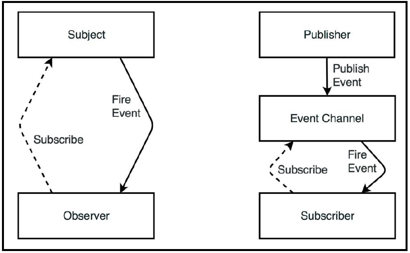
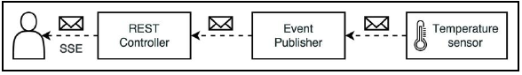
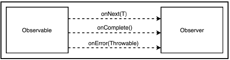
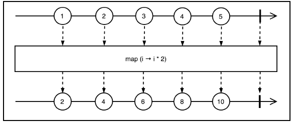
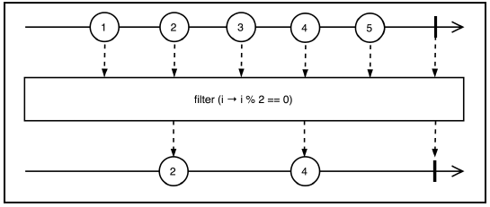
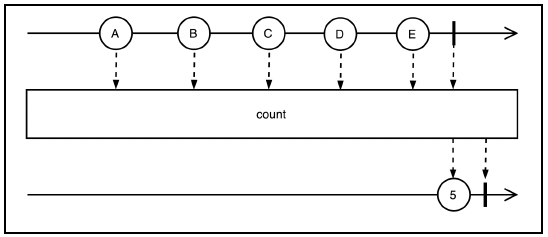
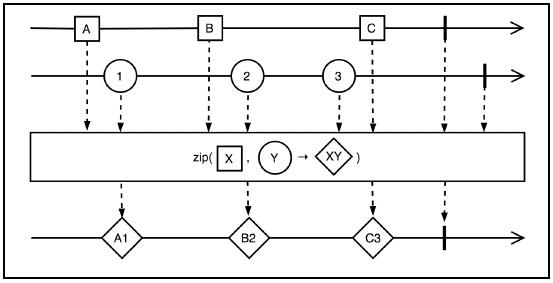

# 2강

[[toc]]

## 리액티브를 위한 스프링 프레임워크의 초기 해법
### 관찰자(Observer) 패턴
- 관찰자 패턴은 관찰자라고 불리는 자손의 리스트를 가지고 있는 `주체(subject)`가 필요
- 주체는 자신의 메소드중 하나를 호출해 `관찰자`에게 상태 변경 알림
- 이벤트 처리 기반 시스템의 필수 방식
- MVC패턴의 매우 중요한 부분 -> 대부분의 UI 라이브러리가 내부적으로 관찰자 패턴 사용
- 간단하게 그림으로 이해해보면



- 관찰자 패턴을 사용하면 런타임에 객체 사이에 일대다 의존성 등록이 가능
- 결합도가 낮춰진다



- 일반적인 관찰자 패턴은 Subject / Observer 2 개의 인터페이스로 구성된다
- Observer 는 Subject에 등록되고 Subject로부터 알람을 수신
- Subject 스스로 이벤트를 발생시키거나 다른 구성 요소에 의해 호출됨

```java
public interface Subject<T> {
    void registerObserver(Observer<T> observer);
    void unregisterObserver(Observer<T> observer);
    void notifyObservers(T event);
}
```

- 옵저버는 다음과 같다

```java
public interface Observer<T> {
    void observe(T event);
}
```

- String 메세지를수신해 출력하는 Observer 구현체

```java
public class ConcreteObserverA implements Observer<String> {
  @Override
  public void observe(String event) {
    System.out.println("Observer A : " + event);
  }
}

public class ConcreteObserverB implements Observer<String> {
    @Override
    public void observe(String event) {
        System.out.println("Observer B : " + evnet);
    }
}
```

- 이벤트를 String 이벤트를 생성하는 Subject<String>의 구현체도 만들어야 한다

```java
public class ConcreteSubject implements Subject<String> {

  private final Set<Observer<String>> observers =
      new CopyOnWriteArraySet<>();

  public void registerObserver(Observer<String> observer) {
    observers.add(observer);
  }

  public void unregisterObserver(Observer<String> observer) {
    observers.remove(observer);
  }

  public void notifyObservers(String event) {
    observers.forEach(observer -> observer.observe(event));
  }
}
```

### 관찰자 패턴 사용 예
- Junit 테스트를 돌려보면

```java
@Test
public void observersHandleEventsFromSubject() {

    //given
    Subject<String> subject = new ConcreteSubject();
    Observer<String> observerA = Mockito.spy(new ConcreteObserverA());
    Observer<String> observerB = Mockito.spy(new ConcreteObserverB());

    //when
    subject.notifyObservers("No listeners");

    subject.registerObserver(observerA);
    subject.notifyObservers("Message for A");

    subject.registerObserver(observerB);
    subject.notifyObservers("Message for A and B");

    subject.unregisterObserver(observerA);
    subject.notifyObservers("Message for B");

    subject.unregisterObserver(observerB);
    subject.notifyObservers("No listeners");

    //then
    Mockito.verify(observerA, times(1)).observe("Message for A");
    Mockito.verify(observerA, times(1)).observe("Message for A and B");
    Mockito.verifyNoMoreInteractions(observerA);

    Mockito.verify(observerB, times(1)).observe("Message for B");
    Mockito.verify(observerB, times(1)).observe("Message for A and B");
    Mockito.verifyNoMoreInteractions(observerB);
}


결과 : 
Observer A : Message for A
Observer A : Message for A and B
Observer B : Message for A and B
Observer B : Message for B
```

- 구독 취소가 필요 없는 경우 Observer 구현을 위해 람다 표현식 사용이 가능하다

```java
@Test
public void subjectLeveragesLamdas() {
    //given
    Subject<String> subject = new ConcreteSubject();

    subject.registerObserver(e -> System.out.println("A : " + e));
    subject.registerObserver(e -> System.out.println("B : " + e));
    subject.notifyObservers("Message for A and B");
}
```

- 다운스트림 처리와 같이, 대기시간이 긴 이벤트를 처리하는 관찰자가 많을 경우 추가적인 스레드 할당 또는 스레드풀을 사용해 메세지를 병렬로 처리가 가능하다

```java
private final ExecutorService executorService =
    Executors.newCachedThreadPool();

public void notifyObservers(String event) {
    observers.forEach(observer ->
        executorService.submit(
            () -> observer.observe(event)
        )
    );
}
```

- 이런 개선 방법은 직접 개발한 솔루션에서 자주 발생하는 비효율성 및 버그 발생 가능성이 높으니, 잘 만들어진 라이브러리를 쓰자
- 자바 옵저버도 있지만, 제네릭타입도 적용 안한 구버전이므로 쓰진말자
- 관찰자 패턴을 직접 구현해도 되지만, 너무 복잡하고 일일히 다 구현하긴 비효율 적이니 만들어 진걸 쓰자

### @EventListener를 사용한 발행-구독 패턴
- 스프링은 이벤트 처리를 위한 @EventListener와 ApplicationEventPublisher를 제공한다
- 해당 기능은 `발행-구독 패턴`



- 발행-구독 패턴은 게시자와 구독자 간에 간접적인 계층을 제공한다
- 구독자는 브로드캐스트 하는 이벤트 채널은 알고있지만, 게시자가 누군진 알지 못한다
- 각 이벤트 채널에는 여러명의 게시자가 있을 수 있다
- 이벤트 채널 (브로커)는 수신 메세지를 구독자에게 배포하기 전에 필터링도 가능

### @EventListener를 활용한 응용 프로그램 개발
- 서버에서 클라로 비동기 메세지 전달을 할 수 있는 SSE(Sever-Sent Events) 사용

#### 스프링 부트 애플리케이션 만들기
- spring-initializer 로 만듬

#### 비즈니스 로직 구현하기


- 예제에서 도메인 모델은 Temperature 클래스만 구성

```java
@Data
public class Temperature {
  private final double value;
}

@Component
public class TemperatureSensor {
  private final ApplicationEventPublisher publisher;
  private final Random rnd = new Random();
  private final ScheduledExecutorService executor = Executors.newSingleThreadScheduledExecutor();

  public TemperatureSensor(ApplicationEventPublisher publisher) {
    this.publisher = publisher;
  }

  @PostConstruct
  public void startProcessing() {
    this.executor.schedule(this::probe, 1, TimeUnit.SECONDS);
  }

  private void probe() {
    double temperature = 16 + rnd.nextGaussian() * 10;
    publisher.publishEvent(new Temperature(temperature));
    // random한 지연시간(0~5초)를 두고 다음 읽기 스케줄 예약
    executor.schedule(this::probe, rnd.nextInt(5000),TimeUnit.MILLISECONDS);
  }
}
```

### 스프링 웹 MVC를 이용한 비동기 HTTP 통신
- 스프링 웹 MVC에서 @Controller는 단일 타입 T 이외에도 Callable<T> 또는 DefferedResult<T>도 반환이 가능해 졌다
- 스프링 웹 MVC 4.2부터 DefferedResult와 비슷하게 동작하는 ResponseBodyEmitter를 반환할 수 있다
- ResponseBodyEmitter는 메세지 컨버터에 의해 개별적으로 만들어진 여러 개의 오브젝트를 전달하는 용도로 사용이 가능
- SseEmitter는 ResponseBodyEntity를 상속, SSE의 프로토콜 요구사항에 따라 하나의 수신 요청에 대해 다수의 발신 메세지를 보낼 수 있다.
- MVC는 ResponseBodyEmitter 및 SseEmitter와 StreamingResponseBody 인터페이스를 지원한다
- 위의 것들을 사용하면 @Controller에서 반환될 때 데이터를 비동기적으로 보낼 수 있다

### SSE 엔드포인트 노출

```java
@RestController
public class TemperatureController {

  private final Set<SseEmitter> clients = new CopyOnWriteArraySet<>();

  @GetMapping("/temperature-stream")
  public SseEmitter events(HttpServletRequest request) {
    SseEmitter emitter = new SseEmitter();
    clients.add(emitter);

    // remove emitter from clients on error or disconnect
    emitter.onTimeout(() -> clients.remove(emitter));
    emitter.onCompletion(() -> clients.remove(emitter));
    return emitter;
  }

  @Async
  @EventListener
  public void handleMessage(Temperature temperature) {
    List<SseEmitter> deadEmitters = new ArrayList<>();
    clients.forEach(emitter -> {
      try {
        emitter.send(temperature, MediaType.APPLICATION_JSON);
      } catch (Exception ignore) {
        deadEmitters.add(emitter);
      }
    });

    clients.removeAll(deadEmitters);
  }
}
```

- MVC에서는 SSE 이벤트를 보내는 목적으로만 SseEmitter 클래스를 사용
- temperature-stream으로 요청이 오면 새로운 SseEmitter를 만들고 활성 클라이언트 목록에 등록 후 리턴한다
- emitter는 자기 할일이 끝나거나 timeout에 도달하면 clients 컬렉션에서 제거
- handleMessage는 @EventListener 어노테이션을 사용해서 온도 이벤트를 수신할 때만 해당 메소드를 호춯한다
- @Async는 비동기 표시이며, json으로 송신한다

### 비동기 지원 설정하기
- 전체 코드 실행을 위해 실행 클래스를 생성한다

```java
@EnableAsync
@SpringBootApplication
public class Spring5ReactiveApplication implements AsyncConfigurer {

  public static void main(String[] args) {
    SpringApplication.run(Spring5ReactiveApplication.class, args);
  }

  @Override
  public Executor getAsyncExecutor() {
    ThreadPoolTaskExecutor executor = new ThreadPoolTaskExecutor();
    executor.setCorePoolSize(2);
    executor.setMaxPoolSize(100);
    executor.setQueueCapacity(5);
    executor.initialize();
    return executor;
  }

  @Override
  public AsyncUncaughtExceptionHandler getAsyncUncaughtExceptionHandler() {
    return new SimpleAsyncUncaughtExceptionHandler();
  }
}
```

- @EnableAsync 어노테이션에 의해 비동기 실행이 가능한 스프링 부트 어플리케이션이 됨
- 비동기 시행에서 발생한 예외에 대한 예외 처리 구현이 가능하다

### SSE를 지원하는 UI작성
```javascript
<body>
<ul id="events"></ul>
<script type="application/javascript">
  function add(message) {
    const el = document.createElement("li");
    el.innerHTML = message;
    document.getElementById("events").appendChild(el);
  }

  var eventSource = new EventSource("/temperature-stream");
  eventSource.onmessage = e => {
    const t = JSON.parse(e.data);
    const fixed = Number(t.value).toFixed(2);
    add('Temperature: ' + fixed + ' C');
  }
  eventSource.onopen = e => add('Connection opened');
  eventSource.onerror = e => add('Connection closed');
</script>
</body>
```

```java
result:

Connection opened
Temperature: 19.28 C
Temperature: 6.35 C
Temperature: 21.28 C
Temperature: 5.59 C
Temperature: 17.45 C
Temperature: 32.67 C
Temperature: 28.80 C
Temperature: 6.28 C
Temperature: 22.16 C
Temperature: 23.81 C
Temperature: 31.51 C
Temperature: 19.65 C
Temperature: 17.86 C
Temperature: 6.81 C
Connection closed
Connection opened
Temperature: 29.29 C
```

### 솔루션에 대한 평가
- 기본적인 스프링에서 제공하는 구독-발행 구조를 사용한다
- 스프링 프레임워크의 이 구조는 단순한 프로그램 수명주기 이벤트를 처리하는 용도라서, 수백만개의 개별 스트림에는 부하 처리가 힘들다
- 기타 여러 문제가 있어 솔루션을 사용한다

## 리액티브 프레임워크 RxJava
- RxJava는 ReactiveX의 자바 구현체

### 관찰자 + 반복자 = 리액티브 스트림
- 관찰자 패턴을 다시 봐보자

```java
public interface Observer<T> {
    void observe(T event);
}

public interface Subject<T> {
    void registerObserver(Observer<T> observer);
    void unregisterObserver(Observer<T> observer);
    void notifyObservers(T event);
}
```

- 위의 접근법은 무한히 오는 데이터 스트림에 대해선 매우 매력적이지만, 데이터 스트림의 끝을 알리는 기능이 없다
- 또 컨슈머가 준비되기 전에 프로듀서가 이벤트를 생성하는거도 별로다
- 동기식 방법에선 반복자 패턴이 있다

```java
public interface Iterator<T> {
    T next();
    boolean hasNext();
}
```

- 하나씩 검색하기위한 next() 메소드와 hasNext 결과로 끝을 알 수 있다
- 이제 비동기 방식에서 이 아이디어를 혼합해보면

```java
public interface RxObserver<T> {
    void onNext(T next);
    void onComplete();
    void onError(Exception e);
}
```

- onNext() 콜백에 의해 RxObserever에 새로운 값이 통지된다
- onComplete() 메소드를 통해 스트림의 끝을 알린다
- onError() 메소드를 통해 에러를 알린다

<hr />

- 리액티브 Observable 클래스는 관찰자 패턴의 주체(Subject)와 일치한다
- 즉 Observable은 이벤트 발생시킬 때 이벤트 소스 역할 수행
- Subscriber 추상 클래스는 Observer 인터페이스를 구현하고 이벤트를 소비한다



- Observable은 0을 포함해 일정 개수의 이벤트를 보낼 수 있다
- 그런 이후 성공을 알리거나, 오류를 발생시켜 실행 종료를 알린다
- 즉 연결된 각 구독자에 대한 Observable은 onNext()를 여러 번 호출한 이후 onComplete() 또는 onError()를 호출한다
- onError 나 onComplete() 이후엔 onNext()가 호출되지 않는다

### 스트림의 생산과 소비
- RxJava에 대한 코드를 작성한다
- 자세한건 책을 통해 RxJava를 활용 할 때 보면 될 듯

### 스트림 변환과 마블 다이어 그램

#### Map

```java
<R> Observable<R> map(Func<T,R> func)
```

- map 연산자는 스트림의 각 원소의 값을 변경시킨다



#### Filter
- 받은 것보다 적은 수의 원소를 생성할 수도 있다
- 조건부 테스트를 통과한 원소만 재발행 한다



#### Count
- 숫자를 세준다



#### Zip
- 두 개의 병렬 스트림 값을 결합해준다
- 예상되는 결과의 일부가 다른 출처에서 발행될 때 데이터를 결합하는 데 자주 사용

