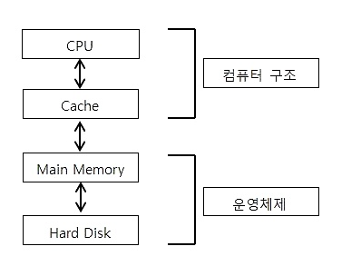
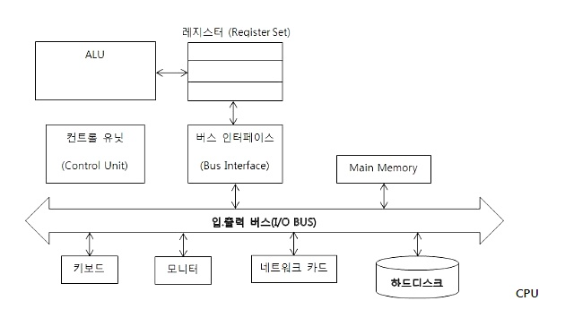

# 1강
[[toc]]

## 1. 시스템 프로그래밍의 이해와 접근

### 시스템 프로그래밍이란?
- `컴퓨터 시스템을 동작시키는 프로그램`
- 시스템 프로그램이란 하드웨어를 사용할 수 있도록 도와주는 프로그램을 말하는 것
- 시스템 프로그래밍을 제대로 공부하기 위해서는 운영체제와 컴퓨터 구조를 잘 알아야 한다

### 컴퓨터 시스템의 주요 구성요소



- CPU, 캐쉬, 메인 메모리, 하드 디스크
- CPU, 캐쉬는 컴퓨터 구조, 메인 메모리 하드디스크는 OS
- 컴퓨터 구조와 운영체제를 이해하게 되면, 시스템 프로그래밍만 가능하게 되는 것이 아니라 언어의 문법적 요소만을 이해하고 프로그래밍하는 프로그래머들보다 효율적인 프로그램 구현이 가능해진다.

## 2. 컴퓨터 하드웨어의 구성



### CPU
- 흔히 말하는 중앙처리장치
- CPU는 연산을 담당한다

### 메인 메모리
- RAM 이라는 저장장치로 구성되는 메인 메모리는 `컴파일이 완료된 프로그램 코드가 올라가서 실행되는 영역`
- 예를들어 게임 받아서 돌리면 그 게임은 메인 메모리에 올라가서 실행된다.

### 입,출력 버스
- 입 출력 버스는 컴퓨터를 구성하는 구성요소 사이에서 데이터를 주고 받기 위해 사용되는 경로
- 주고 받는 데이터의 종류와 역할에 따라서 어드레스버스, 데이터버스, 컨트롤 버스로 구성된다.
- 그림에서 보는 바와 같이 메인메모리, 하드디스크, CPU 등등이 모두 버스에 연결되어 있어 서로간에 데이터 전달이 가능하다.

## 3. CPU에 대한 이해
### ALU
- CPU 내부에서 실제로 연산을 담당하는 블록
- ALU가 처리하는 연산은 덧셈 밸셈 같은 산술연산, 나머지는 AND나 OR같은 논리 연산
- 아주 복잡한 형태의 프로그램도 CPU 입장에서는 이 두 가지 형태의 연산으로 이루어진다

### 컨트롤 유닛
- 프로그래머가 작성한 프로그램을 컴파일하면 실행파일이 생성된다.
- 실행 파일 내에는 CPU에게 일을 시키기 위한 명령어들이 저장되어 있는데, 어떠한 경로를 거치건 이 명령어가 CPU로 흘러들어가야 CPU에게 일을 시킬 수 있다.
- 어떠한 형태로든 명령어가 흘러가면, 형태는 다음과 같다
```
10011010 00011010 10011110 10010011
```

- ALU는 위의 명령이 뭔지 모른다
- ALU는 단순하게 연산을 할 뿐이라 대신 이 명령어를 해석해주는 역할이 필요하다
- 컨트롤 유닛이 바로 그 역할을 담당한다
- 컨트롤 유닛은 CPU가 처리해야할 명령어들을 해석해준다.

### CPU 내부에 존재하는 레지스터들(Register Set)
- ALU에서 계산될 피 연산자 (ex: 5, 9) 같은 데이터들을 임시적으로 저장하는 공간이다.
- 레지스터란 CPU 내부에 존재하는 2진 데이터 저장을 위한 저장장치

### 버스 인터페이스
- CPU, 하드디스크, 램 등 데이터를 주고받을 때 이용하는것이 버스
- 버스 인터페이스는 버스가 어떻게 데이터를 전송하는지, 그에 대한 프로토콜 혹은 통신방식을 알고 있는 장치

### 클럭 신호
- 클럭 신호는 CPU를 구성하는 요소는 아님
- CPU의 클럭 속도가 높으면 초당 처리하는 명령어의 개수가 많아져 컴퓨터의 전체적인 성능이 좋아진다.

## 4. 프로그램의 실행 과정
### 폰 노이만
- 천재아저씨
- 프로그램이 컴퓨터 내부에 저장되는 구조를 생각해냄

### 프로그램의 실행과정
- 단계 1: 전처리기에 의한 치환 작업
    - 실행파일 생성의 가장 첫 번째 단계가 전처리기에 의해 이뤄진다
    - #include 같은 지시에 따라 소스코드를 적절히 변경하는 작업을 가진다
- 단계 2: 컴파일러에 의한 번역
    - 소스코드는 컴파일러에 의해 어셈블리 코드로 번역된다
- 단계 3: 어셈블러에 의한 바이너리 코드 생성
    - 컴파일러에 의해 번역된 어셈블리 코드는 컴퓨터에 의해 실행되기에 앞서 바이너리 코드로 번역되어야 한다
    - ADD MIN MUL 같은 어셈블리 프로그래밍을 CPU가 이해하도록 바이너리 코드로 변경
- 단계 4: 링커에 의한 연결과 결합
    - 프로그램 내에서 참조하는 함수나 라이브러리들을 하나로 묶는 작업 진행
    - 이 과정이 끝나면 실행해야하는 실행파일이 나온다
- Stored program concept = FETCH / DECODE / EXECUTION

## 5. 하드웨어 구성의 재접근
### 폰 노이만의 컴퓨터 구조 vs 오늘날의 컴퓨터 구조
- FETCH / DECODE / EXECUTION
- FETCH : 메모리에서 Register Set으로 데이터 가져옴
- DECODE : 명령어의 해석 / Controll unit
- EXECUTION : ALU가 실행

### 데이터 이동의 기반이 되는 버스 시스템
- FETCH를 위한 데이터 전송은 어케하는가?
- 데이터를 이동하는 데 있어 사용되는 전송 경로를 가리켜 버스 시스템이라 부른다
- 어드레스 버스, 데이터 버스, 컨트롤 버스 3가지로 구성
- CPU <-> 메모리 간 데이터 이동도 버스가 해줌