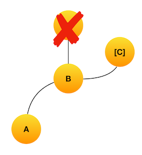

# Git
- 깃을 쓰던거만 쓰다보니 아는게 너무없다.
- 이번에 직면했던 문제(?) 상황은 아래와 같음


- C의 커밋 내용을 B의 서브브랜치로 옮기고, C 커밋포인트는 없애야 되는상황



- 이런 모양이 돼야 한다.

```
고민했던 케이스 1
1. B 커밋포인트에서 브랜치를 따고, C에 있던 커밋 포인트 내용을 B에서 딴 새로운 브랜치에 리베이스
2. C는 hard reset
```

- 결과적으로 헛소리였음
- 브랜치명으로 구분하는게 아니라 커밋포인트로 구분함..(당연한건데 멍청해서 헷갈림)

```
고민했던 케이스 2
1. C 커밋포인트에서 B로 소프트 리셋
2. B에서 새로운 브랜치 생성
3. 새로운 브랜치 커밋 & 푸시
4. 기존 브랜치는 force push
```

- 해결됨
- 소프트 리셋을 하면 C 커밋포인트에서 작성한 변경 소스는 남아 있고 C 커밋포인트는 사라져 B커밋만 남음
- 깔끔

```sh
명령어

git reset --soft (commit point)
```
