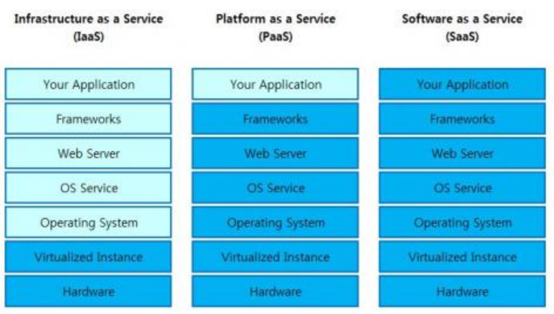

# IaaS / PaaS / SaaS ?

[[toc]]

## IaaS(Infrastructure as a Service)

> 서버를 운영하기 위해서는 서버 자원, IP, Network, Storage, 전력 등등 인프라를 구축하기 위한 서비스를 제공.Iass는 Pass, Saas의 기반이 되는 기술

> 클라이언트는 서비스 제공업체의 클라우드 환경에 구축하고 싶은 OS와 응용프로그램을 설정하여 사용

> Amazon EC2, Google etc..

## PasS(Platform as a Service)

> 서비스를 개발 할 수 있는 안정적인 환경(Platform)과 그 환경을 이용하는 응용 프로그램을 개발 할 수 있는 API까지 제공하는 형태

> 클라이언트는 플랫폼 제공 업체의 기술력을 바탕으로 원하는 시스템을 개발 할 수 있다

## SaaS(Software as a Service) 
> Cloud환경에서 동작하는 응용프로그램을 서비스 형태로 제공하는 것을 SaaS

>“on-demand software” 로도 불리며, 소프트웨어 및 관련 데이터는 중앙에 호스팅되고 사용자는 웹 브라우저 등의 클라이언트를 통해 접속하는 형태의 소프트웨어 전달 형태.

>클라이언트는 자신의 PC에 소프트웨어를 설치하지 않고도 해당 소프트웨어의 기능을 사용할 수 있다.