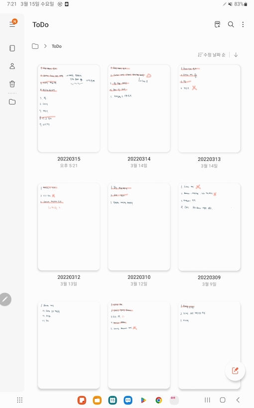
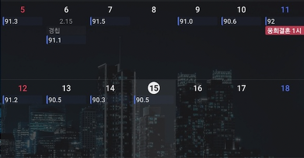

# 간단한 회고

[[toc]]

```
내 상황에 대한 고민 이후에 일주일 정도가 지났다
사실 자주쓰는건 힘들지만 그래도 초반에 의지가 흩어지지 않도록 
당분간은 주기가 짧게 작성해 보려고 한다
```

## 내 다짐에 대한 돌아보기
- 여러가지 다짐을 해봤었다
- 장기 다짐, 단기 다짐
- 1주일간 실천을 해보니 모든걸 다 지키기엔 생각보다 내 시간자체가 적다는걸 깨달았음..
- 간단하게 어느정도 지켰는지 확인을 해보고 반성해야될 부분과 수정해야될 부분을 확인해 봐야겠다

## 복기
### 루틴 만들기
- 삶의 루틴을 만드는건 어느정도 지켜지는 것 같다
- 매일매일 아침마다 뭘할지 TODO 리스트를 만들고 하루가 끝날 때 완료한 부분을 체크하고 있다.



`생각보단 열심히 한거 같기도 하고..?`

- 3월 9일부터 3월 15일까지 11일을 제외하고 전부 TODO를 작성했다
- 달성률은 대충 70퍼센트정도?
- 처음엔 좀 범위를 크게 할 일들을 적었다가, 점점 세분화해서 적게됐다 (날이 지날수록 할 일들의 가지수가 늘어난게 보임)
- 좀 더 촘촘하게 해야될 일들을 세분화해서 TODO를 작성하고, 최대한 다 지켜야 겠다

### 1주일에 1독
- 다짐을 적고 딱 1주일이 지났는데 1독을 못했다
- 생각보다 책을 읽는데 시간이 오래걸린다는걸 깨달았다
- 지대넓얇2 의 챕터 2개 읽는게 다였음..
- 다음주엔 못 읽은책 + 새로운책 2권을 읽어보도록 하자
- 추가로 시간 분배를 위해 책 1권을 읽는데 얼마나 걸리는지 시간 체크좀 해야겠음

### 건강관리
- 아주 열심히 하고있음
- 기존에 비해서 거의 절식(..) 수준으로 음식을 섭취중
- 회사에서 점심을 거의 안먹고 헬스장 가서 1시간씩 운동하고 있다
- 점심을 먹으면 30분 걷기라도 하는중
- 일주일간 운동을 5회를 해서 만족중
- 아쉽게도 몸무게는 별로 안빠졌음
- 그래도 확실히 배는 많이 들어간듯?
- 술도 안먹는중!
- 다음주까지 1.5키로 감량 목표로 잡아야 겠다 (89키로)



`실질적으론 0.5키로가 빠졌음. 11일엔 왜 1.4키로나 쪘지..?`

### 기록하는 연습
- 위에서도 말했던 매일 todo list 작성을 꾸준히 하고 있음
- 하루의 30분은 기록하는 시간을 갖기로 했던건 실패.. 밤에 피곤해서 따로 뭘 적는 건 하지 않은 것 같다
- 다음주엔 2회정도라도 뭔가를 적는걸 실천해야겠음

### 미루는 습관 고치기
- 이건.. 반반인듯?
- 뭔가를 해야되면 최대한 바로 시작하려고 노력함
- 물론 안지켜진것도 있다
- 회사일 하나랑 개인 스터디 작성같은건 너무 하기싫어서 계속 미뤘음..
- 좀 더 계획적으로 행동할 수 있도록 의식을 해야겠다

### 부정적인 말 / 생각 안하기
- 확실히 이건 의식하니까 줄긴했음
- 욕도 거의 안하고 최대한 좋게 생각하려고 노력함
- 그래도 정확하겐 기억이 안나는데 한번 운전하기 전에 시원하게 쌍욕 했음... (왜 했지?)
- 화이팅

### 개발 공부
- 개인 프로젝트를 좀 자유롭게 배포하고 싶어서 젠킨스를 설치했다
- 근데 도커 컨테이너 젠킨스 -> 나스 서버로 통신이 안 돼서 평일인데도 11시부터 2시반까지 삽질하다가 결국 실패하고 자버림..
- 그리고 나서 너무 화나서 이번주는 개인 플젝을 거의 손대지 않았다 ㅠㅠ
- 근데 오늘 고민해 보니까 내 개인서버 ssh 포트를 포트포워딩을 안한거같음(..?!)
- 이따 집에가서 확인해 봐야될듯 하다
- 다음주까지 젠킨스 띄워서 자율 배포 + 만들어야 되는 기능 1개 추가(아마 todo) 를 목표로 해야겠음
- 개발책도 좀 보고..

### 도준이
- 도준이한테 한 번 엄청 크게 화낸 날이 있다.
- 뭔가 화가 너무나서 막 화냈는데 지금 돌이켜 보니까 왜 화냈는지도 모르는 사소한 일이었던거 같음..
- 아마 피곤해서 그랬던거 같은데
- 그날 도준이가 밤에 '아빠 저기 누워주세요' 라고 하면서 몇 개 알지도 못하는 단어를 사용해서 날 밀쳐내고 눈도 안마주침.. ㅠㅠ
- 너무 미안해서 그 날 이후로 화를 안내려고 매우 노력중임
- 같이 있을 때 폰도 좀 적당히하고 잘 놀아줘야 겠음
- 근데 너무 피곤해...

### 회사 생활
- 그냥 저냥 평타 친듯?
- 지금 개발하는 소켓.. 통신 개발이 더럽게 안됨
- 너무 지저분하고 어렵기도 하고
- 다음주까진 끝냈으면 좋겠다.

## 정리
- 전반적으로 지난주보단 더 나은 삶을 산 느낌이다
- 확실히 다짐을 적어 놓으니까 자주 보면서 복기도하고..
- 만족도는 한 70프로? 정도인 것 같다
- 아쉬운건 독서를 너무 많이 못한점
- 사실 전반적인 시간이 많이 없는거 같다
- 퇴근하고 애기 재우면 보통 10시가 넘는데 아침 8시에 일어나서 출근하려면 늦어도 1시전엔 자야 생활이 가능
- 그러다보니까 3시간을 타이트하게 써야되는데 또 사람인지라 피곤하면 더 일찍 자고.. 안 자도 핸드폰 게임하면서 쉬는 날이 많았다
- 사실 고민인 부분이 지금 유일한 취미가 휴대폰 게임인데 요게 또 생각보다 시간을 많이 잡아먹음
- 이걸 그만둬야될까? 근데 또 그러자니 삶이 너무 무미 건조해질 정도로 취미생활이 없어질 거 같음..
- 이건 좀 고민좀 해봐야겠다.
- 확실한건 밤에 멍하니 휴대폰게임을 하는 시간은 조금 줄이긴 해야겠음. 그만두는거 까진 아니더라도
- 한 주 더 해보고 목표들 중에서 우선순위를 좀 정하기도 해야겠음
- 끝!