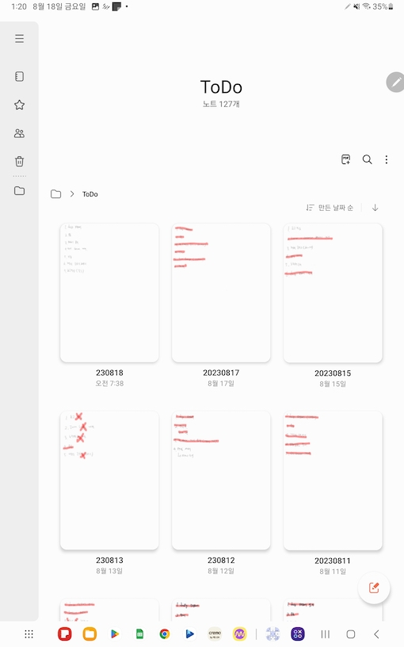
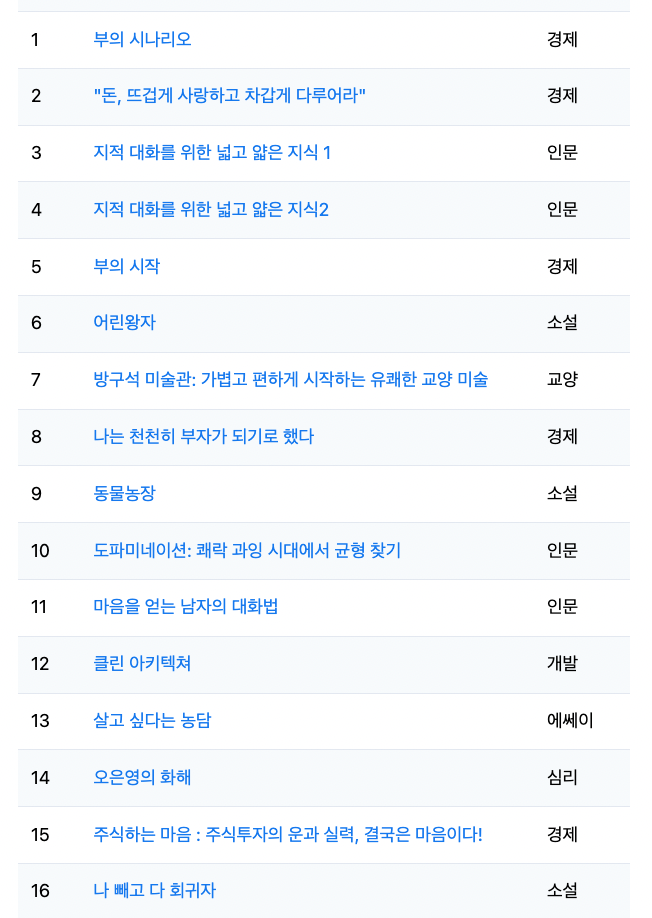
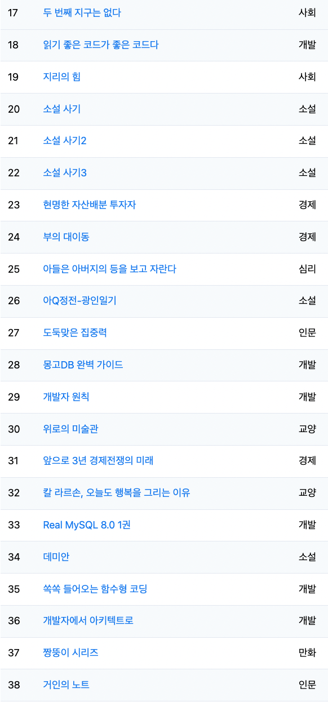
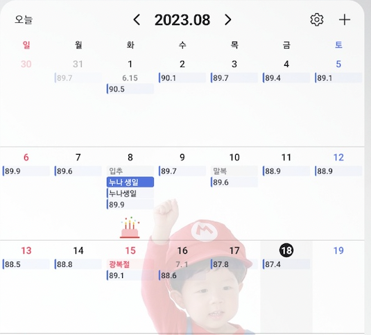

# 5개월 만의 일상 기록

[[toc]]

## 무려 5개월만에 작성하는 기록 

- [저번 글](./2023-03-15.md) 이후로 무려 5개월만의 글이다
- 여러가지 기록들을 남기긴 했는데 매주 남기려던 계획은 대차게 지키지 못했다
- 너무 여러개를 다 하려고해서 지키지 못했다는 생각이 든다
- 한 번 더 상황을 정리해 봐야겠다

## 5개월간의 기록
### 루틴 만들기 - TODO list
- 매일 TODO를 적고 실천하기를 계획 했었다.

- 127개의 작성글이 있고, 3월 15일부터는 90개정도를 작성했다.
- 한달에 16개 정도 작성한 건데, 주말 제외하면 대략 80퍼센트의 작성률을 보이는 것 같다.
- 휴가날이나 공휴일같이 쉬는날에는 안적었으니, 꽤 만족스럽게 지켜진 것 같다.
- 특히 경제 지식을 익히기 위해 [국제금융센터](https://www.kcif.or.kr/annual/newsflashList) 에서 제공하는 정기 보고서를 3월 13일 이후로 하루도 빠짐없이 읽고 있는게 만족스럽다.

### 독서

- 1주일에 1독이라는 독서 목표를 정했었다

- 책은 정말 부저린히 읽은 것 같다. 
- 5권을 제외한 33권을 읽은 상태이다.
- 5개월간 대략 30권을 읽었으니, 한달에 6권을 읽은 셈이다.
- 열심히 지켜진 것 같다
- 특히 다양한 장르의 책을 골고루 읽어서 조금 도움이 된 것 같기도 하고?

### 건강 관리

- 3월~5월까지는 헬스는 깔짝 깔짝 하긴 했는데 살은 아예 빼지 못했었다.
- 6월부터 필라테스를 시작했는데 이 운동이 아주 잘 맞는거 같다.
- 도대체 뭔차이인지 모르겠는데 다른 운동할 때는 한참을 해야 나는 땀이 진짜 필라테스를 하면 10분만에 땀이 미친듯이 나온다.
- 자세가 좋아지는거 같더니 8월에만 3키로가 넘게 빠졌다
- 3개월 결제했는데 아마 추가로 결제하지 않을까 싶다.
- 너무 마음에 드는 운동이다.
- 이번에 돈을 써서 운동하면서 느낀건데 역시 무언가 제대로 하려면 그에 맞는 돈을 써야된다는 생각이 들었다.
- 다른 운동을 하더라도 어느정도는 비용을 지불하면서 해야될 것 같다

- 몸무게 기록 (귀여운 도준 얼굴 등장)

### 기록하는 연습

- 매일 꾸준히라도 기록하는 연습을 하려고 했었다.
- 지켜진거는 TODO작성과 읽은 책 정리 정도 인 것 같다.
- 최근에 거인의 노트라는 책을 읽었는데, 기록의 중요성에 대해서 많은 것을 느낀 책이었다.
- 일상에서 메모를 습관처럼 하고, 책을 읽거나 공부를 할 때도 적어가면서 하는 습관을 가져야 할 것 같다.
- 재밌는게 3월에 단 2번밖에 안한 생각정리 글 덕분에 5개월이 지나 까먹고 있던 내 다짐을 다시 다질 수 있는 계기를 만들어 줬다.
- 기록은 정말 중요한 것 같다.
- 어떠한 방식이든 좋으니 기록을 남기는 습관을 들여야 될 것 같다. (효율적으로..!)

### 개발 공부

- 개발 공부도 명목상으로는 꽤 많이 한 것 같다
- 인강도 듣고 책도 많이 읽고..
- 문제는 머리에 남는게 별로 없다는 것
- 공부 방법이 조금 잘못 된 것 같다.
- 우선 전체적인 웹 흐름을 그리고 각각의 부분에 대해서 모르는 것들을 정리하고 하나씩 공부해야 될 것 같다
- 그리고 너무 빨리 공부한다고 인강 빠르게 듣고 책도 빠르게 1독하고 이런건 조금 지양해야 될 것 같다.
- 뭘 하더라도 차근차근 정확하게 공부해야 될 것 같다

### 미루는 습관

- 여전히 미루는건 끝내주게 잘한다.
- 나는 완전한 수동태형 인간이다.
- 곰곰히 고민해 봤을 때 이런 유형의 인간상은 삶을 발전시키는데 전혀 도움이 안되는 것 같다.
- 의도적으로라도 회사일을 찾아서하고 귀찮은거를 빨리빨리 없애기 위해 노력해야겠다.
- 그런 해결책의 일환으로 귀찮을 일을 개발을 통해 없애는 걸 습관으로 삼아야 겠다
- 가계부 자동화 프로그램부터 만들어 보자

### 도준이

- 한동안 잘 지내다가 요즘 도준이가 말을 정말 너무 안들어서(진짜 너무 말을 안들음) 화를 많이 낸 것 같다.
- 조금 마인드 컨트롤이 필요하다는 생각이 든다.
- 그냥 이시기의 아이들은 말을 무지하게 안듣나 보다..
- 우선 뭐가 됐건 화를 내지 말아야 겠다.
- 추가로 요즘 말을 안듣는걸 포함해서 도준이가 교정해야 될게 많이 보인다. (던지거나 이런것들)
- 주희가 본 책에서 이런 경우에 진짜 100번이고 1000번이고 끊임없이 얘기를 해줘야 한다고 한다.
- 화내지 않고 지치지 않고 계속해서 도준이에게 얘기를 해 줘야겠다.
- 안좋은 것만 쓴거 같은데 솔직히 요즘 도준이 진짜 엄청 귀여움 (말할때 귀여워서 미칠거같음)

### 회사생활

- 한동안 회사생활에 대한 고민이 있었던 것 같다.
- 5월~6월까지 몰아치듯이 일을 했는데 번아웃이 좀 쌔게 온 것 같다.
- 어떻게 지내야 될까를 한달정도 고민했는데 
- 우선 개발실력부터 늘려야 겠다는 답이 나왔다
- 현재 내 실력은 좋게 봐줘야 내 연차의 중간위치인 것 같다.
- 너무 실력이 딸리는 느낌이라 차분차분 하나씩 실력을 늘려가야 될 것 같다
- 그러려면 현재 회사에서 하는 일에 대해서 조금 더 진지한 태도를 가져야 한다는 생각이 들었다.
- 귀찮은 작업들을 좀 능동적으로 나서서 없애버리고, 다른 사람들과 협업하는 방식에 대해서도 고민을 해 봐야될 것 같다.
- 우선 목표로 정한건 매일 다른사람들의 코드를 리뷰해 주기다.
- 뭔가 하나씩 하다보면 괜찮은 회사원이 되지 않을까?

## 하고 싶은 일들

### 개발

- DB를 좀 제대로 파봐야 될 것 같다.
- 여기 적긴 뭐하지만 최근에 면접을 봤다가 개털렸다.
- DB쪽이 많이 부족한 듯 싶다.
- 올해 내로 기본적인건 마스터 해야 될 듯 싶다
- 개인 개발을 좀 많이 해야 될 것 같다.
- 일상에서 귀찮은 것들을 개발해 봐야 될 것 같다.
- 위에서도 말했지만 우선 가계부 자동화 프로그램부터 만들어야 될 것 같다.
- 가계부 쓰는거 너무 귀찮아..

### 기록

- 기록을 좀 더 체계화 해서 해야 될 것 같다.
- 거인의 노트에서 봤던 내용들을 정리해서 실천해 나가야 겠다
- 우선 매일의 생각정리를 메모하고, 분류하고 자기화 하는 연습을 해야 겠다.
- 그리고 이런 형식의 회고는 12월에 한 번 더 써봐야 겠다.
- 그전에는 깔짝 깔짝 쓰고 싶은것 한 두개씩 블로그에 적던가 해야겠다.

### 운동

- 요즘 각을 보니 올해내로 80까지 찍을 수도 있을 것 같다.
- 11월 건강검진 전까지 정상 범위 체중을 목표로 달려봐야 겠다.

### 계획

- 요즘 하고싶은 것들은 엄청 많다
  - 독서, 개발, 운동 등등..
- 근데 현실적으로 시간이 부족하다는 생각이 든다.
- 아침형 인간으로 살아가보려고 10시에 자고 6시에 일어나는 습관을 들이고 있었는데 이게 약간 나랑 안 맞는 것 같다
- 밤에 도준이가 자고 나면 그때부터 1~2시간 가량 공부나 하고싶은거를 하고 아침에 조금 늦게 출근하는걸 고민해 보야 될 듯 싶다.
- 한 달정도 이렇게 해봐야 겠다.

### 생각하기

- 생각해보면 20살이후로 (더 전부터인가?) 나는 뭔가를 깊게 생각해 본적이 없는 것 같다.
- 약간 되는대로 살아오고 운에 맡겨서 살아오고..
- 근데 최근 5개월간은 정말 많이 생각하고 고민하고 어떻게 지내야 될지를 고민한 것 같다.
- 생각을 계속하는건 매우 중요한 일인 것 같다.
- 생각없이 있으면 발전따윈 없고 그냥 계속 시간만 흘러 갈 것 같다는 생각이 들었다.
- 열심히 고민하고 계속해서 생각하자

## 정리

- 정리해보니까 꽤나 성실하게 살아온 것 같기는 하다.
- 게임도 끊고 운동도 열심히 하고 독서도 열심히하고..
- 근데 뭔가 채워지지 않는 기분이 계속 든다.
- 내가 너무 욕심을 부리는건가? 라는 생각이 들기도 하지만 예전에 놀았던걸 생각해 보면 조금 빡빡하게 살아야 되지 않나 싶기도 하다.
- 요즘 들어서 '과거에 이렇게 살았으면 어땠을까' 라는 나답지 않은 과거 후회를 조금 하는데, 그냥 지금부터라도 좀 열심히 살아야 될 것 같다.
- 우선 조금 더 효율적으로 위의 계획들을 실천할 수 있는 방법이 없을지 고민좀 해 봐야겠다.