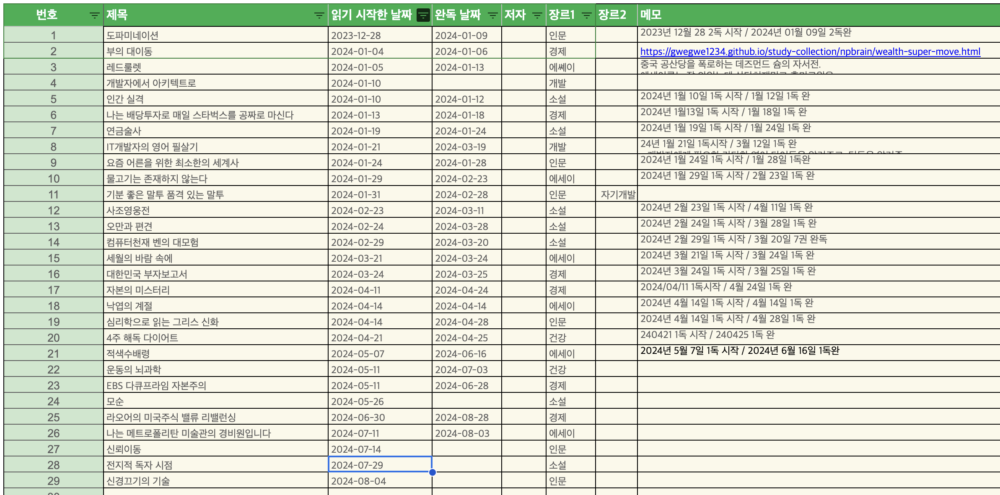
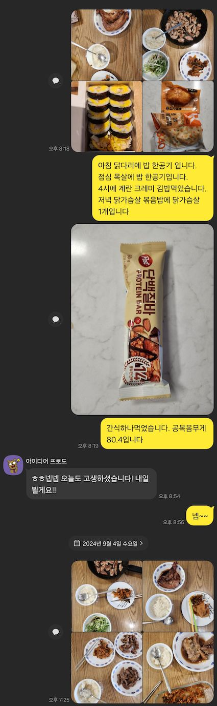

# 2024년 상반기 정리

- 상반기 정리라고 했지만 9월에 작성을 하고 있다.
- 최근의 게으름과 헤이해짐을 정확하게 보여주는(..) 부분이 아닐까 싶다.
- [올해 1월에 정리한 내용](./2024-01-09.md)을 보고 얼마나 지켰는지, 더 나아진 부분과 잘 못한 부분을 확인해 봐야 할 것 같다.

### 1. 1주일에 책 1독

- 올해는 책을 많이 못 읽었다
- 아무래도 벌려놓은 일들이 많고, 회사일도 바쁘다보니 절대적인 시간도 줄어들고, 마음의 여유도 사라진 것 같다.
- 9월 초인 지금까지 29권의 책을 폈고, 24권을 읽었다.
- 1주일에 1독을 하려면, 52권을 읽어야하는데 남은 3달간 최소 20권이 넘게 펴봐야 한다.
- 가능할 지 모르겠지만.. 연말에는 책을 좀 더 읽어야겠다.
- 느린 도파민이 다시 필요한 시기인 것 같다.

### 2. 루틴 만들기

- TODO는 올해 패드로 적다가 중간에 3달정도 휴대폰 앱으로 관리 해봤다.
- 아무래도 잘 작성 안하고, 지키지 않는 듯 해서 바꿔봤는데, 결국 툴의 문제가 아닌 내 마음가짐의 문제였다.
- 현재는 다시 패드로 돌아와서 작성하려고 하는데.. 아무래도 요즘 잘 지키질 못하는 것 같다.
- 작년보다는 매우 게을러지고 루틴도 깨진 것 같다.
- 말해 보카같은 루틴도 한 달 이상 안한 적도 있고, 요즘도 매일은 못하고 있는 것 같다.
- 작년 내내 잘 읽었던 Daily Report도 요즘은 거르는 날이 많아지기도 한다.
- 상반기의 루틴 만들기는 아무래도 달성률이 매우 낮은 것 같다.
- 조금 어떤식으로 루틴을 만들지 다시 한 번 더 고민해보고, 예전에 어떻게 했는지 다시 복기를 해 보아야 할 것 같다.
- 마음을 다잡자

### 3. 건강관리

- 올해 거의 유일하게 잘 지킨 부분인 것 같다.
- PT를 시작해서 제대로 몸을 만들기 시작했고, 식단도 매우 빡시게 하면서 살도 79~80사이로 뺐다
- 골격근도 엄청 오르고, 체지방률도 거의 10프로 가까이 빼서 이제 정상 체지방 률이 되었다.
- 건강 검진 결과도 대부분 다 좋아져서 매우 만족스럽다.
- 특히 허리둘레가 8개월만에 10cm가 줄어들었는데 기분이 좋다.

- 매일매일 보내는 식단관리

### 4. 기록하는 습관

- 기록은 정말 끝내주게 안하고 있다.
- 책정리도 거의 안하고, 몰아서하고, 귀찮아 하고 있다.
- 회사 일 정리나 이력서 관리도 마찬가지..
- 무조건 TODO를 정리하고, 생각정리를 당분간은 무조건 적어야겠다.
- 오죽하면 이 회고록도 7월부터 써야지써야지 하면서 미뤄서 9월에 쓰고 앉아있다..

### 5. 개발 공부

- 개발 공부는 플러터도 하고 유니티도 하고 했지만 정작 BE는 거의 못한 것 같다.
- 인강도 사실상 듣는걸 포기했고, FE개발쪽에 힘을 쏟을 일이 생겨 아무래도 많이 못한 것 같다.
- 이건 올해 다른 할게 많아 어쩔 수 없는 것 같다.
- 내년엔 회사 개발 공부도 좀 해놔야 할 듯 하다
- 우선 백엔드 공부 키워드정도만 틈틈히 적어놓자.

### 6. 미루는 습관

- 미루는 습관은 더 심해진 것 같다.
- 요즘 뭔가를 하려면 너무 하기 싫고 재미가 없다.
- 아무래도 잠이 줄고 게임을 즐기면서 부터 이게 심해진 것 같다.
- 전반적인 집중력 향상이 필요하다.

### 7. 회사 생활

- 회사 생활도 뭐.. 잘한게 없어보인다.
- 정말 단순 노가다성 일만 하고 다른건 할 엄두도 못낸 것 같다
- 번아웃 증상도 같이 오는 듯 해서 아무래도 힘든 한 해 였던 것 같다
- 올해는 어떻게든 잘 버텨보고 내년엔 회사생활도 좀 관리를 해야 될 듯하다
- 이력서 관리도 좀 하고

### 8. 도준이

- 도준이랑은 꽤 잘 지낸거 같다
- 예전보다 화도 거의 안내고, 도준이랑도 많이 친해진 것 같고
- 잘 때 항상 내 옆에서 자는데 너무 귀엽다
- 요즘 많이 커서 말도 잘하고 자기 주장도 또박또박 하는데 이렇게 귀여워도 되나 싶다
- 너무 사랑스럽다
- 이렇게 계속 재밌게 지내야지

### 9. 투자

- 투자는 적당히 잘 된거 같다
- 사실 액티브 투자를 한게 거의 없던 한 해 였는데, 배당주에 조금 더 투자하고 인덱스 투자를 조금 더 한게 다인 듯 하다
- 수익률을 잘 나왔고 전반적인 경제 뉴스나 리포트는 꾸준히 읽고 있어서 전체적으로 투자 관련해선 괜찮은 상반기 였던 거 같다.
- 조금 더 벌만한게 없을까 고민을 해 보아야 할 듯하다.

### 10. 반성할 내용

- 올해 1월에 작성한 내용을 보니 나는 그냥 가을쯤 되면 약간 게임을 하나보다 (ㅎㅎ)
    - 작년에도 연말쯤 게임을 많이하고, 집중을 못하는 경향이 있었는데 요즘도 비슷 한 것 같다.
    - 게임은 재미도 있고 스트레스를 풀어줘서 좋긴한데, 한 번 시작하면 하는 양이 계속 늘어서 줄이기가 힘들다.
    - 어느새 새벽까지 게임을 하고 있는 내 모습을 보면 피곤하고, 피곤해지니까 다른 일을 못하고, 다시 그 스트레스를 이기려고 게임하고 이런게 반복되는 느낌이다.
    - 게임은 다른 할 일을 다하고 시간이 남을 때 하는 습관을 좀 들여야 할 것 같다.
    - 오랜만에 회고록을 보니 김성모의 근성론이 보였다.
        - 하기싫은걸 참고 하는게 근성
    - 근성으로 도파민 뿜뿜 한 것들을 참아보고 할 일을 해보자
- 집중이 되질 않는다.
    - 위에서 말했던 게임과도 연관이 된 거 같긴 한데, 요즘 잠이 너무 줄어서 집중이 안되는 악순환이 발생하고 있다.
    - 그리고 경험해보니 피곤해지고, 잠을 못자면 더 게을러지고 스택처럼 계속 쌓이는 것 같다.
    - 잠을 일정하게 자는 습관을 들여야 할 것 같다.
- 안좋은 습관을 바꾸자
    - 잘 때 휴대폰 안보기
    - 휴대폰 덜 사용
    - 자극적인 영상 / 게시물 들 덜보기
    - 게임 줄이기 or 그만두기
    - 미루지 않기
- 목적을 다시 고민해보자
    - 내가 뭘 하려고 했고 어떤식으로 진행하려고 했는지 기억해보자
- 과거 생각 정리 내용을 보고 느낀 내용
    - 지금 보니 같은 고민을 여러번 했음
    - 게임좀 줄이고 잠좀 늘리고 영상좀 덜보고.. 등등
    - 근데 결국 시간이 지나고 힘들어지면 다시 단순 재미있는 것들만 찾는 거 같다.
    - 자주 상기하고 복기하면서 마음을 다잡아야 할 듯 하다
    - 우선 이 머리 뿌연 현상을 없애야 할듯 하다.. 잠을 푹자자
- 밤에 책상에 앉는 버릇을 다시 만들어야 겠음
    

## 24년 추가 TODO

### 시간 관리

- 올 초에는 새벽에 일어나는게 맞다고 적었는데.. 역시 인간은 확정지어서 말하면 안될 것 같다.
- 요즘 새벽에 절대 못일어나는 몸이 되어 버렸다.
- 아무래도 나이도 들고 운동도 빡시게 하다보니 발생한 현상이 아닐까도 싶다.
- 컨디션에 맞춰 시간관리를 해야 하는데, 그러려면 컨디션을 최대한 일정하게 유지하는게 중요한 것 같다.

## 정리

- 24년 9월까지는 개인적으로 아주 맘에 안 들게 생활 했던 거 같다.
- 위의 9가지 섹터중에 만족할 만한 성과를 낸건 3개정도 밖에 없다. (건강관리, 도준이, 투자)
- 올 초에는 작년보다 나아진거 같다고 적었는데, 올해는 뭔가 더 안좋아 진 것 같다.
- 글도 잘 안쓰고 생각도 잘 안하고 살다보니 회고록 적는거도 어려워 질 정도로..
- 조금 더 생각을 많이하고, 고민도 많이하면서 어제의 나보다 나아진 삶을 살도록 노력해야겠다.
- 이 머리속이 뿌연 현상을 없애봐야 겠다.