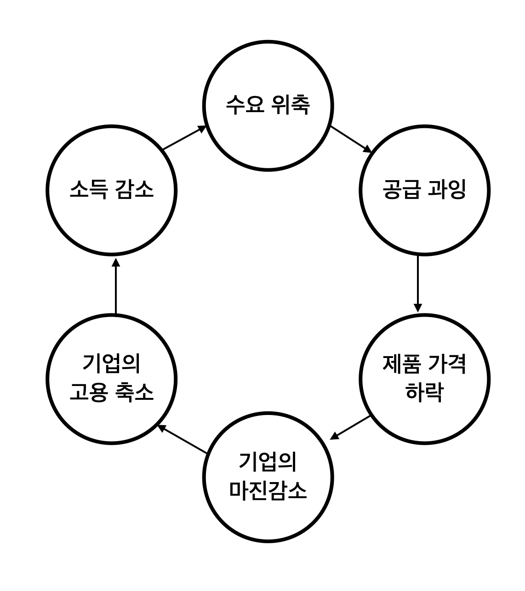

# 부의 대이동

[[toc]]

## 1장 기초지식

- 달러 / 원 환율 = 1달러에 대비되는 원화
- 달러 원 환율 오른다 = 다러가 비싸진다 ex) 1달러 1000원 => 1달러 1500원
- 환율이 상승했다 = 달러 / 원 환율이 상승했다 (달러가치 상승)

- 환율에 영향을 미치는 요인
    - 무역으로 인한 달러의 공급 및 유출
    - 금융권 큰 손이 움직일 때
        - 외국인들이 한국 주식을 사면 달러/원 하락 & 주가 상승
        - 채권을 사도 원화가치 상승
        - 채권사면 채권 금리 하강
        - `한국 부동산 가격 상승`
- 금리
    - 금리가 오르면 채권 가격 하락
    - 단기 국채가 금리 변동에 영향 적음
    - 국채 발행 -> 시중의 돈 없어짐 -> 돈이 귀해짐 -> 금리 상승 -> 기존 채권 보유자 투매
- 기준금리 <---> 시장금리
    - 7일짜리 금리 국채(7RP)
    - 기준 금리가 낮아져도 시중에 국채가 풀리면(ex. 코로나 시기 외국인 매도) 시중 금리는 올라갈 수 있다. 
- 회사채 스프레드
    - 국채와 회사의 금리차

## 2장 달러

- 대출은 미래 소득을 당겨오는 것
- 달러가 계속 강세를 이어갈까?
- 무역 전쟁이 심해지면 미,중 둘 다 안좋음
- 디플레이션 악순환 발생

- 셰일 가스
    - 미국의 원유 증가
    - 원유 공급 증가
    - 가격하락
- 달러의 영원한 강세도, 약세도 없다.
- 위안화 모아야 할까?
    - 마찬가지로 영원한건 없음
- 한 국가의 통화 절상은 수출 경쟁력을 낮춤
- 이머징 국가가 경제 부양을 위해 금리를 낮추면 자본이 유출됨
- 한국 IMF
    - 일본 엔화 가치 하락
    - 수출 경쟁력 하락
    - 달러 빚 증가
- 주식과는 달리 우리나라 채권은 안정적
    - 외환 보유고가 많음
    - 구조적 무역 흑자
- `달러 스마일`
    - 달러가 실실 쪼개는 모양
    - U자형 그래프가 된다.
- 달러의 장점 : 하방 방어(불황을 대비하는 최고의 자산)
    - 경제 위기가 오면 다른 자산은 하락하지만 달러는 오름
    - 반대도 마찬가지
    - 헷징 수단으로 사용해야지 너무 과도하게 들어가면 안됨
    - 여유 자산으로 사는게 안전(적립식)
    - 위기가 오는 순간 매도(위기는 늘 반복)
- 엔화도 달러와 비슷한 포지션
- `안전 자산으로 달러 보유는 필수!`

## 3장 금

- 금은 안전 자산인가?
- 아님
- 현금을 확보하고 싶은 상황에선 금도 안전자산이 아님 (코로나 or 금융위기 초반같은 시기)
- 궁극의 안전 자산은 달러
- 금은 원자재의 특성을 갖고 있음
- 결국 금 <---> 달러 (반대 성향)
- 빚이 많으면 인플레이션에 유리 => 갚을 돈의 가치가 낮아지므로
- 반대로 빚이 많으면 디플레이션은 안좋음
    - 전세계가 빚이 많은 상황 => 인플레이션을 선호한다.
    - 갚을 돈의 가치가 떨어지므로
    - 양적완화와 같은 행위가 앞으로도 수시로 일어날 예정
        - `금의 가치가 높아짐`
- 최근에는 금, 달러 같이 상승하는 추세
    - 미국이 금리를 낮춤 -> 달러가 많아짐 -> 그러나 미국의 차별적 성장 발생 -> 미국 투자가 많아짐(나같은 개미 포함) -> 달러가치가 올라감 -> 달러에 대한 수요 & 공급 둘다 상승 -> 금 & 달러 둘 다 상승

## 결론
- 금, 달러를 보험적인 요소로 포트폴리오에 포함시켜야 한다.
- 비율은 고민해보자. (적립식?)