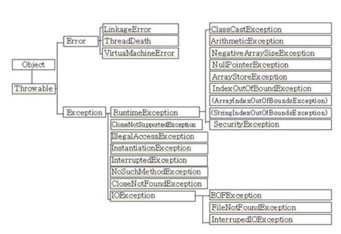

# 예외처리
예외처리를 하다보니 지금까지 예외를 너무 아무렇게나 처리했다.

그냥 캐치문에 로그만 찍어주고 어떤 에러인지 정확히 나누지도않고..

정확히 용도에 맞는 예외처리를 해주도록 연습하고, 예외처리개념을 좀 정확하게 정리할 필요성을 느껴서 정리좀 해봄

---
```
컴파일 에러 : 컴파일 할 때 발생하는 에러
런타임 에러 : 프로그램 실행중에 발생하는 에러

소스코드 컴파일 시 컴파일러에서 소스코드(.java)에 있는 오류들을 잡아서 에러를 알려준다.
정상적으로 수정하면, 컴파일러가 소스코드 (.java)  파일을 .class 파일로 변환해 준다.

자바에서는 실행 시 (runtime) 발생할 수 있는 프로그램 오류를 ‘에러’와 ‘예외’ 두 가지로 구분하고 있다.
에러는 메모리 부족이나 스택오버플로우같은 발생하면 복구하기 힘든 심각한 오류이고, 예외는 발생하더라도 수습이 될 수 있는 비교적 덜 심각한 상황이다.

-> 에러 / 예외는 둘다 런타임 오류이다.
```

## 1. 예외 클래스 


```
RuntimeException 클래스들은 주로 프로그래머의 실수에 의해서 발생할 수 있는 예외들로서 자바의 프로그래밍 요소와 관계가 깊다.
-> 프로그래머의 실수로 발생하는 예외

Exception 클래스들은 주로 외부의 영향으로 발생할 수 있는 것들로서, 프로그램의 사용자들의 동작에 의해서 발생하는 경우가 많다.
-> 사용자의 실수와 같은 외적인 요인에 의해 발생하는 예외
```

```
RuntimeException 클래스들과 Exception 클래스들의 중요한 차이점은 컴파일시의 예외처리 체크여부이다. 

RuntimeException 클래스들 그룹에 속하는 예외가 발생할 가능성이 있는 코드에는 예외 처리를 해주지 않아도 컴파일 시에 문제가 되지 않지만, Exception 클래스들 그룹에 속하는 예외가 발생할 가능성이 있는 예외는 반드시 처리를 해주어야 하며, 그렇지 않으면 컴파일 시에 에러가 발생한다.
```

```java
class ExceptionTest {
    public static void main(String[] args){
        throw new Exception(); // Exception을 강제로 발생시킨다.
    }
}
```


-> 위와 같은 경우는 컴파일 에러가 난다.

예외처리가 되어야 할 부분에 예외처리가 되어 있지 않다는 에러이다. 위의 결과에서 알 수 있는 것처럼, 위에서 분류한 '그 외의 Exception클래스들'이 발생할 가능성이 있는 문자들에 대해 예외처리를 해주지 않으면 컴파일 조차 되지 않는다.


```java
class ExceptionTest {
    public static void main(String[] args){
        try {
            throw new Exception(); // Exception을 강제로 발생시킨다.
        } catch (Exception e) {
              //
        }
    }
}
``` 
-> 이런식으로 수정 필요

```java
class ExceptionTest {
    public static void main(String[] args){
        throw new RuntimeException(); // RuntimeException을 강제로 발생시킨다.
    }
}
```

-> 위와 같은 경우 컴파일에서는 에러가 나지 않지만, 실행시에 런타임 에러가 발생하며 종료된다.
런타임 예외는 컴파일에선 문제가 안되지만, 실제 실행시 문제가 발생하면 에러를 발생시킨다.


## 2. 사용예시

```java
class ExceptionTest {
    public static void main(String[] args){
        try {
            Logic A
        } catch (Exception e) {
            catch
        } finally {  
            무적권
        }
    }
}
```
```
try : try 안에는 예외 상황이 발생할 것으로 예상되는 로직이 위치된다.
catch : catch 안에는 예외 발생시 후처리를 위한 로직이 들어간다.
finally : 무조건 실행
```

## 3. 사용자 정의 예외 생성

개발자에게 자신이 필요한 에러를 직접 커스터마이징도 가능하다.

```java
class NewException extends Exception {
    NewException (String msg) {
        super(msg);
    }
}
```
```
Exception 클래스를 상속받아 NewException을 생성할 수 있다.
필요하면 멤버변수, 메소드를 추가가 가능하다. Exception 클래스는 생성시 스트링을 맏아 메세지로 저장이 가능하다.
사용자 정의 Exception에서도 똑같이 하려면 생성자 정의가 필요
```

```java
class NewException extends Exception {
    private final int ERROR_CODE;

    NewException (String msg, int errorCode) {
        super(msg);
        this.ERROR_CODE = errorCode;
    }

    NewException (String msg) {
        this(msg,500); // 500 error
    }

    public int getErrCode() {
        return this.ERROR_CODE;
    }
}
```

이런식으로 커스터마이징하면, 에러메세지 (getMessage()) 이외에도 설정된 에러코드같은걸 볼 수 있다.

## 4. 트랜잭션
하나의 트랜잭션에서 에러처리를 하는건 매우 중요하다.

트랜잭션은 하나의 작업 처리 단위를 말한다.

예를들어 상품 구매 트랜잭션이 있을 때
* 상품선택
* 장바구니 등록
* 계산
이런 작업들이 있다.

이 세가지 작업중 하나가 실패하면 모두가 취소되어야 한다 (Rollback)

수도코드로 정리를 해보면
```
상품구매() {
    상품선택()
    장바구니등록()
    계산()
}

상품선택() {
    ...
}

장바구니 등록(){
    ...
}

계산(){
    ...
}
```

요런식의 구조가 된다.

이런상태에서 뭔가가 잘못되서 롤백을 하고싶으면,

```
상품구매() {
    try {
        상품선택()
        장바구니등록()
        계산()
    } catch (예외) {
        모두취소()
    }
}

상품선택() throws 예외{
    ...
}

장바구니 등록() throws 예외{
    ...
}

계산() throws 예외 {
    ...
}
```

요런식으로 각 트랜잭션 단계에서 예외를 던지는 형식으로 구현을 해야한다.

만약 
```
상품구매() {
    상품선택()
    장바구니등록()
    계산()
}


상품선택() {
    try {
        ...
    } catch () {
        선택취소 ()
    }
}


장바구니 등록() {
    try {
        ...
    } catch () {
        등록취소 ()
    }
}


계산() {
    try {
        ...
    } catch () {
        계산취소 ()
    }
}
```


요런식이면 상품 선택은 안됐는데 계산은 되는 최악의 상황이 나올 수 있으니 예외처리를 할 때는 잘 고려해서 짜도록 하자.