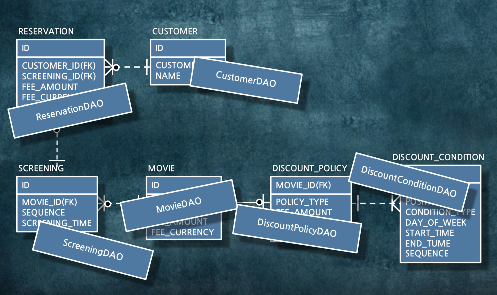
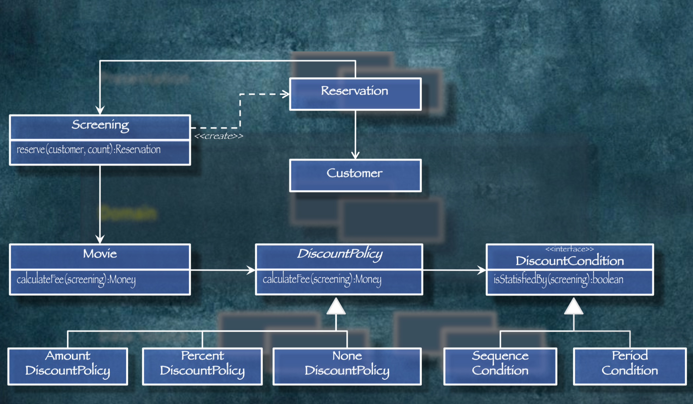

# 절차지향 vs 객체지향

```
객체지향 객체지향 엄청나게 얘기는 많이듣고 좋다고 얘기는 들었지만, 실제로 내가 객체지향으로 개발을 하고있는지에 대한 고민이 들었다. 겸사겸사 객체지향을 공부하면서 정리를 해보려고 한다.
```

- 개발을 하다보면 한번 만든 시스템이 5년, 10년 이상씩 쓴다
- 오래 쓰는 시스템일수록 유지보수에 대한 고찰이 필요하다

```java
초기 개발 비용 <<<< 유지 보수 비용
```

- 이러한 비용을 줄이기 위해 어떤 코드를 짜야할까?
    - 분석이 쉬운 코드
    - 변경이 쉬운 코드
    - -> 객체 지향

### 절차 지향
- 절차 지향 코드는 데이터를 중심으로 개발을 한다.
- 개발 클래스 안에다가 직접 데이터를 조작한다는 소리

- 각각의 클래스에서 데이터를 조작을 하기 때문에, 이에 대한 의존성이 크다.
- 절차지향 -> 이프문
    - 데이터 모델링을 한다 (데이터가 엄청 중요하다고 생각)
    - VO 생성 (getter / setter)
    - dao 생성
    - 순차적으로 dao에서 데이터를 가져오고 조건에 따라 소스를 실행
    - 수많은 if / else 문 생성
    - 객체 지향적으로 짰다고 생각을 하지만 실질적으론 절차 지향적 코드
- 위와 같이 절차지향적으로 짠 코드는 결과적으로 가독성이 떨어지고, 코드의 유지보수가 매우 어려워진다.
- 예를 들어 데이터 타입이 int 에서 long으로 바뀌면, 해당 데이터를 참고하는 모든 클래스의 수정이 필요해진다.
- 데이터 지향 모델

### 객체 지향
- 객체지향은 데이터에 집중하는것이 아닌 기능에 집중한다.
    - 절차지향의 if / else 문을 
- 객체간 데이터 이동은 최소한으로 줄이면서, 객체간엔 서로의 기능을 실행해 달라고 요청을 한다.

- 서로간에 기능을 요청하는 형태이기 때문에, 각각의 내부클래스에서 데이터가 변한다고해도 영향이 덜간다.
- 즉 캡슐화를 잘 하게 되면 유지보수 비용이 줄어든다.

### 객체 지향의 핵심
- 객체의 핵심기능은 바로 *기능* 제공이다.
    - 어떠한 기능을 제공하는지 정의한다.
    - 내부적으로 그 기능을 어떻게 지원하고, 어떤데이터를 쓰는지 등은 숨긴다 (캡슐화)
- 만약 휴대폰이라는 객체가 있다고하면
    - 볼륨 증가
    - 볼륨 감소
    - 화면 띄움
    - 전원 끄기
    - 전원 키기
    - 등등..

```java
CellPhone cellPhone = new CellPhone();
cellPhone.increaseVolume();
// 어떻게 볼륨을 조절하는지 호출하는 쪽에서 알 수가 없음
```

- 만약 절차지향적으로 개발을 하면 

```java
CellPhone cellPhone = new CellPhone();
int Volume = cellPhone.getVolume();
cellPhone.setVolume(volume + 1);
```

- 위의 코드는 기능만 나와있고 데이터는 숨겨져 있지만, 아래는 볼륨의 자료형까지 다 보여진다.
- 만약 절차지향 소스에선, CellPhone에서 볼륨의 자료형이 long으로 바뀌면, 모든 호출하는 코드도 변경이 되어야 한다.
- 하지만 객체 지향은 CellPhone 내의 volume자료형이 뭐건간에 호출하는 쪽에선 변경되는게 없다.
- 이게 바로 객체 지향 vs 절차 지향 의 핵심 차이
- 좋은 객체는 데이터를 주는게 아닌 기능을 제공해야한다. 무조건..!