# Kafak Streams

[[toc]]

## 1.카프카 스트림 이란?
- 카프카 스트림은 카프카에 저장된 데이터를 처리하고 분석하기 위해 개발된 클라이언트 라이브러리
- 이벤트 시간과 처리 시간을 구분하고 간단하면서도 효율적인 응용 프로그램 상태 관리 및 실시간 쿼리와 같은 중요한 스트림 처리 개념을 기반으로 되어있다.
- 카프카에서 데이터를 스트림으로 받아오고, 그 데이터를 가공해서 사용한다.
- 스트림은 절대로 안멈추고, 계속해서 데이터가 흘러 들어온다고 생각하면 된다.
- 이런 데이터 스트림을 사용하기 위해 사용 하는 API는 Kafka Streams API 이다.


### 1-1.카프카 스트림의 주요 특징
- 간단하고 가벼운 클라이언트 라이브러리로 설계되었으며, 모든 Java 응용 프로그램에서 사용이 가능하고, 기존 패키징, 배포 및 운영 도구와 통합이 가능
- Apache Kafka 이외의 시스템에 대한 외부 종속이 없다. 
- Kafka의 파티셔닝 모델을 사용하여 처리를 수평으로 확장하면서 강력한 순서 보장
- 처리 중간에 Streams 클라이언트 또는 Kafka 브로커에서 장애가 발생하더라도 각 데이터가 한번만 처리되도록 보장
- 한 번에 한 레코드 씩 처리하고 데이터 처리에 밀리초 단위로 실행
- 데이터가 순서에 맞지 않게 도착을 해도 이벤트 시간 기반 윈도우 작업을 지원

### 1-2.Processor Topology
카프카 스트림은 Topology 라는 개념으로 실행 흐름을 나타낸다.

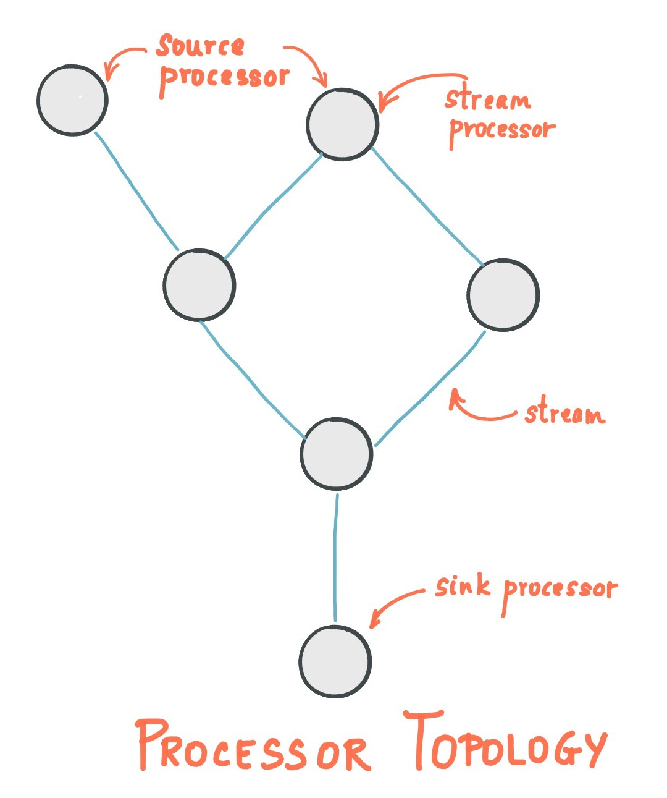


#### 스트림(Stream) 
- 스트림은 카프카 스트림즈 API를 사용해 생성된 토폴로지로, 끊임없이 전달되는 데이터 세트를 의미한다. 
- 스트림에 기록되는 단위는 key-value 형태이다. 

#### 스트림 처리 애플리케이션(Stream Processing Application) 
- 카프카 스트림 클라이언트를 사용하는 애플리케이션으로서, 하나 이상의 프로세서 토폴로지에서 처리되는 로직을 의미한다. 
- 프로세서 토폴로지는 스트림 프로세서가 서로 연결된 그래프를 의미한다. 

#### 소스 프로세서(Source Processor)
- 위쪽으로 연결된 프로세서가 없는 프로세서를 말한다. 
- 이 프로세서는 하나 이상의 카프카 토픽에서 데이터 레코드를 읽어서 아래쪽 프로세서에 전달한다. → 스트림 시작 단계

#### 스트림 프로세서(Stream Processor) 
- 프로세서 토폴로지를 이루는 하나의 노드를 말하여 여기서 노드들은 프로세서 형상에 의해 연결된 하나의 입력 스트림으로부터 데이터를 받아서 처리한 다음 다시 연결된 프로세서에 보내는 역할을 한다. → 실제 데이터 가공 

#### 싱크 프로세서(Sink Processor) 
- 토폴로지 아래쪽에 프로세서 연결이 없는 프로세서를 뜻한다. 
- 상위 프로세서로부터 받은 데이터 레코드를 카프카 특정 토픽에 저장한다. → 스트림 마지막 단계


### 1-3. Kafka Streams API
카프카 스트림은 데이터를 합칠 수 있다.

인풋으로 들어오는 데이터는 KStream 또는 KTable 이고, 아웃풋으로 나가는 데이터 스트림은 KTable이다.

KTable 관련해서 추가로 정리를 할 예정


API 를 사용하면 카프카 클러스터와 상호 작용을 하게 된다.

Kafka Streams API 는 어플리케이션 내에서 작동하는 api로 브로커 바깥에서 작업을 진행한다.

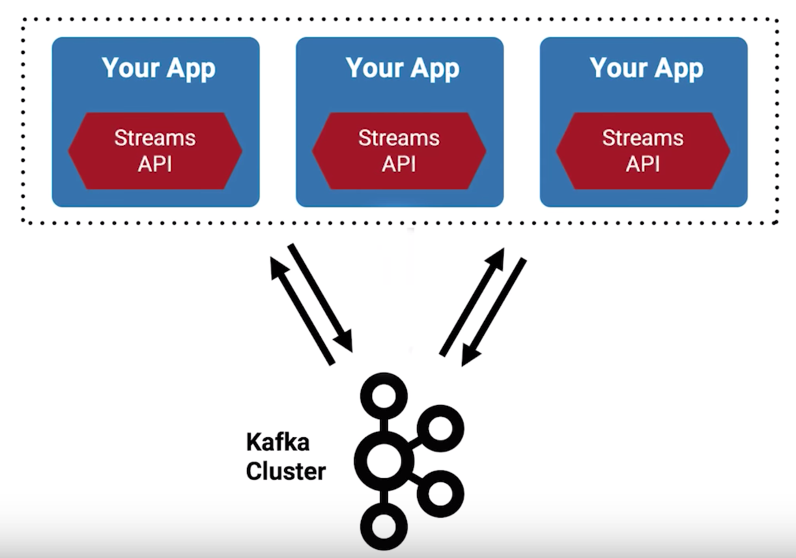

### 1-4. 사용 방법 

#### Serializers 와 Deserializers (aka Serdes) 를 정의
- SERializer
- DESerializer
Key Serdes는 Value Serdes와 별개로 움직인다.

내부적으로 구현된 Serdes

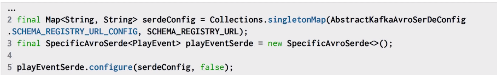


#### 스트림 생성
StreamBuilder를 사용해 KStream 또는 KTable을 설정한다.

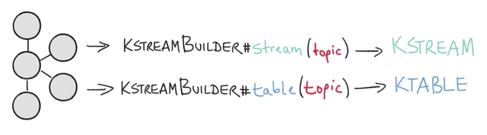

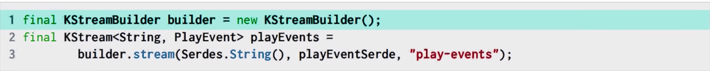

- 위의 예시에선 KStream의 키는 String 타입이고, 값은 PlayEvent  타입이다.
- 이렇게 설정을 해주면, 특정 플레이 이벤트를 각 인스턴스마다 스트림 식으로 모두가 바라보게 있게 된다.
- 이벤트가 업데이트 되면 데이터를 가져오고, 동일한 키에 대해 업데이트되면 값을 덮어 씌우게 된다.


#### 데이터 가공 
데이터를 가져와서 filterling, map, group by 등으로 데이터를 가공해 준다.

필터링같은 작업을 하고나면, 새로운 key / value 로 스트림이 생긴다.

*Filter & Map* 
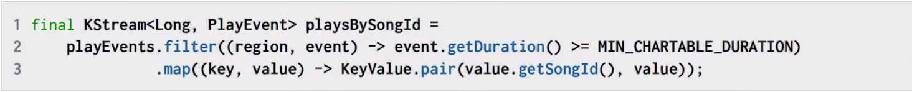

- 위의 예시를 보면, playEvents 스트림을 필터링하고, map을 해서 새로운 KStream 객체로 리턴해준다.
- 즉 새로운 key / value 객체로 가져오게 된다.
- 위에선 새로운 SongID로 키를 만들고, value는 기존 value와 동일하게 설정했다.


*Group By & Count*

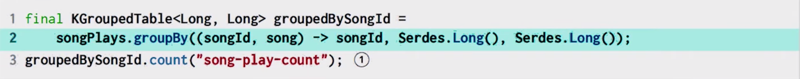

- 새로운 키를 기반으로 Group By 도 가능하다.
- count 를 통해 카운팅도 가능하다

*Reduce or Aggregate*

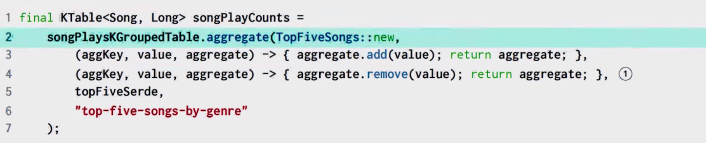

- 이전 record와 현재 record로 합성이 가능하다
- 람다를 사용한다
- 결과물로 KTable이 나온다

이런식으로 나온 스트림을 KTable과 조인도 가능하다. (좀더 공부 후 KTable과 연관해서 설명 추가 작성 필요)

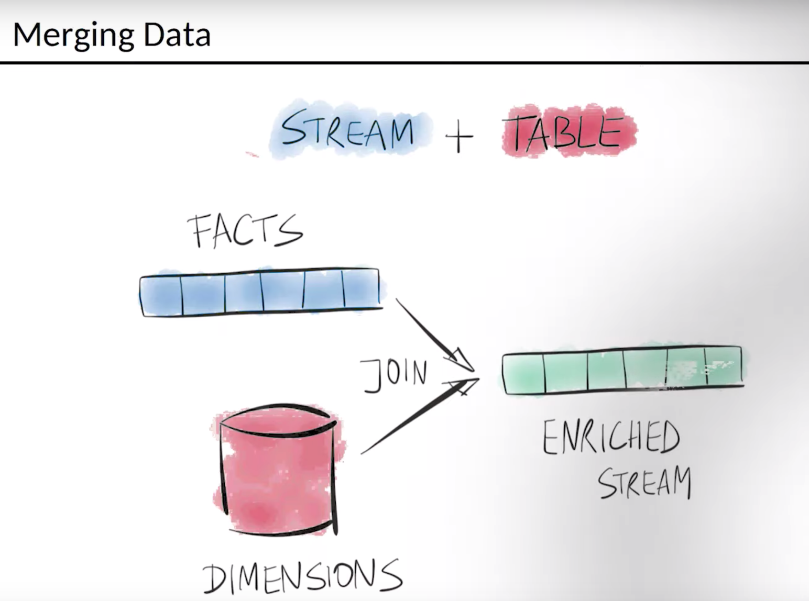

*Join 예시*

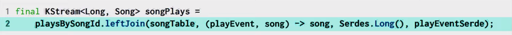

- 다른 Source 에서 온 데이터들을 합칠 수 있다.


#### KStream ↔ KTable
KStream과 Ktable 은 서로서로 변환을 할 수 있다.

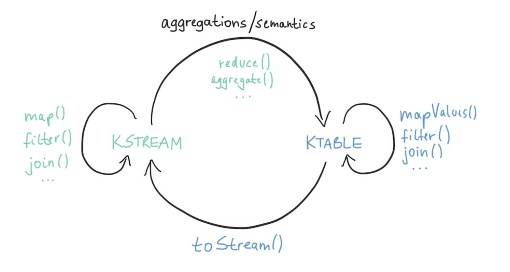


#### Windowing
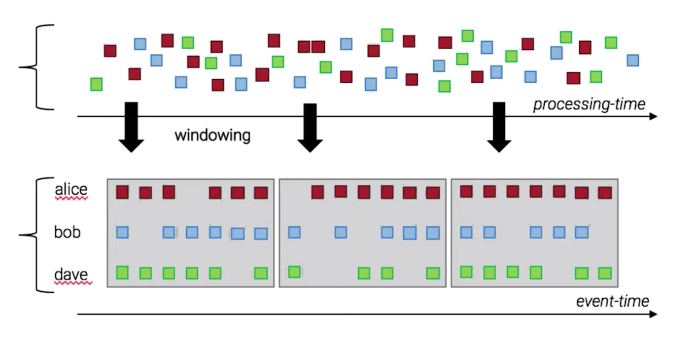
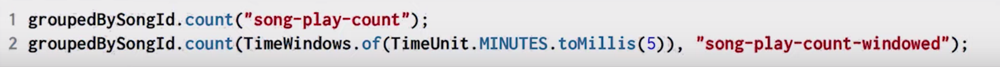

- 데이터를 시간 순서에 따라 키로 그루핑을 해줄 수 있다. 
- 풀링 할 때 프로세싱 타임으로 구분하면, 매번 다른값이 온다. 이런 문제를 해결하기 위해 그루핑을 해주는 거를 Windowing 이라고 한다. (좀더 찾아보고 정리필요 ㅠㅠ..)


## 2. 카프카 스트림 샘플 소스
샘플 소스는 아파치 공식 홈페이지를 참고함

아파치 공홈 : https://kafka.apache.org/24/documentation/streams/tutorial

### 2-1.  로컬 카프카 설정 
도커로 띄워도 되고, 로컬에 직접 카프카를 설치해도 된다.

먼저 카프카를 로컬에 설치하고 예제에 사용할 토픽 2개를 만든다.


#### 토픽 생성

> bin/kafka-topics.sh --create \
    --bootstrap-server localhost:9092 \
    --replication-factor 1 \
    --partitions 1 \
    --topic streams-plaintext-input


결과 : Created topic "streams-plaintext-input" // input 으로 사용할 토픽 생성


> bin/kafka-topics.sh --create \
    --bootstrap-server localhost:9092 \
    --replication-factor 1 \
    --partitions 1 \
    --topic streams-wordcount-output \
    --config cleanup.policy=compact


결과 : Created topic "streams-wordcount-output" // output 으로 사용할 토픽 생성

#### producer 와 consumer 를 띄워준다.

Producer

> bin/kafka-console-producer.sh --broker-list localhost:9092 --topic streams-plaintext-input

Consumer

> bin/kafka-console-consumer.sh --bootstrap-server localhost:9092 \
    --topic streams-wordcount-output \
    --from-beginning \
    --formatter kafka.tools.DefaultMessageFormatter \
    --property print.key=true \
    --property print.value=true \
    --property key.deserializer=org.apache.kafka.common.serialization.StringDeserializer \
    --property value.deserializer=org.apache.kafka.common.serialization.LongDeserializer


### 2-2. 예제 소스 작성
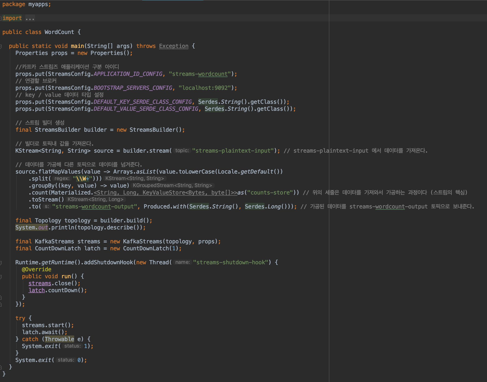

```
Properties 객체에 프로퍼티 정보를 넣어준다.

ID, 연결한 브로커, key value serdes 설정 등을 해줌

StreamBuilder를 통해 데이터를 받을 topic (streams-plaintext-input) 을 설정해서, KStream 객체를 만들어 준다. (Source Processor 단계)

flatMap, gruopBy 등의 함수를 통해 데이터를 가공해 준다. (Stream Processer 단계)

데이터를 전달해줄 topic (streams-wordcount-output) 을 설정한다. (Sink Processor 단계)
```

위의 작업 이후에 Topology 객체에 넣고 stream을 시작해 주면 된다.

topology 정보의 로그를 찍어보면 아래와 같다.


```java
Topologies:
Sub-topology: 0
Source: KSTREAM-SOURCE-0000000000 (topics: [streams-plaintext-input])
--> KSTREAM-FLATMAPVALUES-0000000001
Processor: KSTREAM-FLATMAPVALUES-0000000001 (stores: [])
--> KSTREAM-KEY-SELECT-0000000002
<-- KSTREAM-SOURCE-0000000000
Processor: KSTREAM-KEY-SELECT-0000000002 (stores: [])
--> KSTREAM-FILTER-0000000005
<-- KSTREAM-FLATMAPVALUES-0000000001
Processor: KSTREAM-FILTER-0000000005 (stores: [])
--> KSTREAM-SINK-0000000004
<-- KSTREAM-KEY-SELECT-0000000002
Sink: KSTREAM-SINK-0000000004 (topic: counts-store-repartition)
<-- KSTREAM-FILTER-0000000005

Sub-topology: 1
Source: KSTREAM-SOURCE-0000000006 (topics: [counts-store-repartition])
--> KSTREAM-AGGREGATE-0000000003
Processor: KSTREAM-AGGREGATE-0000000003 (stores: [counts-store])
--> KTABLE-TOSTREAM-0000000007
<-- KSTREAM-SOURCE-0000000006
Processor: KTABLE-TOSTREAM-0000000007 (stores: [])
--> KSTREAM-SINK-0000000008
<-- KSTREAM-AGGREGATE-0000000003
Sink: KSTREAM-SINK-0000000008 (topic: streams-wordcount-output)
<-- KTABLE-TOSTREAM-0000000007
```

이런식으로 데이터 스트림 처리의 흐름을 확인할 수 있다.

### 2-2. 작동 화면
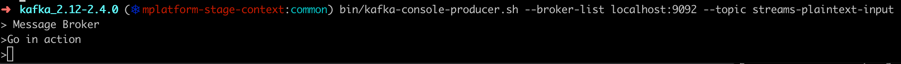

프로듀서에서 Message Broker 와 Go in action 이란 단어를 넣으면

실행한 프로젝트를 통과해 단어를 쪼개고 갯수를 써서 컨슈머 토픽에서 받아볼 수 있다.

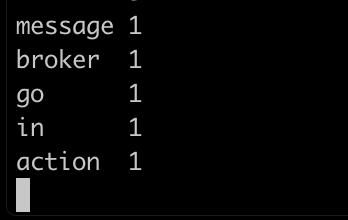

이런식으로 전달되는 것을 확인할 수 있다.

출처 및 참고 :

[https://kafka.apache.org/24/documentation/streams/core-concepts#streams_topology](https://kafka.apache.org/24/documentation/streams/core-concepts#streams_topology)
[https://coding-start.tistory.com/138](https://coding-start.tistory.com/138)