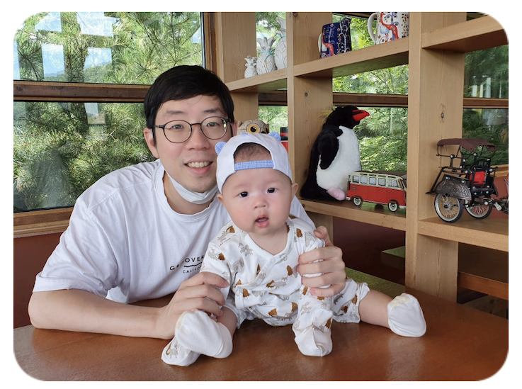

## [About Me]
> Spring을 사용하는 Backend 개발자이며, 독서와 운동을 즐기는 아기 아빠 입니다.  
> **MAU 1000만** 서비스에서 API / 사내 플랫폼 / 신규 서비스 개발 및 인프라 구축 등을 해왔습니다.  
> 개발자 교육의 업을 삼으신 부모님의 영향을 받고,   
> 좋아하는 컴퓨터를 깊게 파볼 수 있어 개발자란 직업을 선택 하였습니다.  
> 외향적인 성격으로 다른 사람들과 소통하는걸 좋아하며,  
> 팀 내에서 여러 **문제들을 해결**하고 **부채를 정리**하는 것을 좋아합니다.  
> 다른 사람의 훌륭한 코드를 보면 꼭 학습을 하고, 응용을 해본 후에 적용하는 것을 좋아하는 개발자 입니다.  

## [경력]
### SK Telecom (2022.10 ~ 현재)
- 에이닷 서비스개발팀 (2022.10 ~ 현재)

### 로엔, 카카오, 카카오 엔터테인먼트
- 멜론 상품 개발팀 (2021.08~ 2022.09)
- 트랙제로 개발팀 (2020.01~ 2021.07)
- 멜론 플랫폼 개발팀 (2017.09 ~ 2019.12)

### LG CNS
- 스마트 팩토리 FA 팀 (2016.07 ~ 2017.08)

## [경험]
- 대용량 트래픽, 대규모 사용자 서비스
- 마케팅 플랫폼 시스템 개발
- 대규모 서버 이전 
- 신규 서비스 오픈
- 팀 내 개발 기술 공유

## [보유기술]
- Spring (MVC / Web-Flux / Data)
- RDB (mysql), NoSql (Mongo)
- React

## [주요 경력 및 수행 업무]
### 신규 서비스 개발
- 트랙제로 서비스
    - 회원 도메인 담당
    - 아티스트 도메인 담당
    - BDD 방법론을 통한 개발
    - Kafka Streams를 사용한 msa 개발
- 에이닷 개발
    - 사이드 드로어 백엔드 api / admin 개발
    - SMS 서비스 연동 소켓 통신 개발
    - 프로야구 서비스 api 개발
    - 생일 서비스 api 개발
    - 대규모 홈 개편 서비스 개발

### 사내 플랫폼 개발 및 운영 (멜론)
- 프레임워크 유지보수 업무 수행. 스프링 기반의 자체 커스터마이징한 프레임워크 개발 및 유지보수.
- 멜론 공통 배포 툴 및 프로세스 관리 
    - svn -> git으로 변경 후 공통 프로세스 관리
    - 젠킨스 / 허드슨 / 쿠버네티스 사용
- 레거시 프로젝트 전환
    - 멜론 통합 어드민 스프링 3 을 boot 1.5 로 변환
- 정적파일 해쉬화 프로그램 개발
- Config-Server 개발 및 유지보수
    - 클라이언트 : React
    - 서버 : Spring / Spring cloud / Spring Security
- 푸시어드민 개발
    - 멜론 공통 푸쉬 (APN, GCM 라이브러리 사용) 기능 유지보수
    - Spring, kafka 기반 모바일 푸시 발송 시스템 개발
    - Security 적용으로 인증 / 인가 개발
    - 배치 관리
- 사내 Docker & k8s 도입
    - Docker 스터디 후 각 팀 개발자들에게 Docker 내용 발표 및 자료 공유 [(링크)](https://gwegwe1234.github.io/study-collection/devops/Docker_summary.html)
    - nexus3로 docker private registry 구성
    - 온프레미스 환경의 Spring boot, React, Spring batch 프로젝트들을 Kubernetes 환경으로 이관 작업 진행 
- 사내 복지이용권 제공 어드민 개발
    - 카카오 / 그룹사 내 멜론 복지이용권 제공 어드민 유지보수
    - 테스트 코드 부재로 모든 api 테스트 코드 작성
    - TestContainer를 통한 테스트용 DB 도커컨테이너 사용

### 대규모 서버 이전 (멜론)
- 로엔 -> 카카오로 인프라 시스템 전체 변경 작업 진행
- ip 연결, db 연결, 소스 이관, apache / tomcat 설정, 인증서 설치, nexus 이관, jenkins 환경 이관 등 모든 공통 적용 사항 이관
- 온프레미스 환경에 적용되는 apache, tomcat 기반의 스프링 프로젝트 이전

### 멜론 타겟 마케팅 시스탬 개발
- 일 평균 1억 리퀘스트의 멜론 마케팅 시스템 개발 
- 멜론 내 배너, 타겟 마케팅, 추천매대 관리
- 레거시 시스템 개선 아키텍쳐 설계
  - Near Real Time 대상 추출을 위한 새로운 ETL 시스템 개선
	- CQRS 패턴을 통한 Read DB, Write DB 분리
    - 여러 개의 Write DB 최소화
  - 여러곳에 퍼져있는 DB 데이터를 카프카를 통해 데이터를 모은 후, Read용 NoSQL 디비에 적재
  - 중복된 마케팅 시스템 관심사를 분리

## [최근 관심사]
- 현재 회사에서 사용중인 Spring WebFlux 의 근본 개념
- 완벽한 FP스타일의 코딩에 대한 고민
- 자신만의 코딩 스타일에 대한 고민과 그 기반으로 다른 동료들에게 리뷰를 잘 해줄 수 있는 방법에 대한 고민
- 반복적인 일을 하지 않을 플랫폼화 된 컨셉의 개발 방법
- 개인 NAS에 개발중인 사이트 고도화 
    - 기록물 저장 사이트
    - 백업에 대한 고민과 여러 기능에 대해 고민 중
    - 해보고 싶었던 다양한 기술들 적용할 방법
    - nextjs에 적용중인 css를 잘 꾸미는법

## [목표 및 포부]
- 같이 일하는 사람들에게 도움이 되는 팀원이 되고자 노력합니다.
- 다른 사람의 의견을 경청하고자 노력하고 아주 조금이라도 배울게 있으면 배우고자 노력합니다.
- 은퇴할 때까지 개발쟁이로 살기 위해 계속해서 배워나가고 싶습니다.