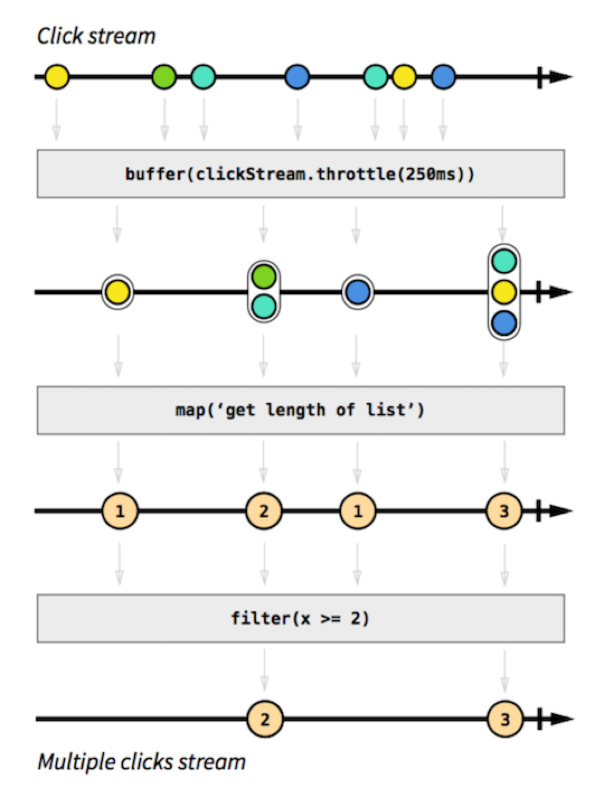
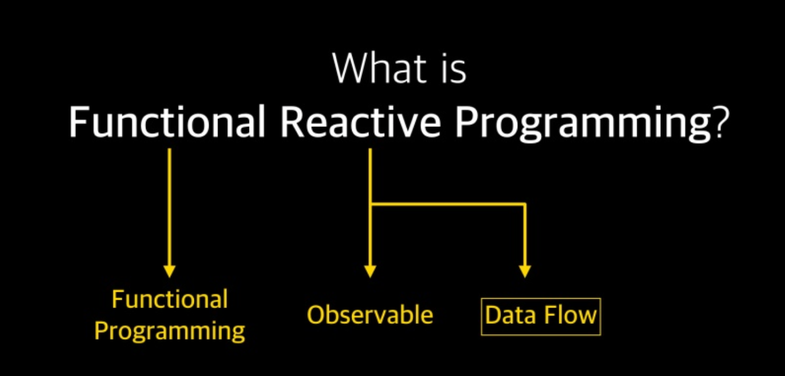
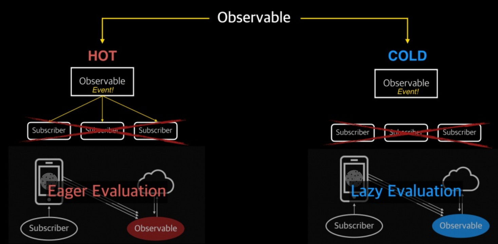

# Reactive Programming
```
Reactive Programming 개념

서버나 애플리케이션은 다양한 데이터를 처리하느라 늘 분주하다. 
그런데 데이터양이 기하급수적으로 늘면서 기존의 프로그래밍 방식으로 이를 처리하기가 점점 어려워지고 있다. 
이에 데이터의 입출력 흐름에 따라 많은 사용자 요청을 한꺼번에 그리고 동시에 처리하는 프로그래밍 기법을 연구하기 시작했고, 
그 결과가 리액티브 프로그래밍이다.

Reactive programming is programming with asynchronous data streams.
Reactive programming은 스트림들의 조합 - 각 스트림들끼리 연결이 가능
비동기 프로그래밍. (ajax 같은거라고 생각하면 편할듯)
The "listening" to the stream is called subscribing.

observable pattern
=> RP = Observable + LINQ + Schedulers

http://wiki.sys4u.co.kr/pages/viewpage.action?pageId=8552930
```
```
Reactive Programming vs Procedure Programming (이거 아닌거같긴한대..)

<명령형 프로그래밍으로 냉장고에 우유 사서 넣기>

- 시작
- 당신의 주머니에 열쇠 배열을 유지하기위한 공간을 만드십시오.
- 주머니에 열쇠배열을 넣으십시오.
- 차고에 가십시오.
- 차고를 엽니다.
- 차에 탑니다.
.
.
.
-우유를 냉장고에 넣습니다.
- 끝

<선언형 프로그래밍으로 우유사기>

- 유당을 소화하는데 문제가 없다면, 우유는 건강 음료입니다.
- 일반적으로 냉장고에 우유를 저장합니다.
- 냉장고는 물건을 시원하게 유지하는 상자입니다.
- 상점은 상품이 판매되는 장소입니다.
- "판매"란 돈을 위해 사물을 교환하는 것을 의미합니다.
- 또한 사물 교환을 "사기(buying)"라고합니다.
```
```
Functional Programming 특징

불변성. 
입력에 의해 변수의 값이 변하면 안된다.
필요할 경우 그냥 새 변수를 생성.
특정 입력이 함수로 들어올 경우, 항상 같은 결과값을 반환해야 한다.
```
```
Reactive 방식의 장점

최근의 웹앱과 모바일 앱에서 좋다.
과거의 웹프로그래밍의 경우 하나의 큰 폼을 백엔드로 보내서 처리하는 형식이었으면, 
최근의 웹 프로그래밍의 경우, 여러개의 이벤트들을 동시에 리얼타임으로 처리하는 경우가 많아 RP방식이 유리하다.

왜 Reactive Programming의 도입을 고려해야 하는가?
Reactive Programming은 코드의 추상화 수준을 높여주어 하찮지만 많은 구현 디테일을 신경쓰는 대신 비즈니스 로직을 정의하는 이벤트들의 상호 의존성을 높이는 데 집중하게 한다. 
Reactive Programming의 코드는 더 명확하다.
데이터 이벤트와 연관된 다양하고 많은 UI 이벤트가 발생하는 현대의 웹 앱이나 모바일 앱 같은 경우 이점은 보다 명확해진다. 
앱은 유저에게 높은 반응성의 경험을 가능하게 하는 실시간 이벤트들을 가지고 있다. 
우리는 이것들을 제대로 다룰 도구가 필요하며 Reactive Programming이 그 답이 될 것이다.

Reactive Programming은 사용자 입장에서 실시간 반응이 이루진다고 할 수 있다. 
예를 들어 어떤 단어를 넣어 검색을 할 때 그에 따라 검색어 제안이 나타나는 것을 말한다. 
이것은 기존의 Observer 패턴을 통해 감지하고 그에 따른 Asynchronous한 처리를 하면 가능하다. 
그러나 그에 따른 코드량의 증가와 분산이 존재한다.

여기서 Functional Programming의 이점이 도입된다. 
위 글의 저자가 놀라운 함수 모음함을 말한 이유가 이것으로 추측된다. 
함수형 프로그래밍은 상태를 저장하지 않고 순수 함수를 사용해 로직을 구성한다. 
여기에서 생기는 이점은 상태를 변경하여 결과가 달라지는 Side-Effect를 최소화 할 수 있다는 것이다.

정해진 input과 output을 내기 위해 코드를 직접 작성해도 되지만 개발자라면 그 과정에서 일어날 수 있는 side를 많이 겪는다.
하지만 Functional Programming을 이용하면 이미 정의된 함수만을 이용하기 때문에 side를 줄이는 것 뿐만 아니라 함수명만으로도 무슨 동작을 수행하는지 알 수있다.
```

```
예시
위의 더블클릭을 찾는 이벤트 스트림을 보면 회색칸은 하나의 스트림을 다른 스트림으로 변경하는 것이다.
더블 클릭시에 버퍼 function에서 250ms 이하로 클릭된걸 찾아서 모은다. 리스트로 묶어 map 함수를 통해 리스트를 구한후,
필터로 2개 이상인 이벤트만 남겨놓는다.
그 이후 이벤트를 subscribe(“listen”) 하여 우리가 원하는 대로 반응(react) 할 수 있다.
```




```
Observer Pattern
HOT
이벤트가 발생하면 Observable은 모든 Subscriber에게 이벤트를 전달한다.
만약 Subscriber가 없어도 이벤트를 전달하려 할것이다.

Cold
만약 Subscriber가 없으면 이벤트를 전달하려 하지 않는다.

Subscriber는 이벤트를 받는애들. 
Observable 은 함수.. 라고해야되나.. 관찰하다가 행동하는 놈들?.. 헷갈려
```


```
Control Flow : 일반적으로 자바같은대서 쓰는방법. 상태를 저장한다. 절차지향적 방법
Data Flow : 상태를 저장하지않는다. 함수형 프로그래밍. 함수지향적 방법
```

```
RP FRP RX

RP : 비동기 데이터 스트림을 이용한 프로그래밍
FRP : RP + Functional Programming
Rx : RP를 할 수 있게 도와주는 API + 기타
```

```
Blocking vs non Blocking

* Non-blocking I/O(Asynchronous I/O 혹은 Non-sequential I/O): Non-blocking I/O란, 
입출력 처리는 시작만 해둔 채 완료되지 않은 상태에서 다른 처리 작업을 계속 진행할 수 있도록 멈추지 않고 입출력 처리를 기다리는 방법을 말한다.
I/O 처리를 하는 전통적인 방법은 I/O 작업을 시작하면 완료될 때까지 기다리는 방법이다. 
기존에는 synchronous I/O 혹은 blocking I/O를 통해 I/O 작업을 진행하는 동안 프로그램의 진행을 멈추고(block) 기다리는 방식이 사용되었으나, 
이는 수많은 I/O 작업이 있는 경우 I/O 작업이 진행되는 동안 프로그램이 아무일도 하지 않고 시간을 소비하게 만든다. 
반면, Non-blocking I/O 방식을 사용하면 외부에 I/O 작업을 하도록 요청한 후 즉시 다음 작업을 처리함으로써 시스템 자원을 더 효율적으로 사용할 수 있게된다. 
그러나 I/O 작업이 완료된 이후에 처리해야하는 후속 작업이 있다면, I/O 작업이 완료될 때까지 기다려야 한다. 
따라서 이 후속 작업이 프로세스를 멈추지 않도록 만들기 위해, 
I/O 작업이 완료된 이후 후속 작업을 이어서 진행할 수 있도록 별도의 약속(Polling, Callback function 등)을 한다.


Non-blocking과 Asynchronous 그리고 Concurrency
Non-blocking과 Async를 비교해보자는 질문이 있다면, 질문 자체를 좀 더 명확히 할 필요성이 있다. 
우선 Non-blocking은 앞서 짚어본 바와 같이 Non-blocking I/O를 의미할 수도 있고, Non-blocking 알고리즘을 의미할 수도 있다. 
또한 Async라는 용어는 Asynchronous I/O를 의미할 수도 있고, Asynchronous Programming을 의미할 수도 있다. 
I/O 작업을 멈추지 않고 기다리는 방식을 구체적으로 분류하면 
Synchronous Non-blocking I/O와 Asynchronous blocking I/O 등으로 구분할 수 있기 때문에 이를 비교해보는 것은 의미가 있다.
12 그러나 Non-blocking I/O와 Asynchronous Programming은 비교 대상이 되기 어렵다. 
각 개념이 바라보는 관점이 다르기 때문이다. 
Asynchronous Programming을 위한 재료로써 Concurrency를 확보하거나 혹은 Non-blocking I/O를 활용할 수 있으나, 
이것이 Asynchronous Programming의 필수조건은 아니다. 
예를 들어 Event-loop를 사용하여 동시성을 확보했으나, I/O 작업의 성격에 따라 그 처리를 위해 blocking I/O 모델을 사용할 수 있다. 
Blocking I/O를 사용했어도 이 부분이 별도의 채널을 통한 작업으로 이루어짐으로써 이 프로그램의 주 실행흐름(event-loop)을 막지 않았다면, 
이 프로그램은 Asynchronous Programming이라고 부를 수 있다.


* Blocking/NonBlocking은 호출한 입장에서의 특징
* Sync/Async는 처리되는 방식의 특징
```

```
소프트웨어 개발과 설계의 관점에서 이야기하는 리액티브는 일반적으로 아래 세 가지 중 하나이다.
 리액티브 시스템 (구조와 설계)
 리액티브 프로그래밍 (선언적 이벤트 기반)
 함수형(Functional) 리액티브 프로그래밍 (FRP)
```

```
리액티브 프로그래밍과 리액티브 시스템이 마이크로서비스와 어떤 관계가 있는가?
자율 분산 서비스에 대한 시스템을 설계하는 마이크로서비스 기반의 아키텍처는 주로 클라우드를 배포 플랫폼으로 한다. 
이러한 시스템에서 리액티브를 이용할 경우 많은 이점을 가질 수 있다.
 리액티브 프로그래밍 과 리액티브 시스템 은 다른 상황에서 다른 이유로 중요하다.
* 리액티브 프로그래밍은 하나의 마이크로 서비스 안에서 서비스 내부 로직과 데이터 흐름 관리를 구현하는 데 사용된다.
* 리액티브 시스템 설계는 마이크로 서비스 사이 에서 사용되며 마이크로 서비스들이 분산 시스템의 규칙에 따라 동작하도록 한다. 메시지 기반으로 만들어진 복원성과 탄력성을 통해 반응성을 제공한다.
```

```
Toby’s Reactive 강의

1.Duality 
2.Observer

Iterable <——> Observable (duality)
Pull            Push

Observable // Source -> Event/Data -> Observer ==> 옵저버를 옵저버블에 등록하는거
observable은 뭔가 이벤트가 발생하면 행위발생.
3.Reactive Streams - 표준
```

https://www.youtube.com/watch?v=8fenTR3KOJo

https://zeddios.tistory.com/303 

https://brunch.co.kr/@oemilk/79

https://gist.github.com/staltz/868e7e9bc2a7b8c1f754

https://tech.peoplefund.co.kr/2017/08/02/non-blocking-asynchronous-concurrency.html

https://www.slideshare.net/andrewdohyunjung/msa-43702981

http://blog.lespinside.com/reactive-programming-versus-reactive-systems/

https://hamait.tistory.com/761

https://sungjk.github.io/2018/09/04/if-kakao-2018.html

https://wiki.daumkakao.com/display/bizdmp/Spring+Webflux

https://www.reactivemanifesto.org/ko

https://hamait.tistory.com/748

https://medium.com/@Alpaca_iOSStudy/what-is-reactive-programming-669e4e804452

여기설명 좋음 : http://2e.co.kr/hp/pages/share/ShareView.php?modsrl=5913&docsrl=181888&datatype=

