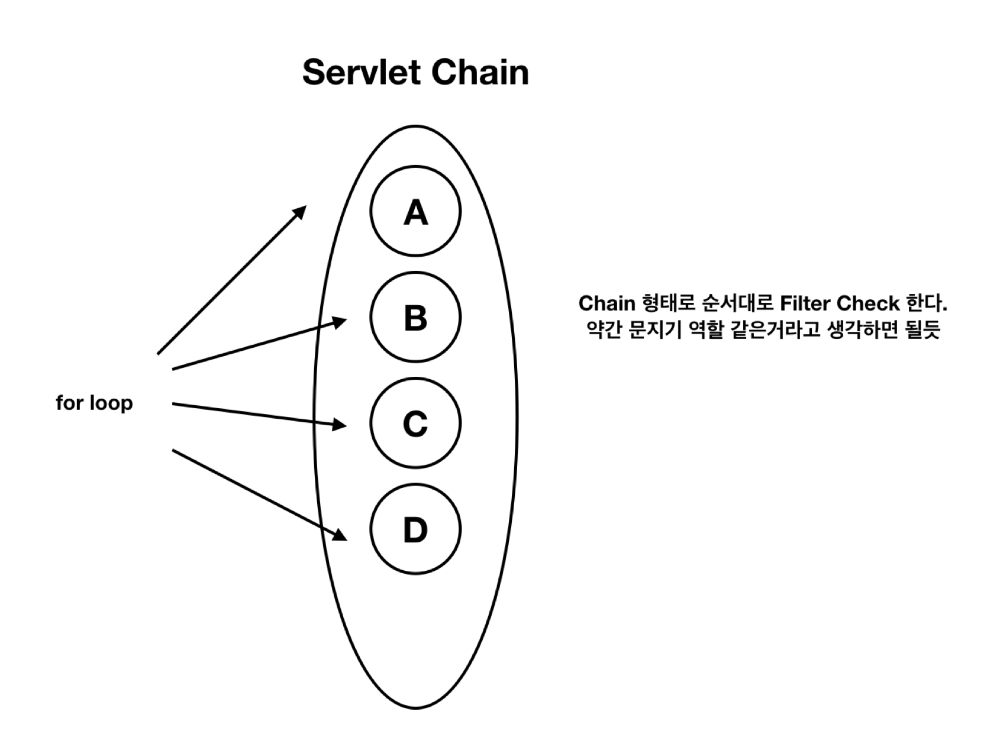
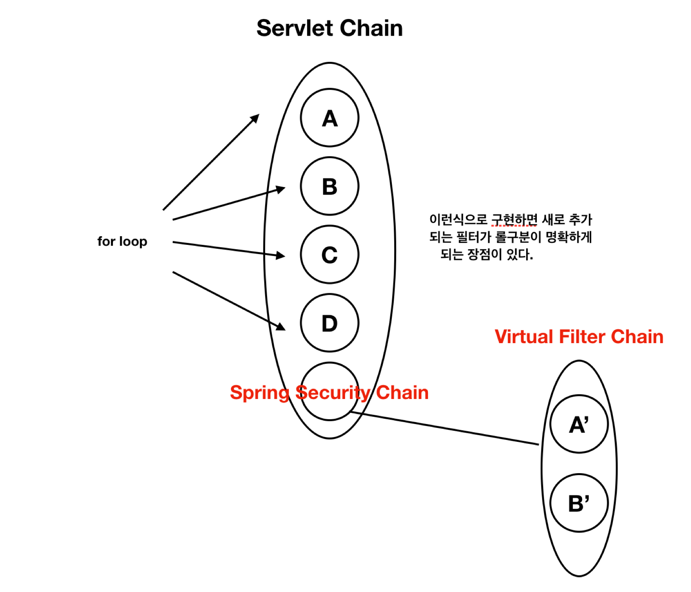

# Spring Filter Chain
```
스프링 필터는 체인구조로 되어있다.
```



```
서블릿 체인에서 스프링에 등록된 기본 filter들 (doFilter로 등록) 을 체크한다. 
여기에 새로운걸 추가하려면 (ex Spring Security) VirtualFilterChain 형태로 등록해주면 좋다 (Spring에 구현되어있음)
```



```
filter 작동원리
등록된 필터들을 돌면서 (FilterChainProxy), 각자 할당된 기능들을 수행 (ex, basicauth, cors, csrf.. 이렇게)
그러다 중간에 뻑나면 튕김.

각각의 필터에서 doFilterInternal overriding 해서 작동한다. 이후에 다시 doFilterChain해서 다음거 돌고 돌고.. 이런식으로
```