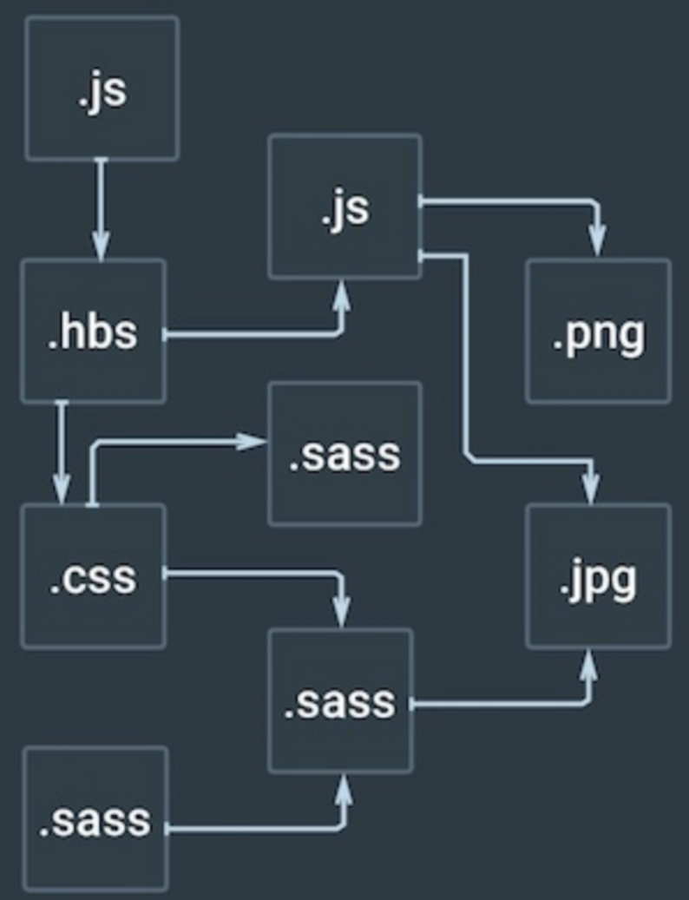

# Webpack

### 1. 설치하기
```
npm install -g webpack

npm init -y

npm install web pack webpack-cli —-save-dev
```
### 2. 실행명령
```
Webpack을 실행하려면:
webpack

Webpack에서 파일의 상태가 변경되면 자동으로 빌드하려는 경우:
webpack —watch

특정한 이름의 사용자가 정의한 Webpack 설정 파일을 사용하려면:
webpack --config myconfig.js
```

### 3. 개념
```
require로 연관된 js 및 기타 파일들이 하나의 bundle.js 로 묶인다 -> 사이즈가 작아져 빠르다.
파일이 여러개에서 몇개의 번들로 관리되어서 네트워크(리퀘스트) 비용이 줄어든다

웹팩의 모든것은 모듈이다.
```



```
엔트리 : 위 그림처럼 자바스크립트가 로딩하는 모듈이 많아질수록 모듈간의 의존성은 증가한다. 의존성 그래프의 시작점을 웹팩에서는 엔트리(entry)라고 한다.

아웃풋 : 엔트리에 설정한 자바스크립트 파일을 시작으로 의존되어 있는 모든 모듈을 하나로 묶을 것이다. 번들된 결과물을 처리할 위치는 output에 기록한다.

로더 : 웹팩은 모든 파일을 모듈로 관리한다고 했다. 자바스크립트 파일 뿐만 아니라 이미지, 폰트, 스타일시트도 전부 모듈로 관리한다. 그러나 웹팩은 자바스크립트 밖에 모른다. 비 자바스크립트 파일을 웹팩이 이해하게끔 변경해야하는데 로더가 그런 역할을 한다.

로더는 test와 use키로 구성된 객체로 설정할 수 있다.
- test에 로딩할 파일을 지정하고
- use에 적용할 로더를 설정한다
```


### 4. 플러그인
webpack에 사용할 수있는 추가기능

### 5. 해쉬화/미니파이
webpack.config.js에서 설정을 통해 가능하다.